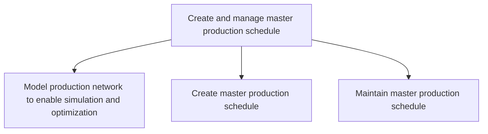
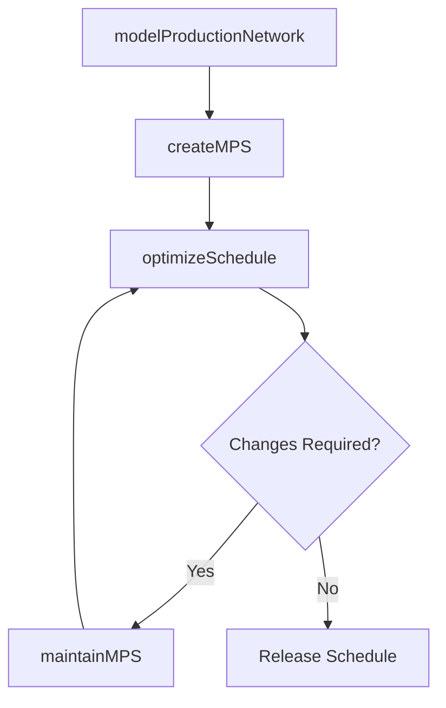

# Create and manage master production schedule

> Business-as-Code definition for master production scheduling. Models production network simulation, MPS creation, and ongoing schedule maintenance as programmable workflows.

## Overview

Taking care of the master production plan. The master production includes creation and implementation of the site-level production plan, as well as management of the inventory that is currently in the production process.

## Process Hierarchy



## GraphDL

```yaml
create:
  object: And Manage Master Production Schedule
  actor: ProductionPlanner
  result: MasterProductionSchedule
```

## Actions

| Action | Description |
|--------|-------------|
| modelProductionNetwork | Build simulation model of multi-site production network |
| createMPS | Generate master production schedule from demand and capacity |
| maintainMPS | Update and adjust MPS for changes in demand or constraints |
| optimizeSchedule | Run optimization algorithms to maximize throughput and minimize cost |

## Events

| Event | Description |
|-------|-------------|
| networkModeled | Production network simulation model created or updated |
| mpsCreated | Master production schedule generated and released |
| mpsMaintained | MPS updated to reflect demand or capacity changes |
| scheduleOptimized | Schedule optimization completed with improved metrics |

## Searches

| Search | Description |
|--------|-------------|
| getMPS | Retrieve master production schedule by product, line, or period |
| getScheduleVariance | Compare planned versus actual production schedule adherence |
| findCapacityGaps | Identify periods where demand exceeds production capacity |

## Process Flow



## RACI Matrix

| Activity | Responsible | Accountable | Consulted | Informed |
|----------|-------------|-------------|-----------|----------|
| modelProductionNetwork | ProductionEngineer | VP Manufacturing | IT, Operations | SupplyChain |
| createMPS | ProductionPlanner | PlantManager | MaterialsPlanning, Sales | Finance |
| maintainMPS | ProductionPlanner | PlantManager | DemandPlanning | Operations |

## Sub-Processes

| ID | Name | Description |
|----|------|-------------|
| 4.1.5.1 | Model production network to enable simulation and optimization | Create representative logical system that provides the framework to attain strategic objectives base |
| 4.1.5.2 | Create master production schedule | Creating  the plan for internal activities such as production, inventory, and staffing. Include fore |
| 4.1.5.3 | Maintain master production schedule | Supervising and overseeing the plan for internal activities such as production, inventory, and staff |

## Related Processes

| Process | Relationship |
|---------|-------------|
| 4.1.3 Manage demand for products | Upstream - consensus forecast drives MPS |
| 4.1.4 Create materials plan | Upstream - materials availability constrains MPS |
| 4.3.1 Schedule production | Downstream - MPS drives shop floor scheduling |

## Related Departments

| Department | Role |
|-----------|------|
| Production Planning | Primary owner of MPS creation and maintenance |
| Manufacturing | Executes production per MPS schedule |
| Supply Chain | Provides demand and materials inputs to MPS |

## Related Occupations

| Occupation | Involvement |
|-----------|-------------|
| Production Planner | MPS generation and ongoing maintenance |
| Production Engineer | Network modeling and simulation |
| Operations Analyst | Schedule optimization and variance analysis |

## KPIs

| KPI | Description | Unit |
|-----|-------------|------|
| MPS Adherence | Percentage of MPS completed as planned | % |
| Schedule Stability | Frequency of MPS changes within frozen horizon | Changes/Week |
| Capacity Utilization | Planned production as percentage of total capacity | % |

## Usage

```typescript
import { createAndManageMasterProductionSchedule } from '@headlessly/create-and-manage-master-production-schedule'

const client = createAndManageMasterProductionSchedule()

// Create master production schedule
const mps = await client.createMPS({
  demandForecastId: 'DF-2025-Q3',
  materialsPlanId: 'MP-2025-Q3',
  planningHorizon: { weeks: 12 },
  frozenPeriod: { weeks: 4 }
})

// Maintain schedule after demand change
const updated = await client.maintainMPS({
  mpsId: mps.id,
  changeType: 'demand-increase',
  affectedProducts: ['SKU-5500', 'SKU-5501'],
  effectiveDate: '2025-06-01'
})
```
