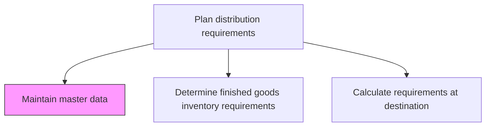
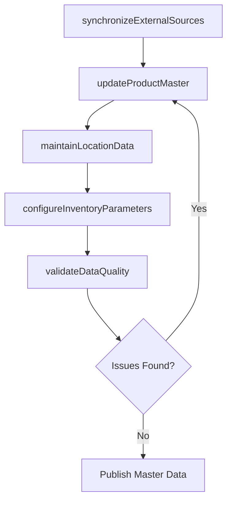

# Maintain master data

> Business-as-Code definition for maintaining distribution master data. Models the governance of product, location, and inventory parameter data that drives distribution requirements planning.

## Overview

Maintaining and preserving the master data plan for distribution requirements. Create a systematic collection of facts and figures regarding the distribution of the inventories. Maintain policies, processes, and tools covering the distribution function.

## Process Hierarchy



## GraphDL

```yaml
maintain:
  object: Master Data
  actor: DataSteward
  result: ValidatedMasterData
```

## Actions

| Action | Description |
|--------|-------------|
| updateProductMaster | Maintain product attributes, dimensions, weight, and packaging specifications |
| maintainLocationData | Keep distribution center, warehouse, and customer location records current |
| configureInventoryParameters | Set reorder points, safety stock levels, and lead times per SKU-location |
| validateDataQuality | Run data quality checks to identify missing, duplicate, or inconsistent records |
| synchronizeExternalSources | Integrate master data updates from ERP, WMS, and partner systems |

## Events

| Event | Description |
|-------|-------------|
| productMasterUpdated | Product master data records modified and published |
| locationDataMaintained | Distribution location records updated and verified |
| inventoryParametersConfigured | Inventory planning parameters set for SKU-location combinations |
| dataQualityValidated | Master data quality audit completed with issues flagged |
| externalSourcesSynchronized | Master data synchronized with external enterprise systems |

## Searches

| Search | Description |
|--------|-------------|
| findDataAnomalies | Identify master data records with quality issues or missing fields |
| getProductMaster | Retrieve product master data by SKU, category, or product family |
| getLocationHierarchy | Query distribution locations and their parent-child relationships |
| getInventoryParameters | Retrieve planning parameters for a specific SKU-location pair |

## Process Flow



## RACI Matrix

| Activity | Responsible | Accountable | Consulted | Informed |
|----------|-------------|-------------|-----------|----------|
| updateProductMaster | DataSteward | VP SupplyChain | ProductManagement | Warehousing |
| configureInventoryParameters | DistributionPlanner | VP Logistics | DemandPlanning | Finance |
| validateDataQuality | DataSteward | IT Manager | SupplyChain | Operations |

## Related Processes

| Process | Relationship |
|---------|-------------|
| 4.1.6.2 Determine finished goods inventory requirements at destination | Downstream - master data drives inventory requirement calculations |
| 4.1.6.4 Calculate requirements at destination | Downstream - location and product data used in calculations |
| 4.4.3 Operate warehousing | Downstream - warehouse operations depend on accurate master data |

## Related Departments

| Department | Role |
|-----------|------|
| Supply Chain Data Management | Primary owner of distribution master data |
| IT | Maintains integration pipelines and data platforms |
| Warehousing | Consumes location and product data for operations |
| Demand Planning | Uses master data for forecast segmentation |

## Related Occupations

| Occupation | Involvement |
|-----------|-------------|
| Data Steward | Maintains and validates master data records |
| Distribution Planner | Configures inventory planning parameters |
| Systems Analyst | Manages data integration and synchronization |

## KPIs

| KPI | Description | Unit |
|-----|-------------|------|
| Data Accuracy Rate | Percentage of master data records passing quality validation | % |
| Sync Latency | Average time lag between source system update and master data reflection | Minutes |
| Data Completeness | Percentage of required fields populated across all records | % |

## Usage

```typescript
import { maintainMasterData } from '@headlessly/maintain-master-data'

const masterData = maintainMasterData()

// Validate data quality across distribution master data
const auditResults = await masterData.validateDataQuality({
  scope: 'distribution',
  checks: ['completeness', 'duplicates', 'referential-integrity']
})

// Update inventory parameters for a product-location
await masterData.configureInventoryParameters({
  sku: 'WIDGET-A',
  locationId: 'dc-northeast',
  safetyStock: 500,
  reorderPoint: 1200,
  leadTimeDays: 5
})
```
