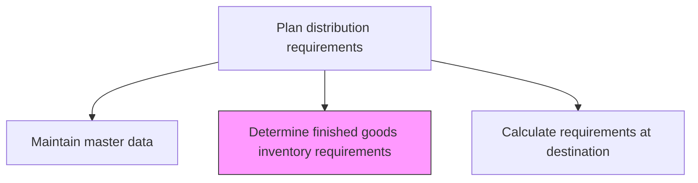
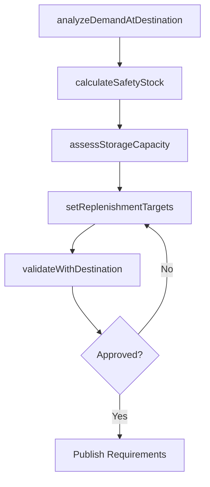

# Determine finished goods inventory requirements at destination

> Business-as-Code definition for determining finished goods inventory requirements at destination. Models the process of calculating what inventory levels are needed at each destination point to meet customer service targets.

## Overview

Interact with the concerned person at the destination to validate the requirements and to avoid any miscommunication of information.

## Process Hierarchy



## GraphDL

```yaml
determine:
  object: Finished Goods Inventory Requirements At Destination
  actor: DistributionPlanner
  result: InventoryRequirementPlan
```

## Actions

| Action | Description |
|--------|-------------|
| analyzeDemandAtDestination | Review demand forecasts and order history for each destination location |
| calculateSafetyStock | Compute safety stock levels based on demand variability and service targets |
| assessStorageCapacity | Evaluate physical storage capacity constraints at each destination |
| setReplenishmentTargets | Define minimum and maximum inventory levels for each SKU-destination pair |
| validateWithDestination | Confirm requirements with destination site managers to ensure alignment |

## Events

| Event | Description |
|-------|-------------|
| demandAtDestinationAnalyzed | Destination-level demand patterns reviewed and documented |
| safetyStockCalculated | Safety stock levels computed for all SKU-destination combinations |
| storageCapacityAssessed | Physical storage constraints evaluated at destination facilities |
| replenishmentTargetsSet | Min/max inventory levels defined and approved |
| requirementsValidated | Inventory requirements confirmed with destination stakeholders |

## Searches

| Search | Description |
|--------|-------------|
| getDestinationDemand | Retrieve demand forecast and order history for a specific destination |
| findUnderStockedLocations | Identify destinations where current inventory falls below requirements |
| getStorageUtilization | Query storage capacity usage at destination facilities |

## Process Flow



## RACI Matrix

| Activity | Responsible | Accountable | Consulted | Informed |
|----------|-------------|-------------|-----------|----------|
| analyzeDemandAtDestination | DistributionPlanner | VP Logistics | DemandPlanning | Sales |
| calculateSafetyStock | InventoryAnalyst | VP SupplyChain | Finance | Warehousing |
| validateWithDestination | DistributionPlanner | VP Logistics | DestinationManagers | Procurement |

## Related Processes

| Process | Relationship |
|---------|-------------|
| 4.1.6.1 Maintain master data | Upstream - master data provides product and location parameters |
| 4.1.6.4 Calculate requirements at destination | Downstream - requirements feed into destination calculations |
| 4.1.3 Manage demand for products | Upstream - demand forecast is key input |

## Related Departments

| Department | Role |
|-----------|------|
| Distribution Planning | Primary owner of destination inventory requirements |
| Demand Planning | Provides demand forecasts by location |
| Warehousing | Provides storage capacity constraints |
| Sales | Provides customer service level requirements |

## Related Occupations

| Occupation | Involvement |
|-----------|-------------|
| Distribution Planner | Calculates and validates inventory requirements |
| Inventory Analyst | Computes safety stock and replenishment parameters |
| Warehouse Manager | Validates storage capacity constraints |

## KPIs

| KPI | Description | Unit |
|-----|-------------|------|
| Service Level Achievement | Percentage of destinations meeting target service levels | % |
| Inventory Turns at Destination | Annual turnover rate of finished goods at destination | Turns/Year |
| Stockout Frequency | Number of stockout events per destination per period | Count/Month |

## Usage

```typescript
import { determineFinishedGoodsInventoryRequirementsAtDestination } from '@headlessly/determine-finished-goods-inventory-requirements-at-destination'

const requirements = determineFinishedGoodsInventoryRequirementsAtDestination()

// Analyze demand patterns at a distribution center
const demand = await requirements.analyzeDemandAtDestination({
  destinationId: 'dc-southeast',
  lookbackMonths: 12,
  productFamily: 'consumer-goods'
})

// Calculate safety stock based on service targets
const safetyStock = await requirements.calculateSafetyStock({
  destinationId: 'dc-southeast',
  targetServiceLevel: 0.97,
  demandAnalysisId: demand.id
})
```
