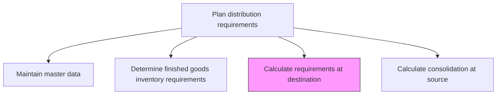
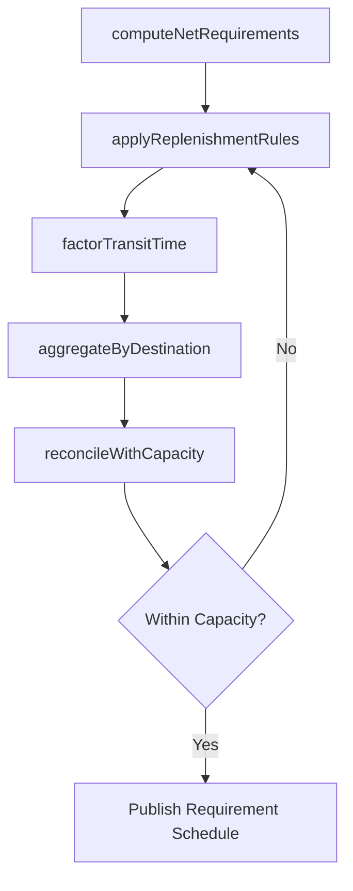

# Calculate requirements at destination

> Business-as-Code definition for calculating distribution requirements at destination. Models the mathematical computation of replenishment quantities needed at each destination based on demand, inventory, and transit data.

## Overview

Interact with the concerned authority at the destination to reach a specific figure that correctly represents requirements.

## Process Hierarchy



## GraphDL

```yaml
calculate:
  object: Requirements At Destination
  actor: DistributionPlanner
  result: DestinationRequirementSchedule
```

## Actions

| Action | Description |
|--------|-------------|
| computeNetRequirements | Calculate net replenishment needs by subtracting on-hand and in-transit from gross demand |
| applyReplenishmentRules | Apply lot sizing, order frequency, and minimum order quantity rules |
| factorTransitTime | Incorporate lead times and transit durations into requirement timing |
| aggregateByDestination | Roll up SKU-level requirements into destination-level shipment plans |
| reconcileWithCapacity | Adjust requirements to fit destination receiving and storage capacity |

## Events

| Event | Description |
|-------|-------------|
| netRequirementsComputed | Net replenishment quantities calculated for all SKU-destination pairs |
| replenishmentRulesApplied | Lot sizing and order frequency rules applied to net requirements |
| transitTimeFactored | Lead times and transit durations incorporated into schedule |
| requirementsAggregated | SKU-level requirements rolled up to destination shipment plan |
| capacityReconciled | Requirements adjusted to destination receiving capacity |

## Searches

| Search | Description |
|--------|-------------|
| getNetRequirements | Retrieve net replenishment needs by SKU and destination |
| getInTransitInventory | Query shipments currently in transit to a destination |
| getDestinationSchedule | Retrieve the planned replenishment schedule for a destination |

## Process Flow



## RACI Matrix

| Activity | Responsible | Accountable | Consulted | Informed |
|----------|-------------|-------------|-----------|----------|
| computeNetRequirements | DistributionPlanner | VP Logistics | InventoryAnalyst | Warehousing |
| applyReplenishmentRules | InventoryAnalyst | VP SupplyChain | Finance | Procurement |
| reconcileWithCapacity | DistributionPlanner | VP Logistics | WarehouseManager | Transportation |

## Related Processes

| Process | Relationship |
|---------|-------------|
| 4.1.6.2 Determine finished goods inventory requirements at destination | Upstream - target inventory levels drive net requirement calculation |
| 4.1.6.5 Calculate consolidation at source | Downstream - destination requirements feed source consolidation |
| 4.1.6.7 Calculate and optimize destination dispatch plan | Downstream - requirements schedule drives dispatch planning |

## Related Departments

| Department | Role |
|-----------|------|
| Distribution Planning | Primary owner of requirement calculations |
| Inventory Management | Provides on-hand and in-transit data |
| Warehousing | Confirms receiving capacity at destinations |

## Related Occupations

| Occupation | Involvement |
|-----------|-------------|
| Distribution Planner | Runs requirement calculations and validates outputs |
| Inventory Analyst | Provides inventory position data and applies rules |
| Logistics Coordinator | Supplies transit time and shipping schedule data |

## KPIs

| KPI | Description | Unit |
|-----|-------------|------|
| Requirement Accuracy | Percentage of calculated requirements matching actual consumption | % |
| Fill Rate | Percentage of destination demand fulfilled from planned replenishments | % |
| Calculation Cycle Time | Time to complete a full requirement calculation run | Hours |

## Usage

```typescript
import { calculateRequirementsAtDestination } from '@headlessly/calculate-requirements-at-destination'

const calc = calculateRequirementsAtDestination()

// Compute net replenishment requirements
const netReqs = await calc.computeNetRequirements({
  destinationId: 'dc-west',
  planningHorizon: { weeks: 8 },
  includeInTransit: true
})

// Apply replenishment rules and generate schedule
const schedule = await calc.applyReplenishmentRules({
  netRequirementsId: netReqs.id,
  lotSizingMethod: 'economic-order-quantity',
  minOrderQuantity: 100
})
```
