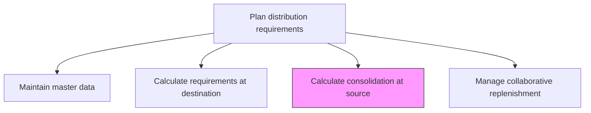
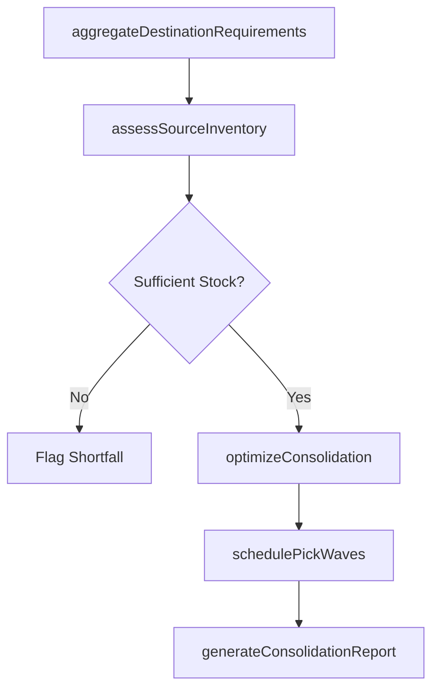

# Calculate consolidation at source

> Business-as-Code definition for calculating source consolidation. Models the aggregation of outbound shipment requirements from multiple destinations into optimized source-level dispatch quantities.

## Overview

Determining the aggregate volume of products/services consolidated at the source. Calculate the number of finished products that are ready to be delivered to the customers, particularly at one date.

## Process Hierarchy



## GraphDL

```yaml
calculate:
  object: Consolidation At Source
  actor: DistributionPlanner
  result: SourceConsolidationPlan
```

## Actions

| Action | Description |
|--------|-------------|
| aggregateDestinationRequirements | Sum outbound requirements across all destinations served by a source |
| assessSourceInventory | Evaluate finished goods availability at the source location |
| optimizeConsolidation | Group shipments to maximize load utilization and minimize transportation cost |
| schedulePickWaves | Plan warehouse pick waves aligned with consolidated shipment groups |
| generateConsolidationReport | Produce summary of consolidated volumes by source and shipping date |

## Events

| Event | Description |
|-------|-------------|
| destinationRequirementsAggregated | All destination requirements rolled up to source level |
| sourceInventoryAssessed | Available finished goods at source evaluated against requirements |
| consolidationOptimized | Shipment groupings optimized for cost and load efficiency |
| pickWavesScheduled | Warehouse pick wave plan created for consolidated shipments |
| consolidationReportGenerated | Source consolidation summary published for review |

## Searches

| Search | Description |
|--------|-------------|
| getSourceDemand | Retrieve aggregated outbound demand by source location and date |
| getSourceInventoryPosition | Query finished goods on-hand at a specific source facility |
| getConsolidationPlan | Retrieve the current consolidation groupings for a source |

## Process Flow



## RACI Matrix

| Activity | Responsible | Accountable | Consulted | Informed |
|----------|-------------|-------------|-----------|----------|
| aggregateDestinationRequirements | DistributionPlanner | VP Logistics | InventoryManagement | Sales |
| optimizeConsolidation | LogisticsAnalyst | VP Logistics | Transportation, Warehousing | Finance |
| schedulePickWaves | WarehouseManager | VP Logistics | DistributionPlanning | Carriers |

## Related Processes

| Process | Relationship |
|---------|-------------|
| 4.1.6.4 Calculate requirements at destination | Upstream - destination requirements are input to consolidation |
| 4.1.6.7 Calculate and optimize destination dispatch plan | Downstream - consolidation feeds dispatch planning |
| 4.4.3 Operate warehousing | Downstream - pick wave schedules drive warehouse operations |

## Related Departments

| Department | Role |
|-----------|------|
| Distribution Planning | Primary owner of source consolidation calculations |
| Warehousing | Executes pick waves based on consolidation plan |
| Transportation | Plans carrier assignments for consolidated shipments |

## Related Occupations

| Occupation | Involvement |
|-----------|-------------|
| Distribution Planner | Aggregates requirements and manages consolidation plan |
| Logistics Analyst | Optimizes shipment groupings for cost efficiency |
| Warehouse Manager | Schedules pick operations based on consolidation output |

## KPIs

| KPI | Description | Unit |
|-----|-------------|------|
| Load Utilization Rate | Percentage of available truck/container capacity used per shipment | % |
| Consolidation Savings | Transportation cost reduction from shipment consolidation | USD/Month |
| Source Fill Rate | Percentage of consolidated requirements fulfilled from source inventory | % |

## Usage

```typescript
import { calculateConsolidationAtSource } from '@headlessly/calculate-consolidation-at-source'

const consolidation = calculateConsolidationAtSource()

// Aggregate destination requirements at source
const aggregated = await consolidation.aggregateDestinationRequirements({
  sourceId: 'plant-midwest',
  shippingDate: '2025-08-01',
  destinations: ['dc-east', 'dc-south', 'dc-west']
})

// Optimize consolidation groupings
const plan = await consolidation.optimizeConsolidation({
  aggregatedId: aggregated.id,
  optimizeFor: 'cost',
  maxLoadWeight: 44000
})
```
