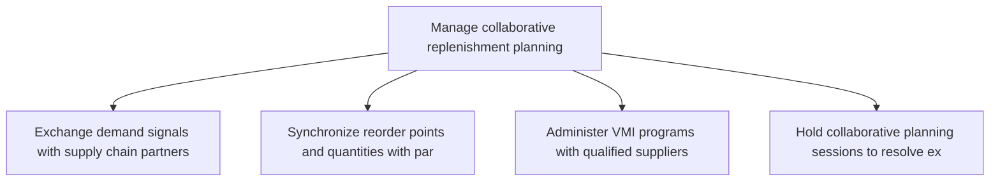
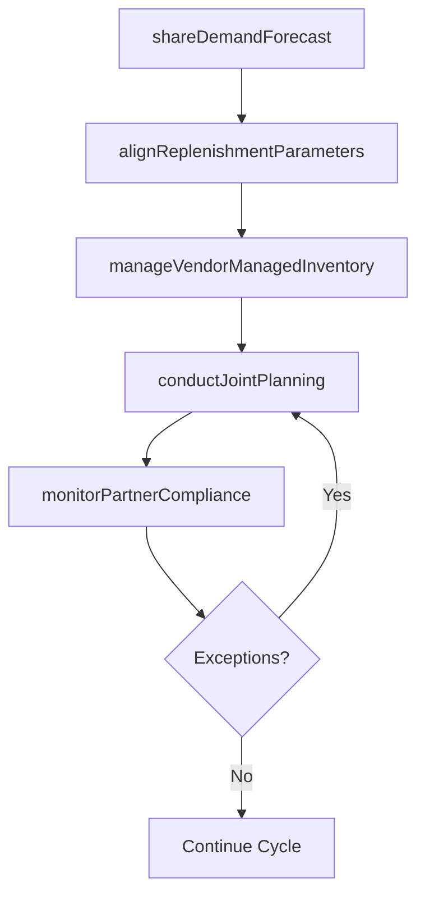

# Manage collaborative replenishment planning

> Business-as-Code definition for collaborative replenishment planning. Models vendor-managed inventory, CPFR processes, and joint demand visibility with supply chain partners.

## Overview

Administering the plan for collaborative replenishment of goods. Replenish inventory by creating a plan in case of faulty production.

## Process Hierarchy



## GraphDL

```yaml
manage:
  object: Collaborative Replenishment Planning
  actor: CollaborativePlanningManager
  result: CollaborativeReplenishmentPlan
```

## Actions

| Action | Description |
|--------|-------------|
| shareDemandForecast | Exchange demand signals with supply chain partners |
| alignReplenishmentParameters | Synchronize reorder points and quantities with partners |
| manageVendorManagedInventory | Administer VMI programs with qualified suppliers |
| conductJointPlanning | Hold collaborative planning sessions to resolve exceptions |
| monitorPartnerCompliance | Track partner adherence to agreed replenishment terms |

## Events

| Event | Description |
|-------|-------------|
| demandForecastShared | Demand forecast exchanged with supply chain partners |
| replenishmentParametersAligned | Reorder points and quantities synchronized |
| vmiProgramManaged | Vendor-managed inventory transactions processed |
| jointPlanningCompleted | Collaborative planning session held and actions agreed |
| partnerComplianceMonitored | Partner replenishment performance assessed |

## Searches

| Search | Description |
|--------|-------------|
| getSharedForecasts | Retrieve demand forecasts exchanged with partners |
| getVMIStatus | Query vendor-managed inventory levels and replenishment activity |
| getPartnerScorecard | Retrieve collaborative planning partner performance data |

## Process Flow



## RACI Matrix

| Activity | Responsible | Accountable | Consulted | Informed |
|----------|-------------|-------------|-----------|----------|
| shareDemandForecast | CollaborativePlanningManager | VP SupplyChain | Sales, Partners | Finance |
| manageVendorManagedInventory | InventoryPlanner | CollaborativePlanningManager | Procurement, Suppliers | Warehouse |
| conductJointPlanning | CollaborativePlanningManager | VP SupplyChain | Sales, Operations | Executive |

## Related Processes

| Process | Relationship |
|---------|-------------|
| 4.1.6.2 Determine finished goods inventory requirements at destination | Upstream - inventory requirements inform collaborative plans |
| 4.2.5 Manage suppliers | Parallel - supplier relationships enable VMI and CPFR |
| 4.1.6.8 Manage dispatch plan attainment | Downstream - collaborative plans feed dispatch execution |

## Related Departments

| Department | Role |
|-----------|------|
| Supply Chain Planning | Primary owner of collaborative planning processes |
| Procurement | Manages supplier relationships for VMI programs |
| Sales | Provides demand insights for partner collaboration |
| IT | Maintains EDI and data exchange platforms |

## Related Occupations

| Occupation | Involvement |
|-----------|-------------|
| Collaborative Planning Manager | CPFR process management and partner coordination |
| VMI Coordinator | Vendor-managed inventory administration |
| Supply Chain Analyst | Partner performance analysis and exception management |

## KPIs

| KPI | Description | Unit |
|-----|-------------|------|
| Forecast Sharing Timeliness | Percentage of forecasts shared by agreed deadline | % |
| VMI Fill Rate | Percentage of VMI replenishments fulfilled on time | % |
| Partner Compliance Rate | Percentage of partners meeting agreed replenishment terms | % |

## Usage

```typescript
import { manageCollaborativeReplenishmentPlanning } from '@headlessly/manage-collaborative-replenishment-planning'

const client = manageCollaborativeReplenishmentPlanning()

// Share demand forecast with a partner
const shared = await client.shareDemandForecast({
  partnerId: 'supplier-acme',
  productFamily: 'raw-materials',
  horizon: { weeks: 12 },
  format: 'CPFR-standard'
})

// Monitor partner compliance
const scorecard = await client.monitorPartnerCompliance({
  partnerId: 'supplier-acme',
  period: 'Q2-2025',
  metrics: ['on-time-replenishment', 'fill-rate', 'forecast-accuracy']
})
```
