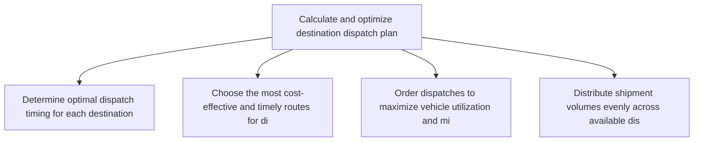
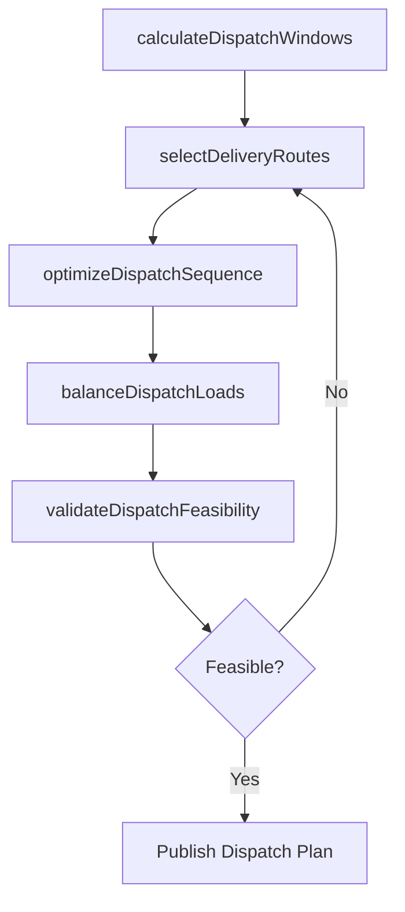

# Calculate and optimize destination dispatch plan

> Business-as-Code definition for destination dispatch plan optimization. Models dispatch timing, route selection, and delivery scheduling as programmable workflows.

## Overview

Estimating the timing and duration of the delivery of the inventory from the source to the destination. Plan the logistic details of all the distribution routes and activities.

## Process Hierarchy



## GraphDL

```yaml
calculate:
  object: And Optimize Destination Dispatch Plan
  actor: DispatchPlanner
  result: OptimizedDispatchPlan
```

## Actions

| Action | Description |
|--------|-------------|
| calculateDispatchWindows | Determine optimal dispatch timing for each destination based on transit times |
| selectDeliveryRoutes | Choose the most cost-effective and timely routes for dispatches |
| optimizeDispatchSequence | Order dispatches to maximize vehicle utilization and minimize wait times |
| balanceDispatchLoads | Distribute shipment volumes evenly across available dispatch windows |
| validateDispatchFeasibility | Verify that dispatch plans meet carrier capacity and destination constraints |

## Events

| Event | Description |
|-------|-------------|
| dispatchWindowsCalculated | Optimal dispatch timing determined for all destinations |
| deliveryRoutesSelected | Routes chosen for all planned dispatches |
| dispatchSequenceOptimized | Dispatch ordering finalized for maximum efficiency |
| dispatchLoadsBalanced | Shipment volumes distributed across dispatch windows |
| dispatchFeasibilityValidated | Dispatch plan verified against all constraints |

## Searches

| Search | Description |
|--------|-------------|
| getDispatchSchedule | Retrieve planned dispatch schedule by destination and date |
| findRouteAlternatives | Query alternative routes for a given origin-destination pair |
| getDispatchCapacity | Check available dispatch capacity by time window |

## Process Flow



## RACI Matrix

| Activity | Responsible | Accountable | Consulted | Informed |
|----------|-------------|-------------|-----------|----------|
| calculateDispatchWindows | DispatchPlanner | TransportationManager | Logistics, Warehouse | Sales |
| selectDeliveryRoutes | DispatchPlanner | TransportationManager | Carrier | Finance |
| validateDispatchFeasibility | DispatchPlanner | VP Logistics | Operations | CustomerService |

## Related Processes

| Process | Relationship |
|---------|-------------|
| 4.1.6.4 Calculate consolidation at source | Upstream - consolidation informs dispatch volumes |
| 4.1.6.8 Manage dispatch plan attainment | Downstream - dispatch plan is tracked for attainment |
| 4.4.4 Operate outbound transportation | Downstream - dispatch plan drives outbound operations |

## Related Departments

| Department | Role |
|-----------|------|
| Transportation Planning | Primary owner of dispatch optimization |
| Warehousing | Coordinates staging for dispatch windows |
| Customer Service | Communicates delivery commitments to customers |

## Related Occupations

| Occupation | Involvement |
|-----------|-------------|
| Dispatch Planner | Dispatch scheduling and route optimization |
| Transportation Coordinator | Carrier coordination and capacity management |
| Logistics Analyst | Route analysis and cost optimization |

## KPIs

| KPI | Description | Unit |
|-----|-------------|------|
| Dispatch On-Time Rate | Percentage of dispatches departing within planned window | % |
| Route Optimization Savings | Cost reduction achieved through route optimization | Currency |
| Vehicle Utilization | Average percentage of vehicle capacity used per dispatch | % |

## Usage

```typescript
import { calculateAndOptimizeDestinationDispatchPlan } from '@headlessly/calculate-and-optimize-destination-dispatch-plan'

const client = calculateAndOptimizeDestinationDispatchPlan()

// Calculate dispatch windows for destinations
const windows = await client.calculateDispatchWindows({
  originWarehouse: 'WH-central',
  destinations: ['DC-east', 'DC-south', 'DC-west'],
  maxTransitDays: 3
})

// Optimize dispatch sequence
const plan = await client.optimizeDispatchSequence({
  dispatchWindowId: windows.id,
  objective: 'minimize-cost',
  carrierPreferences: ['preferred-carrier-A']
})
```
