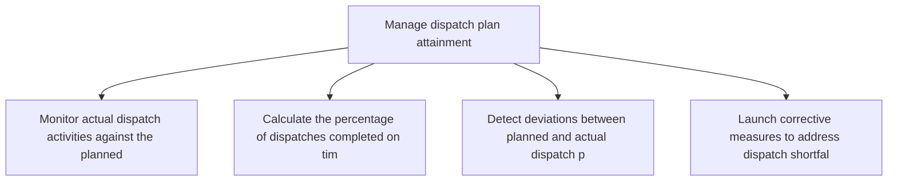
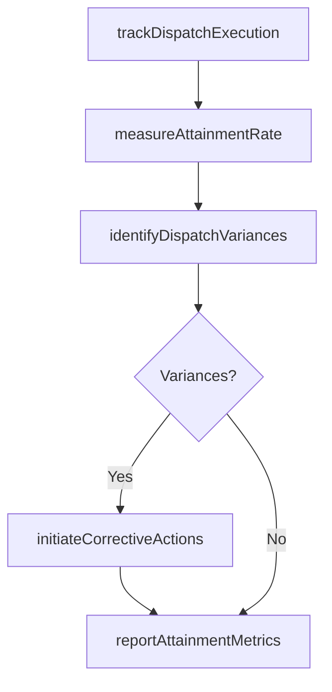

# Manage dispatch plan attainment

> Business-as-Code definition for dispatch plan attainment management. Models dispatch execution tracking, variance analysis, and corrective action as programmable workflows.

## Overview

Accomplishing the dispatch plan. Strictly follow the schedule, and adjust for deviations. Coordinate with the concerned authorities at various destinations.

## Process Hierarchy



## GraphDL

```yaml
manage:
  object: Dispatch Plan Attainment
  actor: DispatchCoordinator
  result: DispatchAttainmentReport
```

## Actions

| Action | Description |
|--------|-------------|
| trackDispatchExecution | Monitor actual dispatch activities against the planned schedule |
| measureAttainmentRate | Calculate the percentage of dispatches completed on time and in full |
| identifyDispatchVariances | Detect deviations between planned and actual dispatch performance |
| initiateCorrectiveActions | Launch corrective measures to address dispatch shortfalls |
| reportAttainmentMetrics | Generate and distribute dispatch attainment performance reports |

## Events

| Event | Description |
|-------|-------------|
| dispatchExecutionTracked | Actual dispatch activities logged against the plan |
| attainmentRateMeasured | Dispatch completion rate calculated for the period |
| dispatchVariancesIdentified | Deviations from dispatch plan detected and categorized |
| correctiveActionsInitiated | Corrective measures launched to close dispatch gaps |
| attainmentMetricsReported | Dispatch attainment report distributed to stakeholders |

## Searches

| Search | Description |
|--------|-------------|
| getAttainmentDashboard | Retrieve real-time dispatch attainment metrics |
| findDispatchDelays | Query dispatches that missed their planned window |
| getCorrectiveActionLog | List corrective actions by status and dispatch |

## Process Flow



## RACI Matrix

| Activity | Responsible | Accountable | Consulted | Informed |
|----------|-------------|-------------|-----------|----------|
| trackDispatchExecution | DispatchCoordinator | TransportationManager | Warehouse | Logistics |
| measureAttainmentRate | DispatchCoordinator | TransportationManager | Finance | Operations |
| initiateCorrectiveActions | TransportationManager | VP Logistics | Carrier, Warehouse | Executive |

## Related Processes

| Process | Relationship |
|---------|-------------|
| 4.1.6.7 Calculate and optimize destination dispatch plan | Upstream - dispatch plan provides the baseline to track |
| 4.4.4 Operate outbound transportation | Parallel - outbound operations execute the dispatch plan |
| 4.1.6.9 Calculate and optimize destination load plans | Parallel - load plan performance affects attainment |

## Related Departments

| Department | Role |
|-----------|------|
| Transportation | Primary owner of dispatch execution and attainment |
| Warehousing | Staging and readiness for on-time dispatch |
| Customer Service | Manages delivery expectations based on attainment |

## Related Occupations

| Occupation | Involvement |
|-----------|-------------|
| Dispatch Coordinator | Execution tracking and variance reporting |
| Transportation Manager | Corrective action and performance oversight |
| Logistics Analyst | Attainment data analysis and root cause investigation |

## KPIs

| KPI | Description | Unit |
|-----|-------------|------|
| Dispatch Attainment Rate | Percentage of planned dispatches completed on time | % |
| Variance Resolution Time | Average time to resolve dispatch deviations | Hours |
| Corrective Action Effectiveness | Percentage of corrective actions that prevent recurrence | % |

## Usage

```typescript
import { manageDispatchPlanAttainment } from '@headlessly/manage-dispatch-plan-attainment'

const client = manageDispatchPlanAttainment()

// Track dispatch execution against plan
const tracking = await client.trackDispatchExecution({
  planId: 'DISP-2025-0601',
  period: '2025-06-01',
  includeCarrierData: true
})

// Measure attainment rate
const attainment = await client.measureAttainmentRate({
  period: 'week-23-2025',
  byDestination: true
})
```
