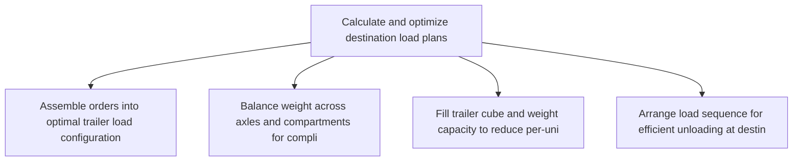
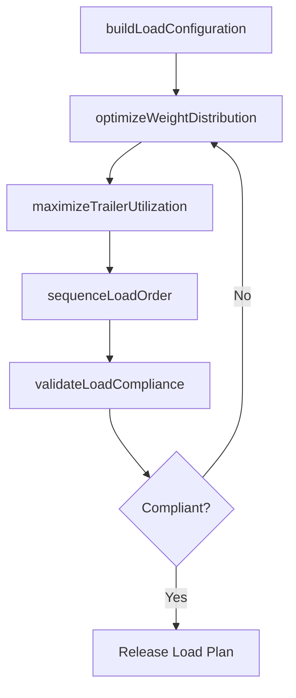

# Calculate and optimize destination load plans

> Business-as-Code definition for destination load plan optimization. Models load building, weight distribution, and trailer utilization maximization as programmable workflows.

## Overview

Evaluating the plans for delivering loads to destinations. Create a systematic plan that specifies the load plans for every single destination.

## Process Hierarchy



## GraphDL

```yaml
calculate:
  object: And Optimize Destination Load Plans
  actor: LoadPlanner
  result: OptimizedLoadPlan
```

## Actions

| Action | Description |
|--------|-------------|
| buildLoadConfiguration | Assemble orders into optimal trailer load configurations |
| optimizeWeightDistribution | Balance weight across axles and compartments for compliance |
| maximizeTrailerUtilization | Fill trailer cube and weight capacity to reduce per-unit costs |
| sequenceLoadOrder | Arrange load sequence for efficient unloading at destination |
| validateLoadCompliance | Verify load plans meet DOT weight limits and safety regulations |

## Events

| Event | Description |
|-------|-------------|
| loadConfigurationBuilt | Orders assembled into trailer load configurations |
| weightDistributionOptimized | Load weight balanced for regulatory compliance |
| trailerUtilizationMaximized | Trailer capacity usage optimized for cost efficiency |
| loadOrderSequenced | Unloading sequence established for each destination stop |
| loadComplianceValidated | Load plans verified against weight and safety regulations |

## Searches

| Search | Description |
|--------|-------------|
| getLoadPlan | Retrieve load plan details by trailer, destination, or date |
| findUnderutilizedLoads | Identify loads with below-target trailer utilization |
| getLoadComplianceStatus | Check regulatory compliance status for planned loads |

## Process Flow



## RACI Matrix

| Activity | Responsible | Accountable | Consulted | Informed |
|----------|-------------|-------------|-----------|----------|
| buildLoadConfiguration | LoadPlanner | TransportationManager | Warehouse | Finance |
| optimizeWeightDistribution | LoadPlanner | TransportationManager | Safety | Carrier |
| validateLoadCompliance | LoadPlanner | TransportationManager | Compliance, Safety | Operations |

## Related Processes

| Process | Relationship |
|---------|-------------|
| 4.1.6.7 Calculate and optimize destination dispatch plan | Upstream - dispatch plan defines which orders to load |
| 4.1.6.10 Manage partner load plan | Parallel - partner loads follow similar optimization |
| 4.4.4 Operate outbound transportation | Downstream - load plans guide physical loading operations |

## Related Departments

| Department | Role |
|-----------|------|
| Transportation Planning | Primary owner of load optimization |
| Warehousing | Executes physical loading per the plan |
| Safety and Compliance | Validates load weight and regulatory compliance |

## Related Occupations

| Occupation | Involvement |
|-----------|-------------|
| Load Planner | Load building and utilization optimization |
| Transportation Coordinator | Carrier assignment and scheduling |
| Warehouse Supervisor | Physical loading execution oversight |

## KPIs

| KPI | Description | Unit |
|-----|-------------|------|
| Trailer Utilization Rate | Average percentage of trailer cube capacity used | % |
| Weight Compliance Rate | Percentage of loads meeting DOT weight regulations | % |
| Cost per Cubic Meter | Average transportation cost per cubic meter shipped | Currency |

## Usage

```typescript
import { calculateAndOptimizeDestinationLoadPlans } from '@headlessly/calculate-and-optimize-destination-load-plans'

const client = calculateAndOptimizeDestinationLoadPlans()

// Build load configuration for a destination
const load = await client.buildLoadConfiguration({
  destinationId: 'DC-southeast',
  orders: ['ORD-001', 'ORD-002', 'ORD-003'],
  trailerType: '53-ft-dry'
})

// Validate load compliance
const compliance = await client.validateLoadCompliance({
  loadId: load.id,
  regulations: ['DOT-weight', 'hazmat-segregation']
})
```
