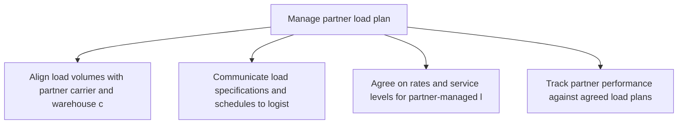
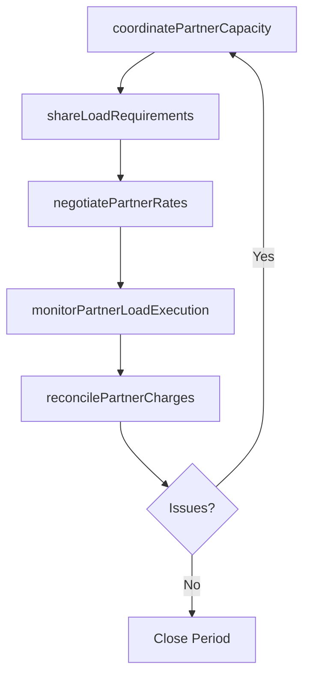

# Manage partner load plan

> Business-as-Code definition for partner load plan management. Models third-party logistics load coordination, partner capacity alignment, and collaborative shipment planning as programmable workflows.

## Overview

Administering the load plan for partners. Manage the delivery, and dispatch from the source to the partners.

## Process Hierarchy



## GraphDL

```yaml
manage:
  object: Partner Load Plan
  actor: PartnerLogisticsCoordinator
  result: PartnerLoadAgreement
```

## Actions

| Action | Description |
|--------|-------------|
| coordinatePartnerCapacity | Align load volumes with partner carrier and warehouse capacity |
| shareLoadRequirements | Communicate load specifications and schedules to logistics partners |
| negotiatePartnerRates | Agree on rates and service levels for partner-managed loads |
| monitorPartnerLoadExecution | Track partner performance against agreed load plans |
| reconcilePartnerCharges | Verify partner invoices against contracted rates and actual volumes |

## Events

| Event | Description |
|-------|-------------|
| partnerCapacityCoordinated | Load volumes aligned with partner capacity |
| loadRequirementsShared | Load specifications communicated to partners |
| partnerRatesNegotiated | Rates and service levels agreed with partner |
| partnerLoadExecutionMonitored | Partner load performance tracked and assessed |
| partnerChargesReconciled | Partner invoices verified against contracts |

## Searches

| Search | Description |
|--------|-------------|
| getPartnerLoadSchedule | Retrieve partner load plans by carrier and date |
| getPartnerPerformance | Query partner delivery and service level metrics |
| findPartnerCapacityGaps | Identify periods where partner capacity is insufficient |

## Process Flow



## RACI Matrix

| Activity | Responsible | Accountable | Consulted | Informed |
|----------|-------------|-------------|-----------|----------|
| coordinatePartnerCapacity | PartnerLogisticsCoordinator | TransportationManager | Carrier, Warehouse | Finance |
| negotiatePartnerRates | PartnerLogisticsCoordinator | VP Logistics | Procurement, Legal | Finance |
| reconcilePartnerCharges | FreightAuditor | TransportationManager | Finance, Partner | Accounting |

## Related Processes

| Process | Relationship |
|---------|-------------|
| 4.1.6.9 Calculate and optimize destination load plans | Upstream - own load plans inform partner load requirements |
| 4.4.4 Operate outbound transportation | Downstream - partners execute outbound shipments |
| 4.2.5 Manage suppliers | Parallel - partner relationship management |

## Related Departments

| Department | Role |
|-----------|------|
| Logistics | Primary owner of partner load coordination |
| Procurement | Supports contract negotiation with logistics partners |
| Finance | Manages partner payment reconciliation |

## Related Occupations

| Occupation | Involvement |
|-----------|-------------|
| Partner Logistics Coordinator | Day-to-day partner load management |
| Freight Auditor | Invoice verification and charge reconciliation |
| Contract Manager | Partner rate negotiation and agreement management |

## KPIs

| KPI | Description | Unit |
|-----|-------------|------|
| Partner On-Time Delivery | Percentage of partner-managed loads delivered on schedule | % |
| Partner Cost Variance | Difference between contracted and actual partner charges | % |
| Partner Load Fill Rate | Average utilization of partner-allocated capacity | % |

## Usage

```typescript
import { managePartnerLoadPlan } from '@headlessly/manage-partner-load-plan'

const client = managePartnerLoadPlan()

// Coordinate partner capacity for upcoming period
const capacity = await client.coordinatePartnerCapacity({
  partnerId: 'carrier-fastfreight',
  period: '2025-Q3',
  expectedVolume: { loads: 150, avgWeight: 38000 }
})

// Monitor partner load execution
const performance = await client.monitorPartnerLoadExecution({
  partnerId: 'carrier-fastfreight',
  period: '2025-06',
  metrics: ['on-time-delivery', 'damage-rate', 'load-accuracy']
})
```
