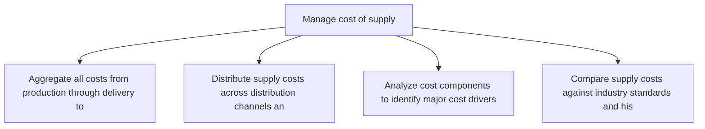
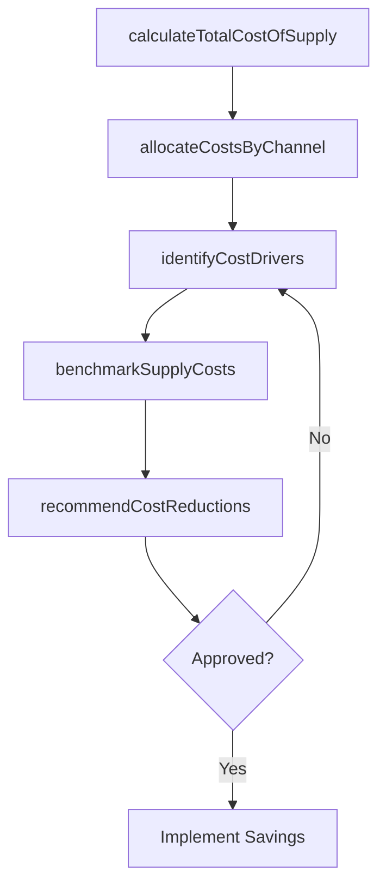

# Manage cost of supply

> Business-as-Code definition for supply cost management. Models total cost of supply analysis, cost allocation, and cost reduction opportunity identification as programmable workflows.

## Overview

Managing all expenses to provide products/services in the market. Estimate the overall cost of supplying of products/inventory, including the cost distributing it through various partners and channels. Consider the cost of all the logistical processes that occur from the moment a product is ready to be dispatched to the time it reaches the destination.

## Process Hierarchy



## GraphDL

```yaml
manage:
  object: Cost Of Supply
  actor: SupplyChainCostAnalyst
  result: SupplyCostAnalysis
```

## Actions

| Action | Description |
|--------|-------------|
| calculateTotalCostOfSupply | Aggregate all costs from production through delivery to destination |
| allocateCostsByChannel | Distribute supply costs across distribution channels and partners |
| identifyCostDrivers | Analyze cost components to identify major cost drivers |
| benchmarkSupplyCosts | Compare supply costs against industry standards and historical data |
| recommendCostReductions | Propose cost optimization opportunities based on analysis |

## Events

| Event | Description |
|-------|-------------|
| totalCostCalculated | End-to-end supply cost aggregation completed |
| costsAllocated | Supply costs distributed across channels and cost centers |
| costDriversIdentified | Major supply cost drivers analyzed and documented |
| supplyCostsBenchmarked | Supply costs compared against benchmarks |
| costReductionsRecommended | Cost optimization opportunities proposed |

## Searches

| Search | Description |
|--------|-------------|
| getSupplyCostBreakdown | Retrieve cost breakdown by component, channel, or product |
| findCostReductionOpportunities | Query identified savings opportunities by category |
| getCostTrends | Retrieve supply cost trends over time periods |

## Process Flow



## RACI Matrix

| Activity | Responsible | Accountable | Consulted | Informed |
|----------|-------------|-------------|-----------|----------|
| calculateTotalCostOfSupply | SupplyChainCostAnalyst | VP SupplyChain | Finance, Logistics | Executive |
| identifyCostDrivers | SupplyChainCostAnalyst | VP SupplyChain | Procurement, Operations | Finance |
| recommendCostReductions | SupplyChainCostAnalyst | VP SupplyChain | Operations, Finance | Executive |

## Related Processes

| Process | Relationship |
|---------|-------------|
| 4.1.6.12 Manage capacity utilization | Parallel - capacity usage affects cost per unit |
| 4.2.1 Provide sourcing governance and perform category management | Upstream - procurement costs are a major supply cost component |
| 4.4.1 Provide logistics governance | Parallel - logistics costs feed into total supply cost |

## Related Departments

| Department | Role |
|-----------|------|
| Supply Chain Finance | Primary owner of supply cost analysis |
| Logistics | Provides transportation and warehousing cost data |
| Procurement | Contributes material and supplier cost information |
| Operations | Provides production cost data |

## Related Occupations

| Occupation | Involvement |
|-----------|-------------|
| Supply Chain Cost Analyst | Cost analysis and benchmarking |
| Financial Analyst | Cost allocation and reporting |
| Logistics Manager | Transportation and distribution cost management |

## KPIs

| KPI | Description | Unit |
|-----|-------------|------|
| Total Cost of Supply | End-to-end cost from production to destination per unit | Currency/Unit |
| Cost-to-Serve | Average cost to fulfill one customer order | Currency |
| Supply Cost Reduction | Year-over-year decrease in supply chain costs | % |

## Usage

```typescript
import { manageCostOfSupply } from '@headlessly/manage-cost-of-supply'

const client = manageCostOfSupply()

// Calculate total cost of supply
const costs = await client.calculateTotalCostOfSupply({
  productFamily: 'consumer-electronics',
  period: 'Q2-2025',
  includeComponents: ['production', 'warehousing', 'transportation', 'duties']
})

// Identify cost drivers
const drivers = await client.identifyCostDrivers({
  costAnalysisId: costs.id,
  topN: 10,
  threshold: 0.05
})
```
