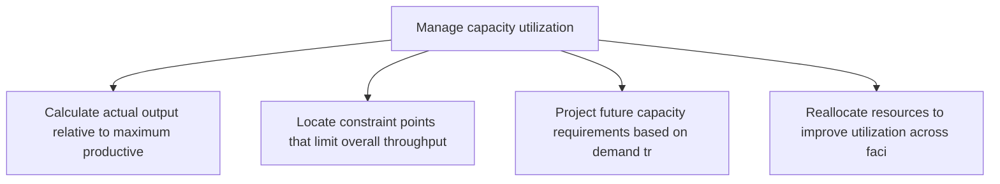
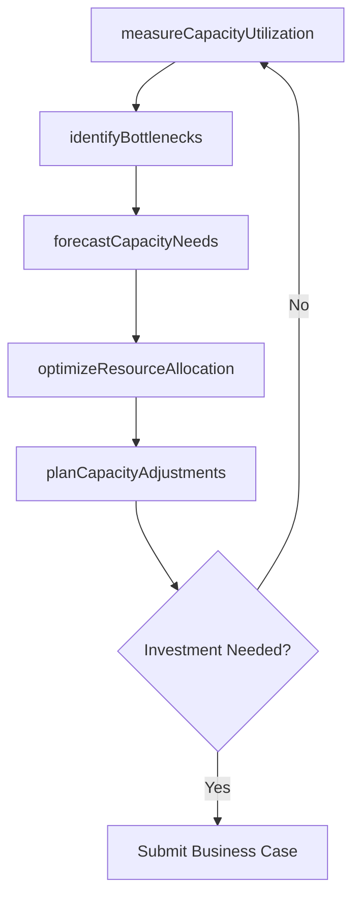

# Manage capacity utilization

> Business-as-Code definition for capacity utilization management. Models capacity measurement, bottleneck identification, and utilization optimization as programmable workflows.

## Overview

Determining the capacity utilization of the organization's production process. Realize the extent to which an enterprise uses its installed productive capacity (i.e., the relationship between output and the potential output if capacity was fully used).

## Process Hierarchy



## GraphDL

```yaml
manage:
  object: Capacity Utilization
  actor: CapacityPlanner
  result: CapacityUtilizationReport
```

## Actions

| Action | Description |
|--------|-------------|
| measureCapacityUtilization | Calculate actual output relative to maximum productive capacity |
| identifyBottlenecks | Locate constraint points that limit overall throughput |
| forecastCapacityNeeds | Project future capacity requirements based on demand trends |
| optimizeResourceAllocation | Reallocate resources to improve utilization across facilities |
| planCapacityAdjustments | Propose capacity expansions, reductions, or shifts between facilities |

## Events

| Event | Description |
|-------|-------------|
| capacityUtilizationMeasured | Utilization rates calculated across all production facilities |
| bottlenecksIdentified | Throughput constraints detected and documented |
| capacityNeedsForecasted | Future capacity requirements projected |
| resourceAllocationOptimized | Resources reallocated for improved utilization |
| capacityAdjustmentsPlanned | Capacity change recommendations prepared |

## Searches

| Search | Description |
|--------|-------------|
| getUtilizationRates | Retrieve capacity utilization by facility, line, or period |
| findBottleneckResources | Identify resources operating above capacity threshold |
| getCapacityForecast | Query projected capacity needs versus available capacity |

## Process Flow



## RACI Matrix

| Activity | Responsible | Accountable | Consulted | Informed |
|----------|-------------|-------------|-----------|----------|
| measureCapacityUtilization | CapacityPlanner | VP Operations | Manufacturing, Finance | Executive |
| identifyBottlenecks | CapacityPlanner | PlantManager | Engineering, Maintenance | Operations |
| planCapacityAdjustments | CapacityPlanner | VP Operations | Finance, Strategy | Executive |

## Related Processes

| Process | Relationship |
|---------|-------------|
| 4.1.5 Create and manage master production schedule | Upstream - MPS drives capacity demand |
| 4.1.6.11 Manage cost of supply | Parallel - utilization directly impacts unit costs |
| 4.3.2 Produce/Assemble product | Downstream - capacity determines production throughput |

## Related Departments

| Department | Role |
|-----------|------|
| Production Planning | Primary owner of capacity measurement and optimization |
| Manufacturing | Provides actual production output and constraint data |
| Finance | Evaluates capital requirements for capacity changes |
| Engineering | Designs solutions for bottleneck elimination |

## Related Occupations

| Occupation | Involvement |
|-----------|-------------|
| Capacity Planner | Utilization measurement and forecasting |
| Industrial Engineer | Bottleneck analysis and process improvement |
| Plant Manager | Facility-level capacity decisions |

## KPIs

| KPI | Description | Unit |
|-----|-------------|------|
| Capacity Utilization Rate | Actual output as percentage of maximum capacity | % |
| Bottleneck Frequency | Number of bottleneck events per production period | Count/Month |
| Capacity Forecast Accuracy | Variance between projected and actual capacity needs | % |

## Usage

```typescript
import { manageCapacityUtilization } from '@headlessly/manage-capacity-utilization'

const client = manageCapacityUtilization()

// Measure capacity utilization across plants
const utilization = await client.measureCapacityUtilization({
  facilities: ['plant-midwest', 'plant-east'],
  period: '2025-05',
  granularity: 'daily'
})

// Identify bottleneck resources
const bottlenecks = await client.identifyBottlenecks({
  facilityId: 'plant-midwest',
  threshold: 0.90,
  includeRootCause: true
})
```
