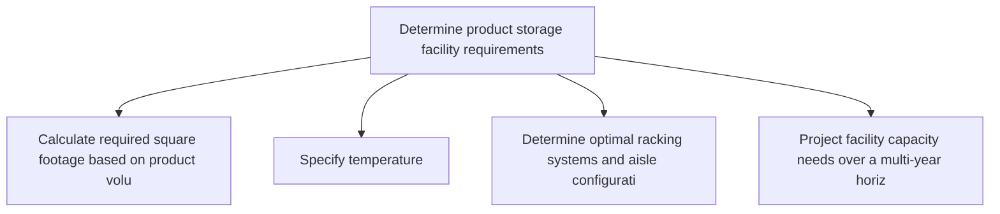
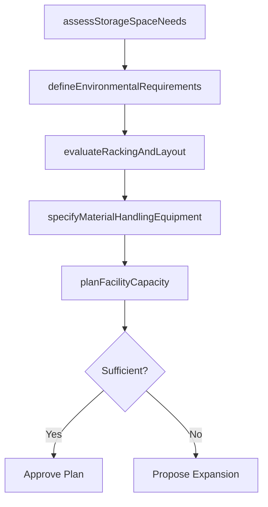

# Determine product storage facility requirements

> Business-as-Code definition for storage facility requirements planning. Models space assessment, environmental controls, and facility capacity planning as programmable workflows.

## Overview

Evaluate constraints, needs, parameters, and conditions for physical storage and retrieval of components or products for future use or shipment in a storage facility within a certain timeframe.

## Process Hierarchy



## GraphDL

```yaml
determine:
  object: Product Storage Facility Requirements
  actor: FacilityPlanner
  result: StorageFacilityPlan
```

## Actions

| Action | Description |
|--------|-------------|
| assessStorageSpaceNeeds | Calculate required square footage based on product volumes and turnover |
| defineEnvironmentalRequirements | Specify temperature, humidity, and hazmat controls for product categories |
| evaluateRackingAndLayout | Determine optimal racking systems and aisle configurations |
| planFacilityCapacity | Project facility capacity needs over a multi-year horizon |
| specifyMaterialHandlingEquipment | Identify forklifts, conveyors, and automation needed for throughput |

## Events

| Event | Description |
|-------|-------------|
| storageSpaceAssessed | Required storage space calculated for all product categories |
| environmentalRequirementsDefined | Storage environmental controls specified |
| rackingAndLayoutEvaluated | Optimal storage layout and racking selected |
| facilityCapacityPlanned | Multi-year facility capacity plan developed |
| handlingEquipmentSpecified | Material handling equipment requirements documented |

## Searches

| Search | Description |
|--------|-------------|
| getSpaceUtilization | Retrieve current warehouse space utilization by zone |
| getFacilityCapacityForecast | Query projected capacity needs versus available space |
| getEnvironmentalCompliance | Check storage areas against environmental requirements |

## Process Flow



## RACI Matrix

| Activity | Responsible | Accountable | Consulted | Informed |
|----------|-------------|-------------|-----------|----------|
| assessStorageSpaceNeeds | FacilityPlanner | WarehouseManager | Operations, Logistics | Finance |
| evaluateRackingAndLayout | FacilityPlanner | WarehouseManager | Engineering, Safety | Operations |
| planFacilityCapacity | FacilityPlanner | VP Logistics | Finance, Strategy | Executive |

## Related Processes

| Process | Relationship |
|---------|-------------|
| 4.1.6.2 Determine finished goods inventory requirements at destination | Upstream - inventory levels drive storage space needs |
| 4.4.3 Operate warehousing | Downstream - facility plans enable warehouse operations |
| 4.1.7 Establish distribution planning constraints | Parallel - facility constraints feed distribution planning |

## Related Departments

| Department | Role |
|-----------|------|
| Facilities Management | Primary owner of storage facility planning |
| Warehousing | Provides operational requirements and throughput data |
| Engineering | Designs racking systems and automation solutions |
| Finance | Approves capital expenditures for facility investments |

## Related Occupations

| Occupation | Involvement |
|-----------|-------------|
| Facility Planner | Space assessment and capacity planning |
| Warehouse Design Engineer | Layout optimization and equipment selection |
| Logistics Manager | Operational requirements definition |

## KPIs

| KPI | Description | Unit |
|-----|-------------|------|
| Space Utilization Rate | Percentage of available warehouse space in use | % |
| Storage Cost per Pallet | Average cost to store one pallet position per month | Currency |
| Facility Readiness Index | Percentage of facility requirements met for planned volumes | % |

## Usage

```typescript
import { determineProductStorageFacilityRequirements } from '@headlessly/determine-product-storage-facility-requirements'

const client = determineProductStorageFacilityRequirements()

// Assess storage space needs for a product category
const spaceNeeds = await client.assessStorageSpaceNeeds({
  productCategory: 'consumer-electronics',
  forecastedVolume: { pallets: 5000, turnoverDays: 30 },
  storageType: 'selective-racking'
})

// Plan facility capacity over a three-year horizon
const plan = await client.planFacilityCapacity({
  facilityId: 'DC-southeast',
  horizon: { years: 3 },
  growthRate: 0.08
})
```
