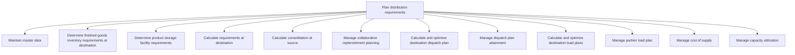
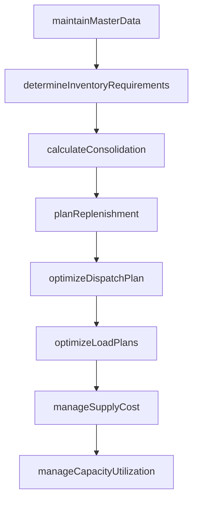

# Plan distribution requirements

> Business-as-Code definition for distribution requirements planning. Models master data maintenance, inventory requirements, dispatch optimization, replenishment planning, and capacity utilization as programmable workflows.

## Overview

Maintaining master data of finished products and inventory. Identify the requirements of finished products at the destination, as well as partner requirements. Calculate the consolidation at source. Manage replenishment planning. Create and administer a dispatch plan. Calculate load plans for destinations and partners. Manage the cost of supplying these products. Ensure effective utilization of capacity.

## Process Hierarchy



## GraphDL

```yaml
plan:
  object: Distribution Requirements
  actor: DistributionPlanner
  result: DistributionRequirementsPlan
```

## Actions

| Action | Description |
|--------|-------------|
| maintainMasterData | Update product and inventory master data for distribution |
| determineInventoryRequirements | Calculate finished goods needs at each destination |
| calculateConsolidation | Determine aggregate shipment volumes at source locations |
| planReplenishment | Manage collaborative replenishment with distribution partners |
| optimizeDispatchPlan | Calculate and optimize destination dispatch schedules |
| optimizeLoadPlans | Calculate optimal load configurations for destinations |
| manageSupplyCost | Monitor and control total cost of distribution |
| manageCapacityUtilization | Track and optimize distribution capacity usage |

## Events

| Event | Description |
|-------|-------------|
| masterDataUpdated | Product and inventory distribution data refreshed |
| inventoryRequirementsDetermined | Destination inventory needs calculated |
| consolidationCalculated | Source consolidation volumes computed |
| replenishmentPlanned | Collaborative replenishment schedule agreed |
| dispatchPlanOptimized | Destination dispatch plan optimized and published |
| loadPlansOptimized | Load configurations calculated for destinations |
| supplyCostManaged | Distribution cost analysis completed and targets set |
| capacityOptimized | Distribution capacity utilization reviewed and adjusted |

## Searches

| Search | Description |
|--------|-------------|
| getDistributionPlan | Retrieve distribution requirements by destination or product |
| findReplenishmentNeeds | Identify destinations requiring inventory replenishment |
| getDispatchSchedule | Query optimized dispatch plan by date or route |
| getSupplyCostBreakdown | Retrieve cost-of-supply analysis by lane or product |
| getCapacityUtilization | Query distribution capacity usage by facility |

## Process Flow



## RACI Matrix

| Activity | Responsible | Accountable | Consulted | Informed |
|----------|-------------|-------------|-----------|----------|
| maintainMasterData | DataAnalyst | DistributionPlanner | IT, Warehouse | Operations |
| determineInventoryRequirements | DistributionPlanner | VP Logistics | Sales, Warehousing | Finance |
| optimizeDispatchPlan | TransportationPlanner | VP Logistics | Carriers, Warehouse | Sales |
| manageSupplyCost | SupplyChainAnalyst | VP SupplyChain | Finance, Procurement | Executive |

## Sub-Processes

| ID | Name | Description |
|----|------|-------------|
| 4.1.6.1 | Maintain master data | Maintaining and preserving the master data plan for distribution requirements. Create a systematic c |
| 4.1.6.2 | Determine finished goods inventory requirements at destination | Interact with the concerned person at the destination to validate the requirements and to avoid any  |
| 4.1.6.3 | Determine product storage facility requirements | Evaluate constraints, needs, parameters, and conditions for physical storage and retrieval of compon |
| 4.1.6.4 | Calculate requirements at destination | Interact with the concerned authority at the destination to reach a specific figure that correctly r |
| 4.1.6.5 | Calculate consolidation at source | Determining the aggregate volume of products/services consolidated at the source. Calculate the numb |
| 4.1.6.6 | Manage collaborative replenishment planning | Administering the plan for collaborative replenishment of goods. Replenish inventory by creating a p |
| 4.1.6.7 | Calculate and optimize destination dispatch plan | Estimating the timing and duration of the delivery of the inventory from the source to the destinati |
| 4.1.6.8 | Manage dispatch plan attainment | Accomplishing the dispatch plan. Strictly follow the schedule, and adjust for deviations. Coordinate |
| 4.1.6.9 | Calculate and optimize destination load plans | Evaluating the plans for delivering loads to destinations. Create a systematic plan that specifies t |
| 4.1.6.10 | Manage partner load plan | Administering the load plan for partners. Manage the delivery, and dispatch from the source to the p |
| 4.1.6.11 | Manage cost of supply | Managing all expenses to provide products/services in the market. Estimate the overall cost of suppl |
| 4.1.6.12 | Manage capacity utilization | Determining the capacity utilization of the organization's production process. Realize the extent to |

## Related Processes

| Process | Relationship |
|---------|-------------|
| 4.1.5 Create and manage master production schedule | Upstream - MPS drives distribution timing |
| 4.1.7 Establish distribution planning constraints | Parallel - constraints bound the distribution plan |
| 4.4 Manage logistics and warehousing | Downstream - plan drives logistics execution |

## Related Departments

| Department | Role |
|-----------|------|
| Distribution Planning | Primary owner of DRP and replenishment |
| Logistics | Executes dispatch and load plans |
| Warehousing | Manages destination inventory and storage |
| Finance | Monitors supply cost and capital efficiency |

## Related Occupations

| Occupation | Involvement |
|-----------|-------------|
| Distribution Planner | DRP creation and replenishment management |
| Transportation Planner | Dispatch and load plan optimization |
| Inventory Analyst | Destination stock level management |

## KPIs

| KPI | Description | Unit |
|-----|-------------|------|
| Dispatch Plan Adherence | Percentage of dispatches executed per plan | % |
| Distribution Cost per Unit | Average cost to move a unit from source to destination | Currency |
| Inventory Days at Destination | Average days of stock held at destination locations | Days |
| Capacity Utilization | Percentage of distribution network capacity used | % |

## Usage

```typescript
import { planDistributionRequirements } from '@headlessly/plan-distribution-requirements'

const client = planDistributionRequirements()

// Calculate destination inventory needs
const requirements = await client.determineInventoryRequirements({
  destination: 'DC-West',
  productFamily: 'consumer-electronics',
  planningHorizon: { weeks: 8 }
})

// Optimize dispatch plan
const dispatch = await client.optimizeDispatchPlan({
  sourceWarehouse: 'DC-Central',
  destinations: ['DC-West', 'DC-South'],
  optimizeFor: 'cost-and-service'
})
```
