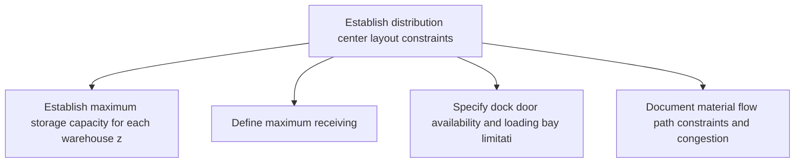
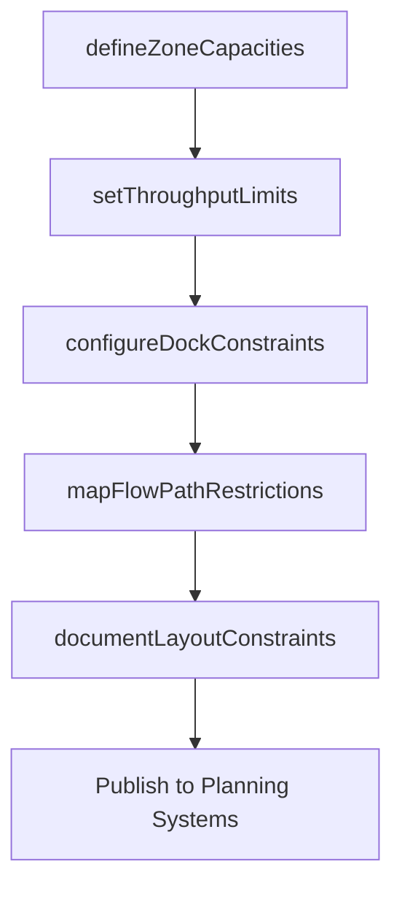

# Establish distribution center layout constraints

> Business-as-Code definition for distribution center layout constraints. Models facility space limitations, zone configurations, and throughput constraints as programmable workflows.

## Overview

Instituting the constraints for creating a layout for distribution center. Consider factors such as the number of customers, demand forecasting, product groups, condition of product conservation, warehousing, and transportation management.

## Process Hierarchy



## GraphDL

```yaml
establish:
  object: Distribution Center Layout Constraints
  actor: DistributionCenterPlanner
  result: LayoutConstraintSet
```

## Actions

| Action | Description |
|--------|-------------|
| defineZoneCapacities | Establish maximum storage capacity for each warehouse zone |
| setThroughputLimits | Define maximum receiving, picking, and shipping throughput per shift |
| configureDockConstraints | Specify dock door availability and loading bay limitations |
| mapFlowPathRestrictions | Document material flow path constraints and congestion points |
| documentLayoutConstraints | Publish consolidated layout constraints for planning systems |

## Events

| Event | Description |
|-------|-------------|
| zoneCapacitiesDefined | Maximum zone capacities established for the distribution center |
| throughputLimitsSet | Operational throughput limits defined per shift |
| dockConstraintsConfigured | Dock door and loading bay limitations documented |
| flowPathRestrictionsMapped | Material flow constraints and congestion points identified |
| layoutConstraintsDocumented | All layout constraints published for downstream planning |

## Searches

| Search | Description |
|--------|-------------|
| getZoneCapacity | Retrieve capacity limits by zone and storage type |
| getThroughputLimits | Query throughput constraints by operation and shift |
| getDockAvailability | Check dock door availability and scheduling constraints |

## Process Flow



## RACI Matrix

| Activity | Responsible | Accountable | Consulted | Informed |
|----------|-------------|-------------|-----------|----------|
| defineZoneCapacities | DistributionCenterPlanner | WarehouseManager | Operations | Logistics |
| setThroughputLimits | DistributionCenterPlanner | WarehouseManager | Engineering | Production |
| documentLayoutConstraints | DistributionCenterPlanner | VP Logistics | IT | SupplyChain |

## Related Processes

| Process | Relationship |
|---------|-------------|
| 4.1.7.2 Establish inventory management constraints | Sibling - inventory constraints complement layout constraints |
| 4.1.7.3 Establish transportation management constraints | Sibling - transport constraints linked to dock configuration |
| 4.4.3 Operate warehousing | Downstream - layout constraints govern warehouse operations |

## Related Departments

| Department | Role |
|-----------|------|
| Warehouse Operations | Primary owner of layout constraint definition |
| Engineering | Provides structural and equipment capacity data |
| IT | Maintains constraint parameters in WMS systems |

## Related Occupations

| Occupation | Involvement |
|-----------|-------------|
| Distribution Center Planner | Layout analysis and constraint definition |
| Warehouse Engineer | Structural and throughput capacity assessment |
| WMS Administrator | System configuration of layout constraints |

## KPIs

| KPI | Description | Unit |
|-----|-------------|------|
| Constraint Accuracy | Percentage of constraints validated against actual operations | % |
| Zone Utilization Compliance | Percentage of zones operating within defined capacity limits | % |
| Constraint Update Frequency | How often layout constraints are reviewed and updated | Per Quarter |

## Usage

```typescript
import { establishDistributionCenterLayoutConstraints } from '@headlessly/establish-distribution-center-layout-constraints'

const client = establishDistributionCenterLayoutConstraints()

// Define zone capacities
const zones = await client.defineZoneCapacities({
  facilityId: 'DC-southeast',
  zones: [
    { name: 'bulk-storage', maxPallets: 3000 },
    { name: 'pick-zone', maxPallets: 800 },
    { name: 'cold-storage', maxPallets: 500 }
  ]
})

// Set throughput limits per shift
const limits = await client.setThroughputLimits({
  facilityId: 'DC-southeast',
  receiving: { palletsPerHour: 60 },
  picking: { ordersPerHour: 120 },
  shipping: { loadsPerShift: 25 }
})
```
