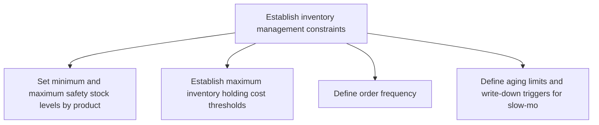
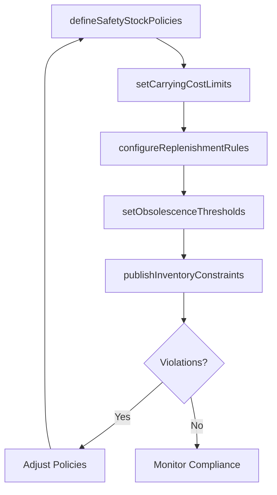

# Establish inventory management constraints

> Business-as-Code definition for inventory management constraint establishment. Models safety stock policies, carrying cost limits, and replenishment restrictions as programmable workflows.

## Overview

Determining any problems that might be faced while managing inventory. Identify problems and possible issues in managing the warehousing of the raw materials, spares, and other items of inventory. Take stock of inventory needs, and determine the exact quantity of the inventory needed in the near future.

## Process Hierarchy



## GraphDL

```yaml
establish:
  object: Inventory Management Constraints
  actor: InventoryPolicyAnalyst
  result: InventoryConstraintSet
```

## Actions

| Action | Description |
|--------|-------------|
| defineSafetyStockPolicies | Set minimum and maximum safety stock levels by product and location |
| setCarryingCostLimits | Establish maximum inventory holding cost thresholds |
| configureReplenishmentRules | Define order frequency, minimum order quantities, and lead time buffers |
| setObsolescenceThresholds | Define aging limits and write-down triggers for slow-moving inventory |
| publishInventoryConstraints | Distribute inventory constraints to planning and execution systems |

## Events

| Event | Description |
|-------|-------------|
| safetyStockPoliciesDefined | Safety stock minimums and maximums established |
| carryingCostLimitsSet | Inventory holding cost thresholds configured |
| replenishmentRulesConfigured | Replenishment frequency and quantity rules defined |
| obsolescenceThresholdsSet | Inventory aging limits and write-down triggers established |
| inventoryConstraintsPublished | Inventory constraints distributed to all planning systems |

## Searches

| Search | Description |
|--------|-------------|
| getInventoryPolicies | Retrieve inventory policies by product category or location |
| findConstraintViolations | Identify locations exceeding inventory constraint limits |
| getObsolescenceRisk | Query products approaching obsolescence thresholds |

## Process Flow



## RACI Matrix

| Activity | Responsible | Accountable | Consulted | Informed |
|----------|-------------|-------------|-----------|----------|
| defineSafetyStockPolicies | InventoryPolicyAnalyst | VP SupplyChain | DemandPlanning, Finance | Warehouse |
| setCarryingCostLimits | InventoryPolicyAnalyst | VP SupplyChain | Finance | Operations |
| publishInventoryConstraints | InventoryPolicyAnalyst | VP SupplyChain | IT | AllPlanners |

## Related Processes

| Process | Relationship |
|---------|-------------|
| 4.1.7.1 Establish distribution center layout constraints | Sibling - physical constraints affect inventory limits |
| 4.1.6.2 Determine finished goods inventory requirements at destination | Downstream - constraints guide inventory planning |
| 4.4.3 Operate warehousing | Downstream - inventory constraints govern storage operations |

## Related Departments

| Department | Role |
|-----------|------|
| Supply Chain Planning | Primary owner of inventory policy definition |
| Finance | Provides carrying cost budgets and investment limits |
| Warehousing | Implements inventory constraints in physical operations |

## Related Occupations

| Occupation | Involvement |
|-----------|-------------|
| Inventory Policy Analyst | Constraint analysis and policy definition |
| Supply Chain Planner | Policy implementation in planning systems |
| Financial Analyst | Carrying cost analysis and budget alignment |

## KPIs

| KPI | Description | Unit |
|-----|-------------|------|
| Inventory Policy Compliance | Percentage of SKU-locations operating within defined constraints | % |
| Carrying Cost to Revenue | Inventory holding cost as percentage of revenue | % |
| Obsolescence Rate | Value of inventory written down due to obsolescence per period | Currency |

## Usage

```typescript
import { establishInventoryManagementConstraints } from '@headlessly/establish-inventory-management-constraints'

const client = establishInventoryManagementConstraints()

// Define safety stock policies
const policies = await client.defineSafetyStockPolicies({
  productCategory: 'fast-movers',
  minDaysOfSupply: 5,
  maxDaysOfSupply: 15,
  serviceLevel: 0.97
})

// Set carrying cost limits
const costLimits = await client.setCarryingCostLimits({
  businessUnit: 'consumer-products',
  maxHoldingCostPercent: 25,
  reviewFrequency: 'quarterly'
})
```
