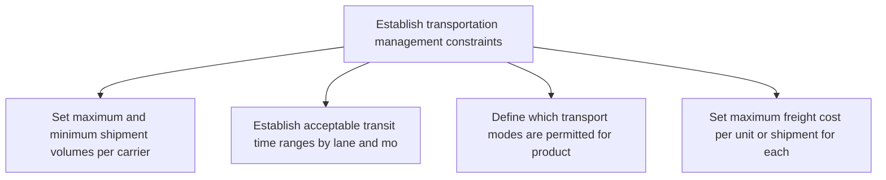
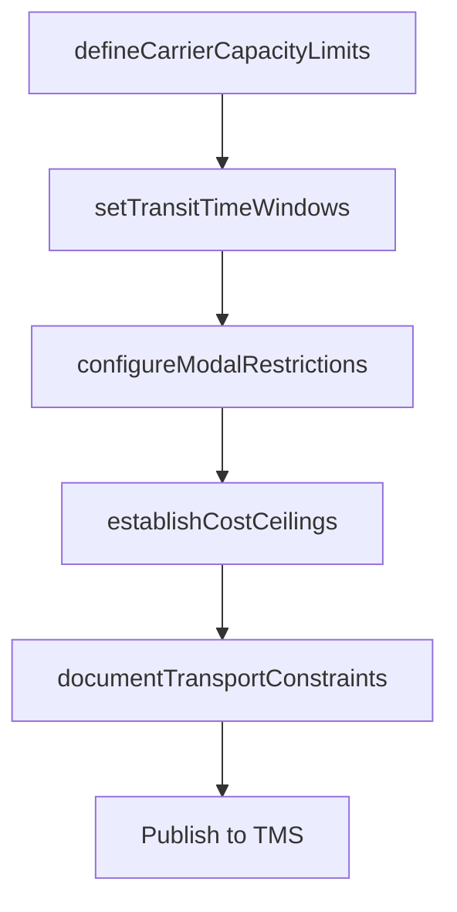

# Establish transportation management constraints

> Business-as-Code definition for transportation management constraint establishment. Models carrier capacity limits, transit time windows, and modal restrictions as programmable workflows.

## Overview

Identifying any potential constraints while deciding on the dispatch and delivery plan from the source to the various distribution centers. Decide how the inventory will be transported , which and how many transportation means to use, what route to take, etc.

## Process Hierarchy



## GraphDL

```yaml
establish:
  object: Transportation Management Constraints
  actor: TransportationPolicyManager
  result: TransportationConstraintSet
```

## Actions

| Action | Description |
|--------|-------------|
| defineCarrierCapacityLimits | Set maximum and minimum shipment volumes per carrier |
| setTransitTimeWindows | Establish acceptable transit time ranges by lane and mode |
| configureModalRestrictions | Define which transport modes are permitted for product categories |
| establishCostCeilings | Set maximum freight cost per unit or shipment for each lane |
| documentTransportConstraints | Publish consolidated transportation constraints for planning |

## Events

| Event | Description |
|-------|-------------|
| carrierCapacityLimitsDefined | Carrier volume limits established for all lanes |
| transitTimeWindowsSet | Acceptable transit times configured by lane and mode |
| modalRestrictionsConfigured | Transport mode permissions defined for product categories |
| costCeilingsEstablished | Maximum freight cost limits set per lane |
| transportConstraintsDocumented | Transportation constraints published to planning systems |

## Searches

| Search | Description |
|--------|-------------|
| getCarrierConstraints | Retrieve carrier capacity limits and allocation by lane |
| getTransitTimeRequirements | Query transit time windows for specific origin-destination pairs |
| getModalOptions | List permitted transport modes for a product and route |

## Process Flow



## RACI Matrix

| Activity | Responsible | Accountable | Consulted | Informed |
|----------|-------------|-------------|-----------|----------|
| defineCarrierCapacityLimits | TransportationPolicyManager | VP Logistics | Carrier, Procurement | Finance |
| setTransitTimeWindows | TransportationPolicyManager | VP Logistics | Sales, CustomerService | Operations |
| establishCostCeilings | TransportationPolicyManager | VP Logistics | Finance | Executive |

## Related Processes

| Process | Relationship |
|---------|-------------|
| 4.1.7.1 Establish distribution center layout constraints | Sibling - dock constraints affect transportation planning |
| 4.1.7.4 Establish storage management constraints | Sibling - storage constraints drive transport frequency |
| 4.4.4 Operate outbound transportation | Downstream - transport constraints govern carrier selection |

## Related Departments

| Department | Role |
|-----------|------|
| Transportation | Primary owner of transport constraint definition |
| Procurement | Supports carrier contract alignment with constraints |
| Finance | Approves freight cost ceilings and budgets |

## Related Occupations

| Occupation | Involvement |
|-----------|-------------|
| Transportation Policy Manager | Constraint definition and policy governance |
| Carrier Manager | Carrier capacity alignment and negotiation |
| Freight Rate Analyst | Cost ceiling analysis and benchmarking |

## KPIs

| KPI | Description | Unit |
|-----|-------------|------|
| Transit Time Compliance | Percentage of shipments arriving within defined transit windows | % |
| Freight Cost Compliance | Percentage of shipments within cost ceiling limits | % |
| Carrier Capacity Utilization | Percentage of contracted carrier capacity actually used | % |

## Usage

```typescript
import { establishTransportationManagementConstraints } from '@headlessly/establish-transportation-management-constraints'

const client = establishTransportationManagementConstraints()

// Define carrier capacity limits
const limits = await client.defineCarrierCapacityLimits({
  carrierId: 'carrier-fastfreight',
  lanes: [
    { origin: 'WH-central', destination: 'DC-east', maxLoadsPerWeek: 15 },
    { origin: 'WH-central', destination: 'DC-south', maxLoadsPerWeek: 10 }
  ]
})

// Set transit time windows
const windows = await client.setTransitTimeWindows({
  lane: { origin: 'WH-central', destination: 'DC-east' },
  minDays: 1,
  maxDays: 3,
  mode: 'truckload'
})
```
