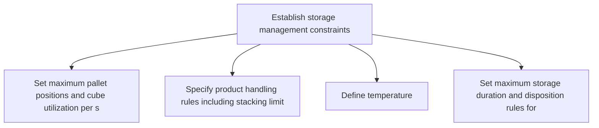
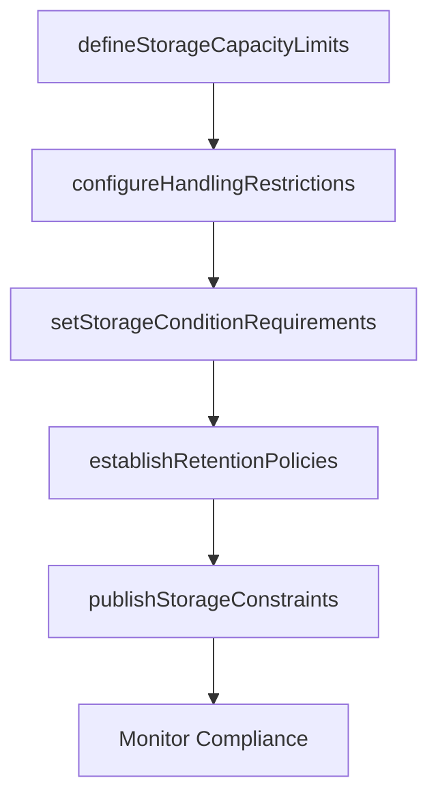

# Establish storage management constraints

> Business-as-Code definition for storage management constraint establishment. Models warehouse capacity limits, handling restrictions, and storage condition requirements as programmable workflows.

## Overview

Determining potential constraints for physical storage and retrieval of components or products in a storage facility within a certain timeframe. Consider factors such as the building shape, height, capacity, door locations, lift equipment, automation, etc.

## Process Hierarchy



## GraphDL

```yaml
establish:
  object: Storage Management Constraints
  actor: StoragePolicyManager
  result: StorageConstraintSet
```

## Actions

| Action | Description |
|--------|-------------|
| defineStorageCapacityLimits | Set maximum pallet positions and cube utilization per storage zone |
| configureHandlingRestrictions | Specify product handling rules including stacking limits and compatibility |
| setStorageConditionRequirements | Define temperature, humidity, and cleanliness standards by zone |
| establishRetentionPolicies | Set maximum storage duration and disposition rules for aging products |
| publishStorageConstraints | Distribute storage constraints to WMS and planning systems |

## Events

| Event | Description |
|-------|-------------|
| storageCapacityLimitsDefined | Zone capacity limits established and configured |
| handlingRestrictionsConfigured | Product handling rules and compatibility matrix updated |
| storageConditionRequirementsSet | Environmental control standards defined by zone |
| retentionPoliciesEstablished | Maximum storage duration and disposition rules set |
| storageConstraintsPublished | Storage constraints distributed to all systems |

## Searches

| Search | Description |
|--------|-------------|
| getStorageZoneConstraints | Retrieve constraint parameters by storage zone |
| findHandlingRestrictions | Query product handling rules and stacking compatibility |
| getRetentionPolicyStatus | Check inventory items approaching retention limits |

## Process Flow



## RACI Matrix

| Activity | Responsible | Accountable | Consulted | Informed |
|----------|-------------|-------------|-----------|----------|
| defineStorageCapacityLimits | StoragePolicyManager | WarehouseManager | FacilityPlanner | Logistics |
| setStorageConditionRequirements | StoragePolicyManager | WarehouseManager | QualityAssurance, Safety | Compliance |
| publishStorageConstraints | StoragePolicyManager | VP Logistics | IT | Operations |

## Related Processes

| Process | Relationship |
|---------|-------------|
| 4.1.7.1 Establish distribution center layout constraints | Sibling - layout constraints define the physical envelope |
| 4.1.7.2 Establish inventory management constraints | Sibling - inventory policies complement storage limits |
| 4.4.3 Operate warehousing | Downstream - storage constraints govern daily warehouse operations |

## Related Departments

| Department | Role |
|-----------|------|
| Warehouse Operations | Primary owner of storage constraint definition |
| Quality Assurance | Defines product-specific storage condition requirements |
| Safety | Ensures hazmat and handling compliance |

## Related Occupations

| Occupation | Involvement |
|-----------|-------------|
| Storage Policy Manager | Constraint definition and compliance oversight |
| Warehouse Planner | Zone capacity analysis and configuration |
| Quality Specialist | Environmental control specification |

## KPIs

| KPI | Description | Unit |
|-----|-------------|------|
| Storage Constraint Compliance | Percentage of zones operating within defined limits | % |
| Environmental Deviation Rate | Frequency of temperature or humidity excursions per period | Events/Month |
| Retention Policy Adherence | Percentage of inventory cleared before maximum retention | % |

## Usage

```typescript
import { establishStorageManagementConstraints } from '@headlessly/establish-storage-management-constraints'

const client = establishStorageManagementConstraints()

// Define storage capacity limits by zone
const zones = await client.defineStorageCapacityLimits({
  facilityId: 'DC-southeast',
  zones: [
    { name: 'ambient', maxPallets: 4000, maxCubePercent: 85 },
    { name: 'cold-chain', maxPallets: 1200, maxCubePercent: 90 }
  ]
})

// Set storage condition requirements
const conditions = await client.setStorageConditionRequirements({
  zone: 'cold-chain',
  tempRange: { min: 2, max: 8, unit: 'celsius' },
  humidityRange: { min: 30, max: 50, unit: 'percent' }
})
```
