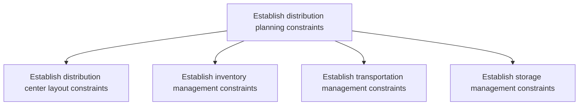
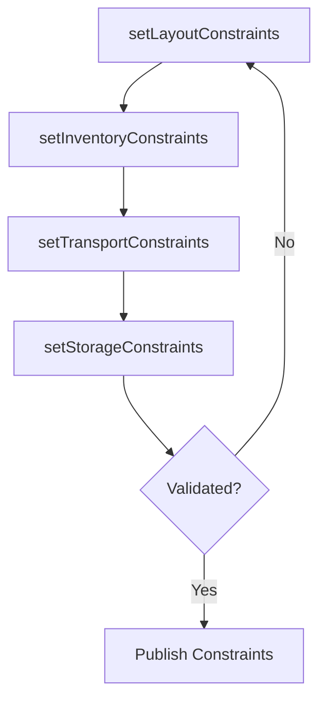

# Establish distribution planning constraints

> Business-as-Code definition for distribution planning constraints. Models distribution center layout, inventory management, transportation, and storage constraints as programmable workflows.

## Overview

Instituting the constraints for planning of distribution process. Create a plan that specifies every element in the distribution process from the blueprint of the distribution centers to how and when the inventory would reach the distribution centers.

## Process Hierarchy



## GraphDL

```yaml
establish:
  object: Distribution Planning Constraints
  actor: DistributionPlanner
  result: ConstraintProfile
```

## Actions

| Action | Description |
|--------|-------------|
| setLayoutConstraints | Define distribution center floor plan and throughput limits |
| setInventoryConstraints | Establish min/max stock levels and reorder policies |
| setTransportConstraints | Define carrier capacity, route restrictions, and delivery windows |
| setStorageConstraints | Specify storage type, temperature, and capacity limits |

## Events

| Event | Description |
|-------|-------------|
| layoutConstraintsSet | Distribution center layout constraints documented |
| inventoryConstraintsSet | Inventory management parameters established |
| transportConstraintsSet | Transportation management limits defined |
| storageConstraintsSet | Storage management constraints specified |

## Searches

| Search | Description |
|--------|-------------|
| getConstraintsByFacility | Retrieve all constraints for a specific distribution center |
| findConstraintViolations | Identify operations exceeding defined constraints |
| getCapacityLimits | Query storage and throughput capacity limits |

## Process Flow



## RACI Matrix

| Activity | Responsible | Accountable | Consulted | Informed |
|----------|-------------|-------------|-----------|----------|
| setLayoutConstraints | FacilityPlanner | VP Logistics | Engineering, Operations | Finance |
| setInventoryConstraints | InventoryPlanner | DistributionPlanner | Finance, Sales | Warehouse |
| setTransportConstraints | TransportationPlanner | VP Logistics | Carriers, Legal | Operations |
| setStorageConstraints | WarehouseManager | VP Logistics | Safety, Compliance | Operations |

## Sub-Processes

| ID | Name | Description |
|----|------|-------------|
| 4.1.7.1 | Establish distribution center layout constraints | Instituting the constraints for creating a layout for distribution center. Consider factors such as  |
| 4.1.7.2 | Establish inventory management constraints | Determining any problems that might be faced while managing inventory. Identify problems and possibl |
| 4.1.7.3 | Establish transportation management constraints | Identifying any potential constraints while deciding on the dispatch and delivery plan from the sour |
| 4.1.7.4 | Establish storage management constraints | Determining potential constraints for physical storage and retrieval of components or products in a  |

## Related Processes

| Process | Relationship |
|---------|-------------|
| 4.1.6 Plan distribution requirements | Parallel - constraints bound distribution planning |
| 4.1.8 Review distribution planning policies | Downstream - policies reference constraint parameters |
| 4.4.3 Operate warehousing | Downstream - warehouse operations respect constraints |

## Related Departments

| Department | Role |
|-----------|------|
| Distribution Planning | Primary owner of constraint definitions |
| Warehousing | Provides facility capacity and layout data |
| Transportation | Supplies carrier and route constraint data |
| Compliance | Ensures regulatory storage and transport requirements |

## Related Occupations

| Occupation | Involvement |
|-----------|-------------|
| Distribution Planner | Constraint definition and validation |
| Facility Planner | Distribution center layout analysis |
| Transportation Planner | Route and carrier constraint management |

## KPIs

| KPI | Description | Unit |
|-----|-------------|------|
| Constraint Compliance | Percentage of operations within defined constraints | % |
| Constraint Review Frequency | How often constraints are reviewed and updated | Per Year |
| Capacity Buffer | Available capacity margin above constraint thresholds | % |

## Usage

```typescript
import { establishDistributionPlanningConstraints } from '@headlessly/establish-distribution-planning-constraints'

const client = establishDistributionPlanningConstraints()

// Set inventory management constraints
const inventoryConstraints = await client.setInventoryConstraints({
  facility: 'DC-East',
  minStockDays: 7,
  maxStockDays: 30,
  reorderPoint: 'dynamic',
  safetyStockPolicy: 'service-level-based'
})

// Define transportation constraints
const transportConstraints = await client.setTransportConstraints({
  facility: 'DC-East',
  maxDailyShipments: 200,
  deliveryWindows: ['06:00-18:00'],
  carrierCapacity: { truckload: 50, ltl: 100 }
})
```
