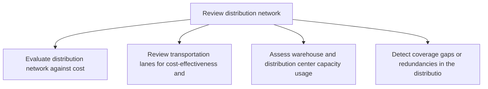
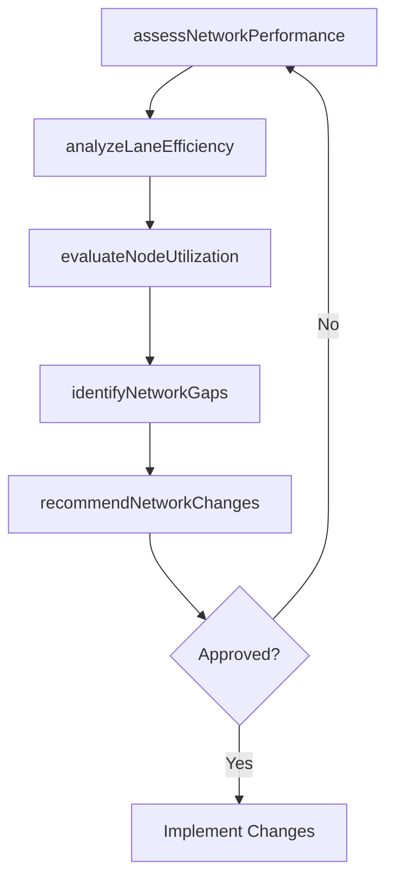

# Review distribution network

> Business-as-Code definition for distribution network review. Models network performance evaluation, lane analysis, and network optimization recommendations as programmable workflows.

## Overview

Evaluating the system that defines how the products/inventory would reach from the source (i.e., manufacturer) to the destination (i.e., retailer/distributer).

## Process Hierarchy



## GraphDL

```yaml
review:
  object: Distribution Network
  actor: DistributionNetworkAnalyst
  result: NetworkReviewReport
```

## Actions

| Action | Description |
|--------|-------------|
| assessNetworkPerformance | Evaluate distribution network against cost, service, and utilization KPIs |
| analyzeLaneEfficiency | Review transportation lanes for cost-effectiveness and transit time performance |
| evaluateNodeUtilization | Assess warehouse and distribution center capacity usage and throughput |
| identifyNetworkGaps | Detect coverage gaps or redundancies in the distribution footprint |
| recommendNetworkChanges | Propose network redesign or optimization opportunities |

## Events

| Event | Description |
|-------|-------------|
| networkPerformanceAssessed | Distribution network KPIs evaluated and documented |
| laneEfficiencyAnalyzed | Transportation lane review completed |
| nodeUtilizationEvaluated | Warehouse and DC capacity assessment completed |
| networkGapsIdentified | Coverage gaps or redundancies detected in the network |
| networkChangesRecommended | Network optimization proposals submitted |

## Searches

| Search | Description |
|--------|-------------|
| getNetworkPerformance | Retrieve distribution network performance metrics |
| findInefficientLanes | Identify transportation lanes below efficiency thresholds |
| getNodeUtilizationReport | Query warehouse and DC utilization rates |

## Process Flow



## RACI Matrix

| Activity | Responsible | Accountable | Consulted | Informed |
|----------|-------------|-------------|-----------|----------|
| assessNetworkPerformance | DistributionNetworkAnalyst | VP Logistics | Finance, Transportation | Executive |
| analyzeLaneEfficiency | DistributionNetworkAnalyst | TransportationManager | Carrier, Warehouse | Finance |
| recommendNetworkChanges | DistributionNetworkAnalyst | VP Logistics | Strategy, Finance | Executive |

## Related Processes

| Process | Relationship |
|---------|-------------|
| 4.1.8.2 Establish sourcing relationships | Downstream - network review informs sourcing decisions |
| 4.1.8.3 Establish dynamic deployment policies | Downstream - network review drives deployment policy updates |
| 4.4.1 Provide logistics governance | Parallel - governance uses network review findings |

## Related Departments

| Department | Role |
|-----------|------|
| Logistics Strategy | Primary owner of distribution network analysis |
| Transportation | Provides lane performance and cost data |
| Warehousing | Provides node utilization and throughput data |
| Finance | Evaluates financial impact of network changes |

## Related Occupations

| Occupation | Involvement |
|-----------|-------------|
| Distribution Network Analyst | Network modeling and performance review |
| Logistics Strategist | Network redesign and optimization planning |
| Transportation Manager | Lane efficiency evaluation |

## KPIs

| KPI | Description | Unit |
|-----|-------------|------|
| Network Cost Efficiency | Total distribution cost per unit shipped across the network | Currency/Unit |
| Service Level Achievement | Percentage of deliveries meeting target transit times | % |
| Node Utilization Variance | Spread of utilization rates across distribution centers | % |

## Usage

```typescript
import { reviewDistributionNetwork } from '@headlessly/review-distribution-network'

const client = reviewDistributionNetwork()

// Assess network performance
const performance = await client.assessNetworkPerformance({
  networkScope: 'north-america',
  period: 'Q2-2025',
  metrics: ['cost-per-unit', 'transit-time', 'utilization']
})

// Identify network gaps
const gaps = await client.identifyNetworkGaps({
  networkId: performance.networkId,
  coverageTarget: { maxTransitDays: 2, populationPercent: 95 }
})
```
