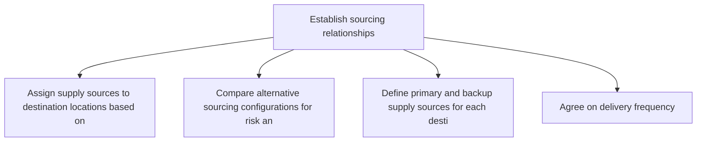
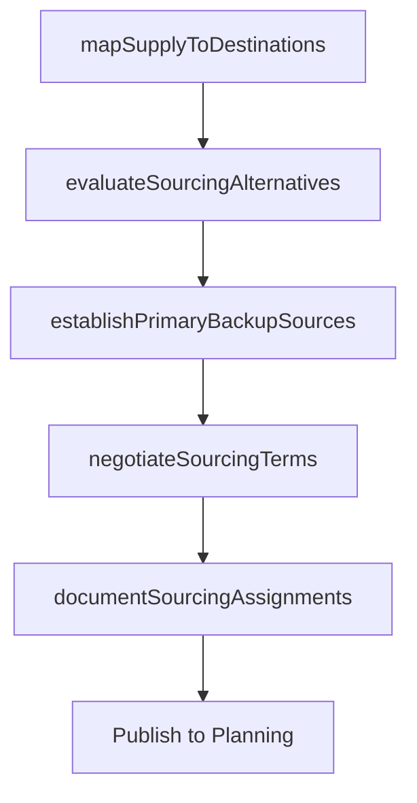

# Establish sourcing relationships

> Business-as-Code definition for sourcing relationship establishment. Models supplier network design, sourcing assignments, and supply-demand matching for distribution as programmable workflows.

## Overview

Establishing relationships with transportation/distribution sources in order to ensure an effective distribution network and strategy. Screen and evaluate various sources available to pick out the best among them.

## Process Hierarchy



## GraphDL

```yaml
establish:
  object: Sourcing Relationships
  actor: SourcingRelationshipManager
  result: SourcingRelationshipMap
```

## Actions

| Action | Description |
|--------|-------------|
| mapSupplyToDestinations | Assign supply sources to destination locations based on cost and service |
| evaluateSourcingAlternatives | Compare alternative sourcing configurations for risk and efficiency |
| establishPrimaryBackupSources | Define primary and backup supply sources for each destination |
| negotiateSourcingTerms | Agree on delivery frequency, lead times, and service levels with sources |
| documentSourcingAssignments | Record and publish sourcing assignments in planning systems |

## Events

| Event | Description |
|-------|-------------|
| supplyMappedToDestinations | Supply sources assigned to all destination locations |
| sourcingAlternativesEvaluated | Alternative sourcing configurations analyzed |
| primaryBackupSourcesEstablished | Primary and backup sources defined for all destinations |
| sourcingTermsNegotiated | Delivery terms and service levels agreed with sources |
| sourcingAssignmentsDocumented | Sourcing assignments published to planning systems |

## Searches

| Search | Description |
|--------|-------------|
| getSourcingAssignments | Retrieve source-to-destination assignments by product or location |
| findBackupSources | Query backup supply sources for a given destination |
| getSourcingCostComparison | Compare total landed costs across sourcing alternatives |

## Process Flow



## RACI Matrix

| Activity | Responsible | Accountable | Consulted | Informed |
|----------|-------------|-------------|-----------|----------|
| mapSupplyToDestinations | SourcingRelationshipManager | VP SupplyChain | Logistics, Procurement | Finance |
| establishPrimaryBackupSources | SourcingRelationshipManager | VP SupplyChain | RiskManagement | Operations |
| negotiateSourcingTerms | SourcingRelationshipManager | VP SupplyChain | Legal, Procurement | Finance |

## Related Processes

| Process | Relationship |
|---------|-------------|
| 4.1.8.1 Review distribution network | Upstream - network review informs sourcing decisions |
| 4.2.3 Select suppliers and develop/maintain contracts | Parallel - supplier contracts support sourcing relationships |
| 4.1.6 Plan distribution requirements | Downstream - sourcing assignments drive distribution planning |

## Related Departments

| Department | Role |
|-----------|------|
| Supply Chain Planning | Primary owner of sourcing relationship design |
| Procurement | Supports supplier negotiations and contracts |
| Logistics | Provides transportation cost and lead time data |

## Related Occupations

| Occupation | Involvement |
|-----------|-------------|
| Sourcing Relationship Manager | Source-to-destination assignment and optimization |
| Supply Chain Planner | Sourcing alternative analysis |
| Procurement Specialist | Supplier negotiation support |

## KPIs

| KPI | Description | Unit |
|-----|-------------|------|
| Sourcing Assignment Coverage | Percentage of destinations with assigned primary and backup sources | % |
| Total Landed Cost | Average total cost including production, transport, and duties per unit | Currency/Unit |
| Sourcing Risk Score | Weighted risk assessment of current sourcing configuration | Score |

## Usage

```typescript
import { establishSourcingRelationships } from '@headlessly/establish-sourcing-relationships'

const client = establishSourcingRelationships()

// Map supply sources to destinations
const assignments = await client.mapSupplyToDestinations({
  productFamily: 'consumer-electronics',
  optimizationGoal: 'minimize-landed-cost',
  constraints: { maxLeadTimeDays: 5 }
})

// Establish primary and backup sources
const sources = await client.establishPrimaryBackupSources({
  destinationId: 'DC-southeast',
  productId: 'SKU-5500',
  backupRequired: true
})
```
