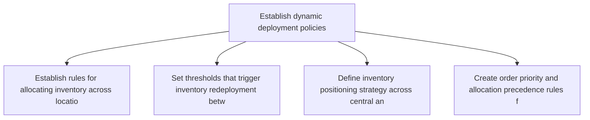
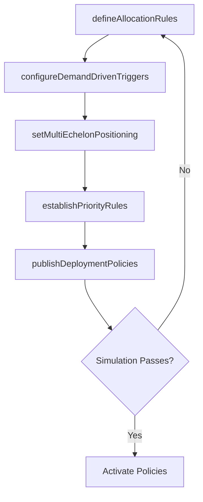

# Establish dynamic deployment policies

> Business-as-Code definition for dynamic deployment policy establishment. Models inventory deployment rules, demand-driven allocation, and multi-echelon positioning strategies as programmable workflows.

## Overview

Creating strategic guidelines on the availability of the products at all the distribution centers. Create a dynamic network to ensure availability at all times, even in cases of defaults.

## Process Hierarchy



## GraphDL

```yaml
establish:
  object: Dynamic Deployment Policies
  actor: DeploymentPolicyAnalyst
  result: DeploymentPolicySet
```

## Actions

| Action | Description |
|--------|-------------|
| defineAllocationRules | Establish rules for allocating inventory across locations based on demand signals |
| configureDemandDrivenTriggers | Set thresholds that trigger inventory redeployment between locations |
| setMultiEchelonPositioning | Define inventory positioning strategy across central and regional tiers |
| establishPriorityRules | Create order priority and allocation precedence rules for constrained supply |
| publishDeploymentPolicies | Distribute deployment policies to inventory planning systems |

## Events

| Event | Description |
|-------|-------------|
| allocationRulesDefined | Inventory allocation rules established across the network |
| demandDrivenTriggersConfigured | Redeployment triggers set and activated |
| multiEchelonPositioningSet | Multi-tier inventory positioning strategy defined |
| priorityRulesEstablished | Order priority and allocation precedence rules created |
| deploymentPoliciesPublished | Deployment policies distributed to all planning systems |

## Searches

| Search | Description |
|--------|-------------|
| getDeploymentPolicies | Retrieve current deployment policies by product or location |
| findRedeploymentTriggers | Query active redeployment triggers and their thresholds |
| getAllocationPriorities | List order priority rules for constrained supply situations |

## Process Flow



## RACI Matrix

| Activity | Responsible | Accountable | Consulted | Informed |
|----------|-------------|-------------|-----------|----------|
| defineAllocationRules | DeploymentPolicyAnalyst | VP SupplyChain | DemandPlanning, Sales | Finance |
| setMultiEchelonPositioning | DeploymentPolicyAnalyst | VP SupplyChain | Logistics | Warehouse |
| publishDeploymentPolicies | DeploymentPolicyAnalyst | VP SupplyChain | IT | AllPlanners |

## Related Processes

| Process | Relationship |
|---------|-------------|
| 4.1.8.1 Review distribution network | Upstream - network structure informs deployment policies |
| 4.1.8.2 Establish sourcing relationships | Parallel - sourcing relationships constrain deployment options |
| 4.1.6.2 Determine finished goods inventory requirements at destination | Downstream - deployment policies guide inventory positioning |

## Related Departments

| Department | Role |
|-----------|------|
| Supply Chain Planning | Primary owner of deployment policy design |
| Demand Planning | Provides demand signals driving allocation decisions |
| Logistics | Executes inventory transfers based on deployment policies |

## Related Occupations

| Occupation | Involvement |
|-----------|-------------|
| Deployment Policy Analyst | Policy design and simulation |
| Inventory Strategist | Multi-echelon positioning design |
| Demand Planner | Demand signal provision for allocation rules |

## KPIs

| KPI | Description | Unit |
|-----|-------------|------|
| Allocation Accuracy | Percentage of inventory deployed to the right location at the right time | % |
| Redeployment Frequency | Number of inter-location inventory transfers per period | Transfers/Month |
| Stock-Out Rate | Percentage of demand lost due to deployment policy failures | % |

## Usage

```typescript
import { establishDynamicDeploymentPolicies } from '@headlessly/establish-dynamic-deployment-policies'

const client = establishDynamicDeploymentPolicies()

// Define allocation rules
const rules = await client.defineAllocationRules({
  productFamily: 'consumer-electronics',
  method: 'demand-proportional',
  constrainedSupplyPriority: ['key-accounts', 'regional-DCs', 'overflow']
})

// Set multi-echelon positioning strategy
const positioning = await client.setMultiEchelonPositioning({
  tiers: [
    { level: 'central', holdPercent: 30 },
    { level: 'regional', holdPercent: 50 },
    { level: 'local', holdPercent: 20 }
  ]
})
```
