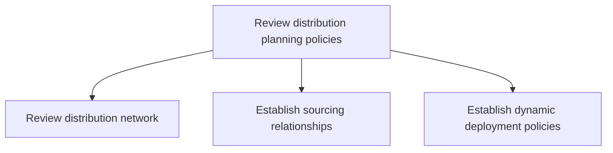
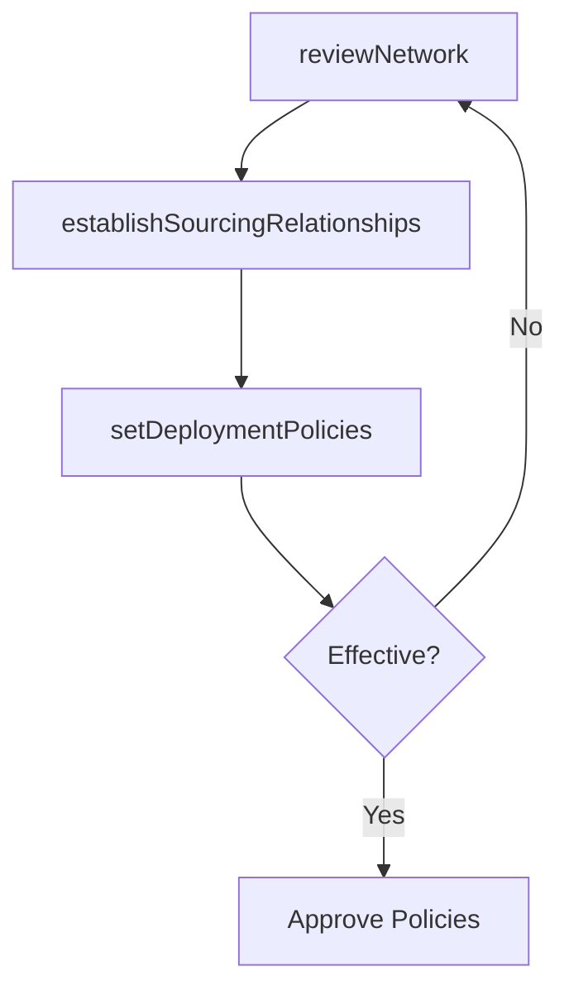

# Review distribution planning policies

> Business-as-Code definition for distribution policy review. Models network assessment, sourcing relationship management, and dynamic deployment policy governance as programmable workflows.

## Overview

Revisiting and refurbishing the policies for planning the distribution process. Asses the distribution strategies, including how the products are to be made available and sent to different distributors. Set guidelines regarding relationships between the sources and the distribution centers.

## Process Hierarchy



## GraphDL

```yaml
review:
  object: Distribution Planning Policies
  actor: DistributionPolicyAnalyst
  result: PolicyReviewReport
```

## Actions

| Action | Description |
|--------|-------------|
| reviewNetwork | Assess distribution network effectiveness and coverage |
| establishSourcingRelationships | Define and maintain partnerships with distribution sources |
| setDeploymentPolicies | Create dynamic product deployment and allocation rules |

## Events

| Event | Description |
|-------|-------------|
| networkReviewed | Distribution network assessment completed |
| sourcingRelationshipEstablished | Distribution source partnership formalized |
| deploymentPoliciesSet | Dynamic deployment rules published and activated |

## Searches

| Search | Description |
|--------|-------------|
| getNetworkPerformance | Retrieve distribution network effectiveness metrics |
| findSourcingPartners | List active distribution sourcing relationships |
| getDeploymentPolicies | Query current product deployment and allocation rules |

## Process Flow



## RACI Matrix

| Activity | Responsible | Accountable | Consulted | Informed |
|----------|-------------|-------------|-----------|----------|
| reviewNetwork | DistributionAnalyst | VP Logistics | Operations, Finance | Executive |
| establishSourcingRelationships | ProcurementManager | VP SupplyChain | Legal, Logistics | Finance |
| setDeploymentPolicies | DistributionPlanner | VP Logistics | Sales, Warehousing | Operations |

## Sub-Processes

| ID | Name | Description |
|----|------|-------------|
| 4.1.8.1 | Review distribution network | Evaluating the system that defines how the products/inventory would reach from the source (i.e., man |
| 4.1.8.2 | Establish sourcing relationships | Establishing relationships with transportation/distribution sources in order to ensure an effective  |
| 4.1.8.3 | Establish dynamic deployment policies | Creating strategic guidelines on the availability of the products at all the distribution centers. C |

## Related Processes

| Process | Relationship |
|---------|-------------|
| 4.1.6 Plan distribution requirements | Upstream - distribution plan informs policy review |
| 4.1.7 Establish distribution planning constraints | Parallel - policies and constraints co-evolve |
| 4.4.1 Provide logistics governance | Downstream - policies feed logistics governance |

## Related Departments

| Department | Role |
|-----------|------|
| Distribution Planning | Primary owner of distribution policy review |
| Logistics | Provides operational performance data for review |
| Procurement | Manages sourcing relationships with distribution partners |

## Related Occupations

| Occupation | Involvement |
|-----------|-------------|
| Distribution Policy Analyst | Policy assessment and recommendations |
| Logistics Strategist | Network optimization analysis |
| Sourcing Manager | Distribution partner relationship management |

## KPIs

| KPI | Description | Unit |
|-----|-------------|------|
| Policy Review Cadence | Frequency of distribution policy reviews completed | Per Year |
| Network Efficiency | Cost-per-unit across the distribution network | Currency/Unit |
| Sourcing Partner Score | Average performance score of distribution partners | Score (1-5) |

## Usage

```typescript
import { reviewDistributionPlanningPolicies } from '@headlessly/review-distribution-planning-policies'

const client = reviewDistributionPlanningPolicies()

// Review distribution network effectiveness
const review = await client.reviewNetwork({
  scope: 'national',
  includeMetrics: ['cost-per-unit', 'transit-time', 'fill-rate'],
  comparisonPeriod: 'year-over-year'
})

// Establish dynamic deployment policies
const policies = await client.setDeploymentPolicies({
  productCategory: 'seasonal-goods',
  allocationMethod: 'demand-weighted',
  rebalanceFrequency: 'weekly'
})
```
