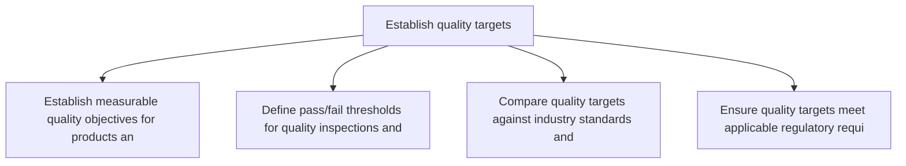
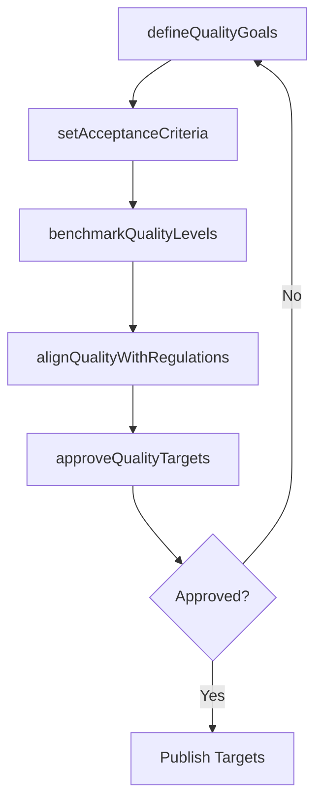

# Establish quality targets

> Business-as-Code definition for quality target establishment. Models quality goal setting, acceptance criteria definition, and quality level benchmarking as programmable workflows.

## Overview

Defining specific qualitative and quantitative target figures for products and manufacturing processes. This involves establishing measurable quality objectives such as defect rates, yield thresholds, and customer satisfaction benchmarks, then validating these targets against industry standards, regulatory requirements, and organizational capability. Quality targets serve as the foundation for all downstream testing procedures and quality control activities.

## Process Hierarchy



## GraphDL

```yaml
establish:
  object: Quality Targets
  actor: QualityStandardsManager
  result: QualityTargetSet
```

## Actions

| Action | Description |
|--------|-------------|
| defineQualityGoals | Establish measurable quality objectives for products and processes |
| setAcceptanceCriteria | Define pass/fail thresholds for quality inspections and tests |
| benchmarkQualityLevels | Compare quality targets against industry standards and competitors |
| alignQualityWithRegulations | Ensure quality targets meet applicable regulatory requirements |
| approveQualityTargets | Obtain management sign-off on finalized quality targets |

## Events

| Event | Description |
|-------|-------------|
| qualityGoalsDefined | Measurable quality objectives established for all products |
| acceptanceCriteriaSet | Inspection and test pass/fail thresholds defined |
| qualityLevelsBenchmarked | Quality targets compared to industry standards |
| qualityAlignedWithRegulations | Regulatory compliance of quality targets verified |
| qualityTargetsApproved | Quality targets approved by management |

## Searches

| Search | Description |
|--------|-------------|
| getQualityTargets | Retrieve quality targets by product, process, or standard |
| findBenchmarkData | Query industry quality benchmarks for comparison |
| getComplianceGaps | Identify gaps between quality targets and regulatory requirements |

## Process Flow



## RACI Matrix

| Activity | Responsible | Accountable | Consulted | Informed |
|----------|-------------|-------------|-----------|----------|
| defineQualityGoals | QualityStandardsManager | VP Quality | Manufacturing, Engineering | Executive |
| setAcceptanceCriteria | QualityEngineer | QualityStandardsManager | Production, Regulatory | Procurement |
| approveQualityTargets | QualityStandardsManager | VP Quality | Legal, Compliance | Executive |

## Related Processes

| Process | Relationship |
|---------|-------------|
| 4.1.9.2 Develop standard testing procedures | Downstream - quality targets drive test procedure design |
| 4.1.9.3 Communicate quality specifications | Downstream - approved targets are communicated to stakeholders |
| 4.3.3 Perform quality testing | Downstream - testing uses established quality targets |

## Related Departments

| Department | Role |
|-----------|------|
| Quality Assurance | Primary owner of quality target establishment |
| Manufacturing | Provides process capability data for target setting |
| Regulatory Affairs | Ensures compliance with regulatory quality standards |
| Engineering | Supports technical feasibility of quality targets |

## Related Occupations

| Occupation | Involvement |
|-----------|-------------|
| Quality Standards Manager | Quality goal definition and benchmarking |
| Quality Engineer | Acceptance criteria specification |
| Regulatory Affairs Specialist | Regulatory alignment verification |

## KPIs

| KPI | Description | Unit |
|-----|-------------|------|
| Quality Target Achievement | Percentage of products meeting defined quality targets | % |
| Benchmark Gap | Difference between company quality levels and industry benchmarks | % |
| Regulatory Compliance Rate | Percentage of quality targets aligned with regulations | % |

## Usage

```typescript
import { establishQualityTargets } from '@headlessly/establish-quality-targets'

const client = establishQualityTargets()

// Define quality goals for a product line
const goals = await client.defineQualityGoals({
  productLine: 'consumer-electronics',
  targets: [
    { metric: 'defect-rate', maxPPM: 50 },
    { metric: 'first-pass-yield', minPercent: 98 }
  ]
})

// Benchmark against industry standards
const benchmark = await client.benchmarkQualityLevels({
  industry: 'electronics-manufacturing',
  metrics: ['defect-rate', 'customer-return-rate'],
  source: 'APQC-benchmark-database'
})
```
