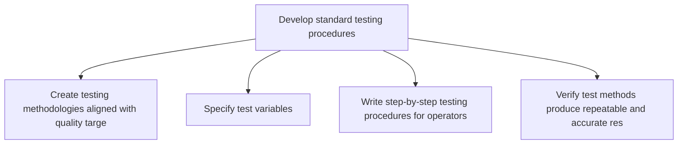
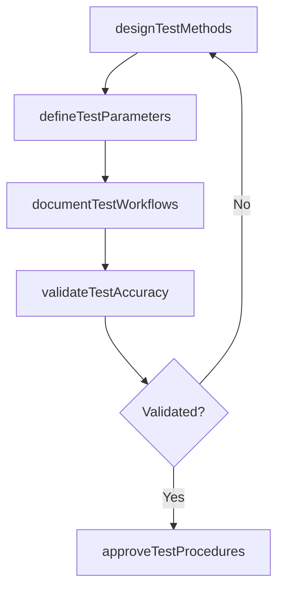

# Develop standard testing procedures

> Business-as-Code definition for standard testing procedure development. Models test method design, equipment calibration protocols, and testing workflow documentation as programmable workflows.

## Overview

Creating standard procedures for testing the quality of products/services. Describe the steps of key processes to help ensure consistent and quality output. Define the routine instructions for performing the quality testing activity.

## Process Hierarchy



## GraphDL

```yaml
develop:
  object: Standard Testing Procedures
  actor: QualityEngineer
  result: StandardTestProcedure
```

## Actions

| Action | Description |
|--------|-------------|
| designTestMethods | Create testing methodologies aligned with quality targets and standards |
| defineTestParameters | Specify test variables, tolerances, sample sizes, and frequencies |
| documentTestWorkflows | Write step-by-step testing procedures for operators |
| validateTestAccuracy | Verify test methods produce repeatable and accurate results |
| approveTestProcedures | Obtain quality management sign-off on testing procedures |

## Events

| Event | Description |
|-------|-------------|
| testMethodsDesigned | Testing methodologies created for all quality targets |
| testParametersDefined | Test variables, tolerances, and frequencies specified |
| testWorkflowsDocumented | Step-by-step test procedures written and distributed |
| testAccuracyValidated | Test method repeatability and accuracy verified |
| testProceduresApproved | Testing procedures approved by quality management |

## Searches

| Search | Description |
|--------|-------------|
| getTestProcedures | Retrieve standard test procedures by product or test type |
| findTestEquipmentRequirements | Query equipment needed for specific test procedures |
| getTestValidationResults | Retrieve method validation and accuracy study results |

## Process Flow



## RACI Matrix

| Activity | Responsible | Accountable | Consulted | Informed |
|----------|-------------|-------------|-----------|----------|
| designTestMethods | QualityEngineer | QAManager | Manufacturing, Regulatory | Production |
| documentTestWorkflows | QualityEngineer | QAManager | Operators, Training | Production |
| approveTestProcedures | QAManager | VP Quality | Regulatory, Engineering | Manufacturing |

## Related Processes

| Process | Relationship |
|---------|-------------|
| 4.1.9.1 Establish quality targets | Upstream - quality targets drive test procedure design |
| 4.1.9.3 Communicate quality specifications | Downstream - test procedures are communicated to testers |
| 4.3.3 Perform quality testing | Downstream - testing follows the standard procedures |

## Related Departments

| Department | Role |
|-----------|------|
| Quality Assurance | Primary owner of test procedure development |
| Manufacturing | Executes testing procedures on the shop floor |
| Metrology | Supports equipment calibration and measurement accuracy |

## Related Occupations

| Occupation | Involvement |
|-----------|-------------|
| Quality Engineer | Test method design and validation |
| Metrology Technician | Equipment calibration and measurement support |
| Quality Inspector | Test procedure execution and feedback |

## KPIs

| KPI | Description | Unit |
|-----|-------------|------|
| Test Procedure Coverage | Percentage of products with documented standard test procedures | % |
| Method Validation Pass Rate | Percentage of test methods passing accuracy validation | % |
| Procedure Update Cycle | Average time to update test procedures after specification changes | Days |

## Usage

```typescript
import { developStandardTestingProcedures } from '@headlessly/develop-standard-testing-procedures'

const client = developStandardTestingProcedures()

// Design test methods for a product
const methods = await client.designTestMethods({
  productId: 'SKU-5500',
  qualityTargets: ['electrical-safety', 'dimensional-tolerance', 'cosmetic-inspection'],
  standards: ['IEC-62368', 'internal-spec-QS-100']
})

// Validate test accuracy
const validation = await client.validateTestAccuracy({
  testMethodId: methods.items[0].id,
  repeatabilityTrials: 30,
  acceptanceCriteria: { rAndR: 10, bias: 5 }
})
```
