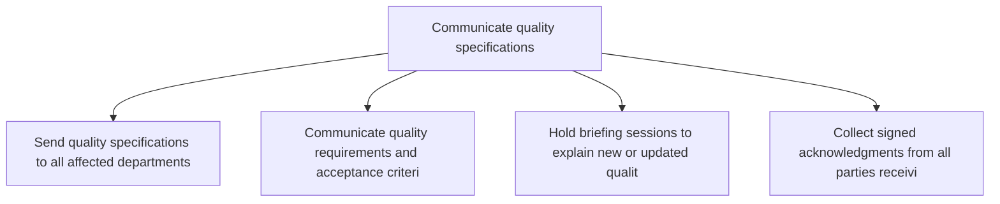
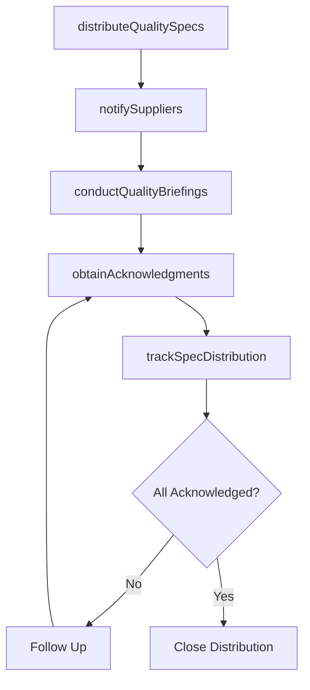

# Communicate quality specifications

> Business-as-Code definition for quality specification communication. Models specification distribution, supplier notification, and quality requirement acknowledgment as programmable workflows.

## Overview

Communicating the desired quality specifications to the manufacturing units, as well as the distribution centers, to avoid any misunderstanding or misinterpretation.

## Process Hierarchy



## GraphDL

```yaml
communicate:
  object: Quality Specifications
  actor: QualityCommunicationsLead
  result: CommunicatedSpecification
```

## Actions

| Action | Description |
|--------|-------------|
| distributeQualitySpecs | Send quality specifications to all affected departments and partners |
| notifySuppliers | Communicate quality requirements and acceptance criteria to suppliers |
| conductQualityBriefings | Hold briefing sessions to explain new or updated quality standards |
| obtainAcknowledgments | Collect signed acknowledgments from all parties receiving specifications |
| trackSpecDistribution | Monitor specification distribution status and identify gaps |

## Events

| Event | Description |
|-------|-------------|
| qualitySpecsDistributed | Quality specifications sent to all stakeholders |
| suppliersNotified | Suppliers informed of quality requirements |
| qualityBriefingsConducted | Quality specification briefing sessions completed |
| acknowledgmentsObtained | Specification acknowledgments collected from all parties |
| specDistributionTracked | Specification distribution status verified |

## Searches

| Search | Description |
|--------|-------------|
| getSpecDistributionStatus | Check which parties have received and acknowledged specifications |
| findPendingAcknowledgments | List parties that have not yet acknowledged specifications |
| getSpecificationHistory | Retrieve version history and distribution log for a specification |

## Process Flow



## RACI Matrix

| Activity | Responsible | Accountable | Consulted | Informed |
|----------|-------------|-------------|-----------|----------|
| distributeQualitySpecs | QualityCommunicationsLead | QAManager | Manufacturing, Procurement | All |
| notifySuppliers | QualityCommunicationsLead | QAManager | Procurement, SupplierQuality | Logistics |
| conductQualityBriefings | QualityCommunicationsLead | VP Quality | Production, Engineering | Training |

## Related Processes

| Process | Relationship |
|---------|-------------|
| 4.1.9.1 Establish quality targets | Upstream - established targets are communicated |
| 4.1.9.2 Develop standard testing procedures | Upstream - test procedures are communicated alongside specs |
| 4.2.5 Manage suppliers | Downstream - supplier quality expectations are communicated |

## Related Departments

| Department | Role |
|-----------|------|
| Quality Assurance | Primary owner of specification communication |
| Procurement | Distributes quality requirements to supply base |
| Training | Supports quality briefing sessions and materials |

## Related Occupations

| Occupation | Involvement |
|-----------|-------------|
| Quality Communications Lead | Specification distribution and acknowledgment tracking |
| Supplier Quality Engineer | Quality requirement communication to suppliers |
| Training Coordinator | Quality briefing session facilitation |

## KPIs

| KPI | Description | Unit |
|-----|-------------|------|
| Specification Acknowledgment Rate | Percentage of parties acknowledging quality specifications | % |
| Communication Cycle Time | Average time from specification approval to full distribution | Days |
| Supplier Notification Compliance | Percentage of suppliers notified within required timeframe | % |

## Usage

```typescript
import { communicateQualitySpecifications } from '@headlessly/communicate-quality-specifications'

const client = communicateQualitySpecifications()

// Distribute quality specifications
const distribution = await client.distributeQualitySpecs({
  specificationId: 'QS-2025-0045',
  recipients: ['manufacturing', 'procurement', 'supplier-quality'],
  effectiveDate: '2025-07-01'
})

// Notify affected suppliers
const notifications = await client.notifySuppliers({
  specificationId: 'QS-2025-0045',
  supplierIds: ['supplier-acme', 'supplier-globalparts'],
  requireAcknowledgment: true,
  deadline: '2025-06-15'
})
```
