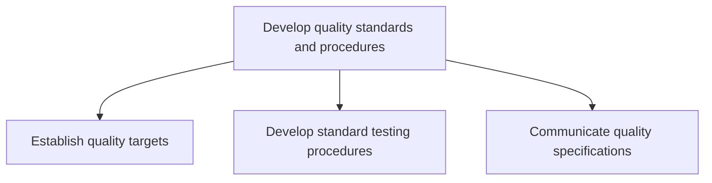
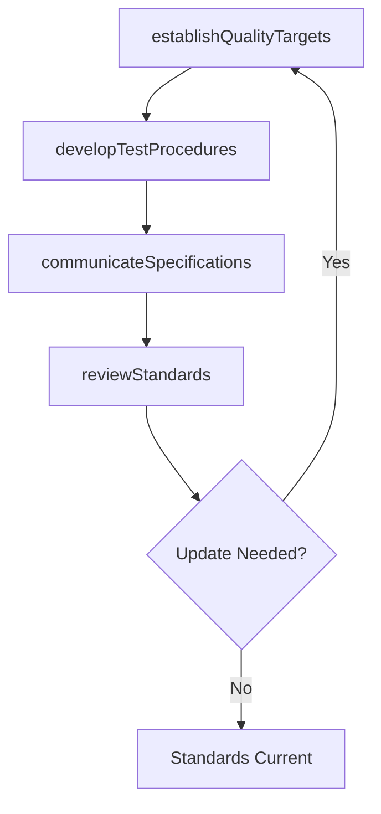

# Develop quality standards and procedures

> Business-as-Code definition for quality standards and procedures development. Models quality target setting, test procedure design, and specification communication as programmable workflows.

## Overview

Developing standards and procedures for maintaining the quality of products/services. Establish desired quality targets. Create standardized procedures for the quality. Ensure quality specifications are effectively communicated.

## Process Hierarchy



## GraphDL

```yaml
develop:
  object: Quality Standards And Procedures
  actor: QualityManager
  result: QualityStandardsDocument
```

## Actions

| Action | Description |
|--------|-------------|
| establishQualityTargets | Define quantitative and qualitative quality thresholds |
| developTestProcedures | Create standardized testing methods and protocols |
| communicateSpecifications | Distribute quality specifications to production and suppliers |
| reviewStandards | Periodically assess and update quality standards |

## Events

| Event | Description |
|-------|-------------|
| qualityTargetsEstablished | Quality targets defined and approved |
| testProceduresDeveloped | Standard testing procedures documented and validated |
| specificationsCommunicated | Quality specifications distributed to all stakeholders |
| standardsReviewed | Quality standards assessed and updated as needed |

## Searches

| Search | Description |
|--------|-------------|
| getQualityTargets | Retrieve quality targets by product or process |
| findTestProcedures | Query standard testing procedures by type or product |
| getSpecificationDistribution | Track which teams have acknowledged quality specifications |

## Process Flow



## RACI Matrix

| Activity | Responsible | Accountable | Consulted | Informed |
|----------|-------------|-------------|-----------|----------|
| establishQualityTargets | QualityEngineer | QAManager | Production, Engineering | Executive |
| developTestProcedures | QualityEngineer | QAManager | Lab, Production | Procurement |
| communicateSpecifications | QualityCoordinator | QAManager | Production, Suppliers | Sales |

## Sub-Processes

| ID | Name | Description |
|----|------|-------------|
| 4.1.9.1 | Establish quality targets | Defining specific qualitative and quantitative target figures. |
| 4.1.9.2 | Develop standard testing procedures | Creating standard procedures for testing the quality of products/services. Describe the steps of key |
| 4.1.9.3 | Communicate quality specifications | Communicating the desired quality specifications to the manufacturing units, as well as the distribu |

## Related Processes

| Process | Relationship |
|---------|-------------|
| 4.3.3 Perform quality testing | Downstream - standards guide test execution |
| 4.2.5.4 Monitor quality of product delivered | Downstream - supplier quality measured against standards |
| 4.3.2.4 Monitor quality | Downstream - in-process quality monitored per standards |

## Related Departments

| Department | Role |
|-----------|------|
| Quality Assurance | Primary owner of quality standards and procedures |
| Manufacturing | Implements quality standards on production floor |
| Regulatory | Ensures standards meet regulatory requirements |

## Related Occupations

| Occupation | Involvement |
|-----------|-------------|
| Quality Manager | Standards development and governance |
| Quality Engineer | Test procedure design and validation |
| Regulatory Affairs Specialist | Compliance alignment |

## KPIs

| KPI | Description | Unit |
|-----|-------------|------|
| Standards Coverage | Percentage of products with defined quality standards | % |
| Test Procedure Currency | Percentage of test procedures reviewed within last 12 months | % |
| Specification Acknowledgment Rate | Percentage of stakeholders confirming receipt of specs | % |

## Usage

```typescript
import { developQualityStandardsAndProcedures } from '@headlessly/develop-quality-standards-and-procedures'

const client = developQualityStandardsAndProcedures()

// Establish quality targets for a product line
const targets = await client.establishQualityTargets({
  productLine: 'precision-components',
  tolerances: { dimensional: '0.01mm', surface: 'Ra 0.8' },
  defectRateMax: 50
})

// Develop standard testing procedure
const procedure = await client.developTestProcedures({
  productId: 'SKU-5500',
  testType: 'dimensional-inspection',
  samplePlan: 'AQL-2.5',
  equipment: ['CMM', 'surface-profilometer']
})
```
