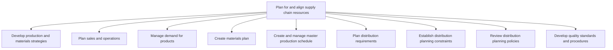
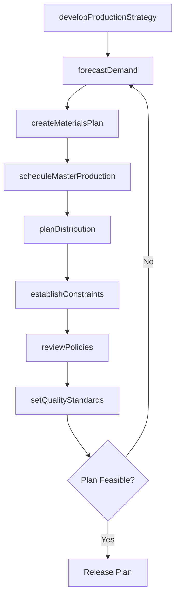

# Plan for and align supply chain resources

> Business-as-Code definition for supply chain planning and alignment. Models demand forecasting, production scheduling, materials planning, and distribution coordination as programmable workflows.

## Overview

Creating strategies for production and materials. Handle the demand for the products of the organization. Develop plans for handling materials. Develop and administer the schedule for master production. Plan for distribution requirements and its constraints by reviewing and assessing distribution policies and performance and by establishing quality standards and procedures.

## Process Hierarchy



## GraphDL

```yaml
plan:
  object: For And Align Supply Chain Resources
  actor: SupplyChainPlanner
  result: SupplyChainPlan
```

## Actions

| Action | Description |
|--------|-------------|
| developProductionStrategy | Define manufacturing goals, labor policies, and capacity plans |
| forecastDemand | Build and refine demand forecasts using customer and market data |
| createMaterialsPlan | Generate constrained materials plans aligned with supplier capacity |
| scheduleMasterProduction | Create and maintain the master production schedule |
| planDistribution | Define distribution requirements, routing, and replenishment |
| establishConstraints | Set distribution center layout, inventory, and transportation limits |
| reviewPolicies | Assess distribution network and sourcing relationship effectiveness |
| setQualityStandards | Establish quality targets and standard testing procedures |

## Events

| Event | Description |
|-------|-------------|
| productionStrategyDeveloped | Production and materials strategies finalized |
| demandForecasted | Demand consensus forecast created and validated |
| materialsPlanCreated | Constrained materials plan generated and approved |
| masterSchedulePublished | Master production schedule released to operations |
| distributionPlanned | Distribution requirements and dispatch plans completed |
| constraintsEstablished | Distribution planning constraints defined and documented |
| policiesReviewed | Distribution planning policies assessed and updated |
| qualityStandardsSet | Quality targets and testing procedures established |

## Searches

| Search | Description |
|--------|-------------|
| getDemandForecast | Retrieve demand forecast by product, region, or time period |
| getProductionSchedule | Query master production schedule by line, product, or date |
| findMaterialsGaps | Identify shortfalls in materials availability against demand |
| getDistributionPlan | Retrieve distribution requirements and dispatch plans |
| getCapacityUtilization | Query production and distribution capacity usage |

## Process Flow



## RACI Matrix

| Activity | Responsible | Accountable | Consulted | Informed |
|----------|-------------|-------------|-----------|----------|
| developProductionStrategy | SupplyChainPlanner | VP Operations | Manufacturing, Finance | Executive |
| forecastDemand | DemandPlanner | VP SupplyChain | Sales, Marketing | Finance |
| createMaterialsPlan | MaterialsPlanner | VP Operations | Procurement, Suppliers | Manufacturing |
| scheduleMasterProduction | ProductionPlanner | PlantManager | SupplyChain, QA | Logistics |
| planDistribution | DistributionPlanner | VP Logistics | Warehousing, Transportation | Sales |

## Sub-Processes

| ID | Name | Description |
|----|------|-------------|
| 4.1.1 | Develop production and materials strategies | Creating strategies for production processes, as well as the process of managing materials. Define p |
| 4.1.2 | Plan sales and operations | Plan sales and operations within the supply chain to ensure operational efficiency and alignment with organizational objectives |
| 4.1.3 | Manage demand for products | Forecasting demand for products using secondary research and customer feedback. Refine these forecas |
| 4.1.4 | Create materials plan | Developing a scheme that allows for advance planning for the availability of raw materials and spare |
| 4.1.5 | Create and manage master production schedule | Taking care of the master production plan. The master production includes creation and implementatio |
| 4.1.6 | Plan distribution requirements | Maintaining master data of finished products and inventory. Identify the requirements of finished pr |
| 4.1.7 | Establish distribution planning constraints | Instituting the constraints for planning of distribution process. Create a plan that specifies every |
| 4.1.8 | Review distribution planning policies | Revisiting and refurbishing the policies for planning the distribution process. Asses the distributi |
| 4.1.9 | Develop quality standards and procedures | Developing standards and procedures for maintaining the quality of products/services. Establish desi |

## Related Processes

| Process | Relationship |
|---------|-------------|
| 4.2 Procure materials and services | Downstream - materials plan drives procurement |
| 4.3 Produce/Assemble/Test product | Downstream - production schedule drives manufacturing |
| 4.4 Manage logistics and warehousing | Downstream - distribution plan drives logistics |
| 3.3 Market and sell products and services | Upstream - sales forecasts inform demand planning |

## Related Departments

| Department | Role |
|-----------|------|
| Supply Chain Planning | Primary owner of demand and supply alignment |
| Manufacturing | Provides production capacity and constraint data |
| Sales | Contributes demand signals and customer commitments |
| Procurement | Supplies materials availability and lead time data |
| Quality Assurance | Defines quality standards for production processes |

## Related Occupations

| Occupation | Involvement |
|-----------|-------------|
| Supply Chain Planner | Demand forecasting and supply alignment |
| Production Planner | Master production scheduling |
| Materials Planner | Materials requirements and constraint planning |
| Distribution Planner | Distribution network and requirements planning |

## KPIs

| KPI | Description | Unit |
|-----|-------------|------|
| Forecast Accuracy | Variance between forecasted and actual demand | % |
| Schedule Adherence | Percentage of production schedule met on time | % |
| Capacity Utilization | Percentage of available production capacity used | % |
| Plan Cycle Time | Time to complete integrated supply chain planning cycle | Days |
| Inventory Days of Supply | Number of days current inventory can cover demand | Days |

## Usage

```typescript
import { planForAndAlignSupplyChainResources } from '@headlessly/plan-for-and-align-supply-chain-resources'

const client = planForAndAlignSupplyChainResources()

// Build demand forecast
const forecast = await client.forecastDemand({
  productFamily: 'consumer-electronics',
  horizon: { months: 6 },
  method: 'consensus'
})

// Create constrained materials plan
const materialsPlan = await client.createMaterialsPlan({
  forecastId: forecast.id,
  supplierConstraints: true,
  capacityLimits: true
})

// Generate master production schedule
const schedule = await client.scheduleMasterProduction({
  materialsPlanId: materialsPlan.id,
  planningPeriod: 'Q3-2025'
})
```
