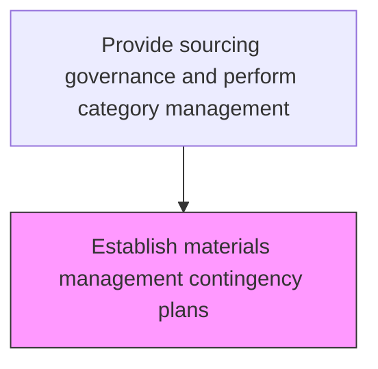
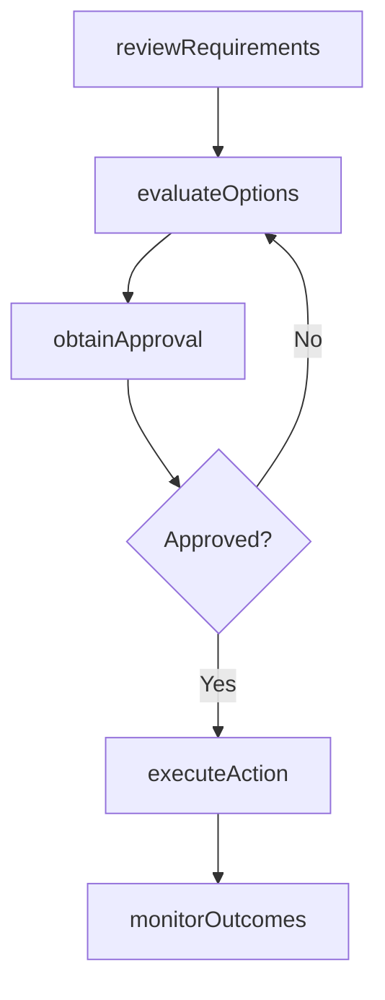

# Establish materials management contingency plans

> Business-as-Code definition for establish materials management contingency plans. Models the sourcing processes within procurement to ensure materials and services are acquired efficiently and cost-effectively.

## Overview

Developing a strategy to deal with issues projected to arise during implementation of the inventory plan. Identify how to react to issues that arise and require changes to the inventory plan, such as a vendor failing to deliver materials on time. Collaborate with production and suppliers to prepare solutions to projected problems.

## Process Hierarchy



## GraphDL

```yaml
establish:
  object: Materials Management Contingency Plans
  actor: SourcingManager
  result: EstablishResult
```

## Actions

| Action | Description |
|--------|-------------|
| establishMaterials | Establish materials management contingency plans based on organizational requirements |
| reviewRequirements | Assess business needs and specifications for procurement activities |
| evaluateOptions | Compare available options against cost, quality, and delivery criteria |
| obtainApproval | Secure necessary approvals from budget holders and management |
| executeAction | Carry out establish materials management contingency plans tasks and document outcomes |
| monitorOutcomes | Track results and measure effectiveness of procurement actions |

## Events

| Event | Description |
|-------|-------------|
| requirementsReviewed | Business needs and specifications assessed for procurement |
| optionsEvaluated | Available options compared against selection criteria |
| approvalObtained | Required approvals secured from management |
| actionExecuted | Establish materials management contingency plans tasks completed and documented |
| outcomesMonitored | Results tracked and effectiveness measured |

## Searches

| Search | Description |
|--------|-------------|
| getProcurementStatus | Retrieve current status of establish materials management contingency plans activities |
| findSupplierOptions | Query available suppliers and their capabilities for this requirement |
| getSpendAnalysis | Retrieve spend analysis data for the relevant category |
| getProcurementHistory | Query historical data for materials management contingency plans activities |

## Process Flow



## RACI Matrix

| Activity | Responsible | Accountable | Consulted | Informed |
|----------|-------------|-------------|-----------|----------|
| reviewRequirements | SourcingManager | VP Procurement | Requestors, Finance | Operations |
| evaluateOptions | SourcingManager | VP Procurement | QualityAssurance, Legal | Suppliers |
| executeAction | SourcingManager | VP Procurement | SupplyChain | Finance |
| monitorOutcomes | ProcurementAnalyst | VP Procurement | Finance, Quality | Executive |

## Related Processes

| Process | Relationship |
|---------|-------------|
| 4.2.1 Provide sourcing governance and perform category management | Parent process |
| 4.2.4 Order materials and services | Downstream - procurement plans drive ordering |
| 4.1.4 Create materials plan | Upstream - materials plan defines procurement requirements |

## Related Departments

| Department | Role |
|-----------|------|
| Procurement | Primary owner of materials and services acquisition |
| Finance | Approves budgets and validates cost-effectiveness |
| Quality Assurance | Validates supplier quality capabilities |
| Legal | Reviews contract terms and compliance requirements |

## Related Occupations

| Occupation | Involvement |
|-----------|-------------|
| SourcingManager | Primary executor of procurement activities |
| Procurement Analyst | Provides analytical support and spend analysis |
| Category Manager | Manages category strategy and supplier portfolio |

## KPIs

| KPI | Description | Unit |
|-----|-------------|------|
| Procurement Cycle Time | Average time to complete establish materials management contingency plans | Days |
| Cost Savings Achieved | Savings realized through procurement activities | % |
| Supplier Quality Rate | Percentage of procured items meeting quality specifications | % |

## Usage

```typescript
import { establishMaterialsManagementContingencyPlans } from '@headlessly/establish-materials-management-contingency-plans'

const client = establishMaterialsManagementContingencyPlans()

// Review requirements for procurement
const requirements = await client.reviewRequirements({
  category: 'materials-management-contingen',
  urgency: 'standard',
  budgetCode: 'PROC-2025'
})

// Evaluate options and execute
const evaluation = await client.evaluateOptions({
  requirementsId: requirements.id,
  criteria: ['cost', 'quality', 'delivery-time']
})
```
