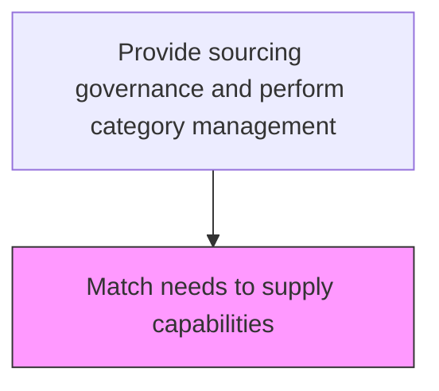
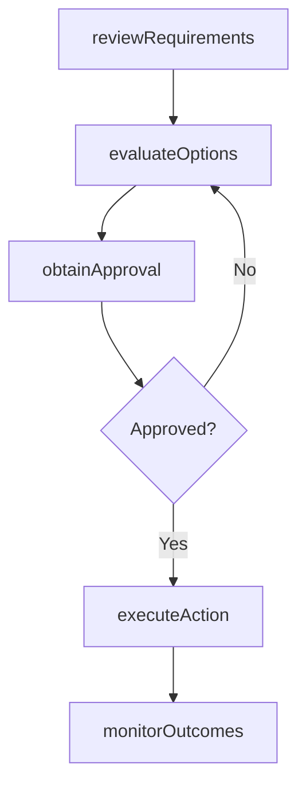

# Match needs to supply capabilities

> Business-as-Code definition for match needs to supply capabilities. Models the sourcing processes within procurement to ensure materials and services are acquired efficiently and cost-effectively.

## Overview

Synchronizing the requirements of materials and services and the capacity of suppliers for providing these materials and services. Revamp the procurement needs of the company in consideration of the capabilities of the suppliers.

## Process Hierarchy



## GraphDL

```yaml
match:
  object: Needs To Supply Capabilities
  actor: SourcingManager
  result: MatchResult
```

## Actions

| Action | Description |
|--------|-------------|
| matchNeeds | Match needs to supply capabilities based on organizational requirements |
| reviewRequirements | Assess business needs and specifications for procurement activities |
| evaluateOptions | Compare available options against cost, quality, and delivery criteria |
| obtainApproval | Secure necessary approvals from budget holders and management |
| executeAction | Carry out match needs to supply capabilities tasks and document outcomes |
| monitorOutcomes | Track results and measure effectiveness of procurement actions |

## Events

| Event | Description |
|-------|-------------|
| requirementsReviewed | Business needs and specifications assessed for procurement |
| optionsEvaluated | Available options compared against selection criteria |
| approvalObtained | Required approvals secured from management |
| actionExecuted | Match needs to supply capabilities tasks completed and documented |
| outcomesMonitored | Results tracked and effectiveness measured |

## Searches

| Search | Description |
|--------|-------------|
| getProcurementStatus | Retrieve current status of match needs to supply capabilities activities |
| findSupplierOptions | Query available suppliers and their capabilities for this requirement |
| getSpendAnalysis | Retrieve spend analysis data for the relevant category |
| getProcurementHistory | Query historical data for needs to supply capabilities activities |

## Process Flow



## RACI Matrix

| Activity | Responsible | Accountable | Consulted | Informed |
|----------|-------------|-------------|-----------|----------|
| reviewRequirements | SourcingManager | VP Procurement | Requestors, Finance | Operations |
| evaluateOptions | SourcingManager | VP Procurement | QualityAssurance, Legal | Suppliers |
| executeAction | SourcingManager | VP Procurement | SupplyChain | Finance |
| monitorOutcomes | ProcurementAnalyst | VP Procurement | Finance, Quality | Executive |

## Related Processes

| Process | Relationship |
|---------|-------------|
| 4.2.1 Provide sourcing governance and perform category management | Parent process |
| 4.2.4 Order materials and services | Downstream - procurement plans drive ordering |
| 4.1.4 Create materials plan | Upstream - materials plan defines procurement requirements |

## Related Departments

| Department | Role |
|-----------|------|
| Procurement | Primary owner of materials and services acquisition |
| Finance | Approves budgets and validates cost-effectiveness |
| Quality Assurance | Validates supplier quality capabilities |
| Legal | Reviews contract terms and compliance requirements |

## Related Occupations

| Occupation | Involvement |
|-----------|-------------|
| SourcingManager | Primary executor of procurement activities |
| Procurement Analyst | Provides analytical support and spend analysis |
| Category Manager | Manages category strategy and supplier portfolio |

## KPIs

| KPI | Description | Unit |
|-----|-------------|------|
| Procurement Cycle Time | Average time to complete match needs to supply capabilities | Days |
| Cost Savings Achieved | Savings realized through procurement activities | % |
| Supplier Quality Rate | Percentage of procured items meeting quality specifications | % |

## Usage

```typescript
import { matchNeedsToSupplyCapabilities } from '@headlessly/match-needs-to-supply-capabilities'

const client = matchNeedsToSupplyCapabilities()

// Review requirements for procurement
const requirements = await client.reviewRequirements({
  category: 'needs-to-supply-capabilities',
  urgency: 'standard',
  budgetCode: 'PROC-2025'
})

// Evaluate options and execute
const evaluation = await client.evaluateOptions({
  requirementsId: requirements.id,
  criteria: ['cost', 'quality', 'delivery-time']
})
```
