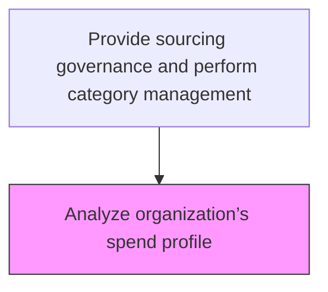
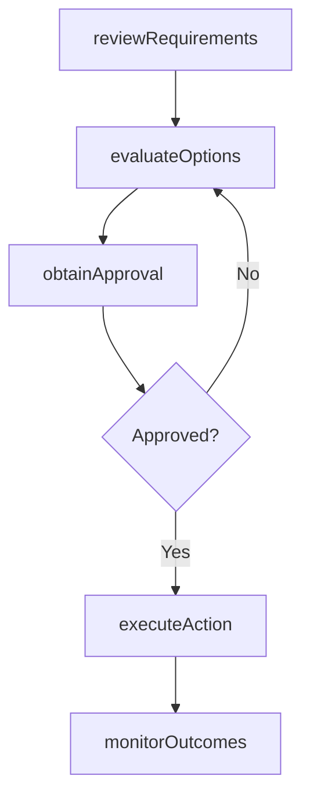

# Analyze organization’s spend profile

> Business-as-Code definition for analyze organization’s spend profile. Models the sourcing processes within procurement to ensure materials and services are acquired efficiently and cost-effectively.

## Overview

Evaluating the spend profile of the organization. Collect, cleanse, classify, and analyze the procurement data with the purpose of reducing procurement costs, improving efficiency, and monitoring compliance.

## Process Hierarchy



## GraphDL

```yaml
analyze:
  object: Organization’s Spend Profile
  actor: SourcingManager
  result: AnalyzeResult
```

## Actions

| Action | Description |
|--------|-------------|
| analyzeOrganization’s | Analyze organization’s spend profile based on organizational requirements |
| reviewRequirements | Assess business needs and specifications for procurement activities |
| evaluateOptions | Compare available options against cost, quality, and delivery criteria |
| obtainApproval | Secure necessary approvals from budget holders and management |
| executeAction | Carry out analyze organization’s spend profile tasks and document outcomes |
| monitorOutcomes | Track results and measure effectiveness of procurement actions |

## Events

| Event | Description |
|-------|-------------|
| requirementsReviewed | Business needs and specifications assessed for procurement |
| optionsEvaluated | Available options compared against selection criteria |
| approvalObtained | Required approvals secured from management |
| actionExecuted | Analyze organization’s spend profile tasks completed and documented |
| outcomesMonitored | Results tracked and effectiveness measured |

## Searches

| Search | Description |
|--------|-------------|
| getProcurementStatus | Retrieve current status of analyze organization’s spend profile activities |
| findSupplierOptions | Query available suppliers and their capabilities for this requirement |
| getSpendAnalysis | Retrieve spend analysis data for the relevant category |
| getProcurementHistory | Query historical data for organization’s spend profile activities |

## Process Flow



## RACI Matrix

| Activity | Responsible | Accountable | Consulted | Informed |
|----------|-------------|-------------|-----------|----------|
| reviewRequirements | SourcingManager | VP Procurement | Requestors, Finance | Operations |
| evaluateOptions | SourcingManager | VP Procurement | QualityAssurance, Legal | Suppliers |
| executeAction | SourcingManager | VP Procurement | SupplyChain | Finance |
| monitorOutcomes | ProcurementAnalyst | VP Procurement | Finance, Quality | Executive |

## Related Processes

| Process | Relationship |
|---------|-------------|
| 4.2.1 Provide sourcing governance and perform category management | Parent process |
| 4.2.4 Order materials and services | Downstream - procurement plans drive ordering |
| 4.1.4 Create materials plan | Upstream - materials plan defines procurement requirements |

## Related Departments

| Department | Role |
|-----------|------|
| Procurement | Primary owner of materials and services acquisition |
| Finance | Approves budgets and validates cost-effectiveness |
| Quality Assurance | Validates supplier quality capabilities |
| Legal | Reviews contract terms and compliance requirements |

## Related Occupations

| Occupation | Involvement |
|-----------|-------------|
| SourcingManager | Primary executor of procurement activities |
| Procurement Analyst | Provides analytical support and spend analysis |
| Category Manager | Manages category strategy and supplier portfolio |

## KPIs

| KPI | Description | Unit |
|-----|-------------|------|
| Procurement Cycle Time | Average time to complete analyze organization’s spend profile | Days |
| Cost Savings Achieved | Savings realized through procurement activities | % |
| Supplier Quality Rate | Percentage of procured items meeting quality specifications | % |

## Usage

```typescript
import { analyzeOrganization’sSpendProfile } from '@headlessly/analyze-organizations-spend-profile'

const client = analyzeOrganization’sSpendProfile()

// Review requirements for procurement
const requirements = await client.reviewRequirements({
  category: 'organization’s-spend-profile',
  urgency: 'standard',
  budgetCode: 'PROC-2025'
})

// Evaluate options and execute
const evaluation = await client.evaluateOptions({
  requirementsId: requirements.id,
  criteria: ['cost', 'quality', 'delivery-time']
})
```
