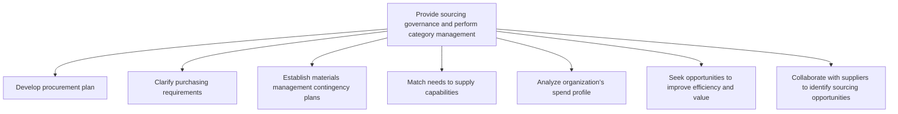
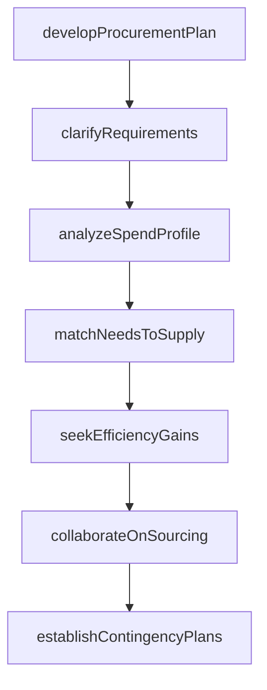

# Provide sourcing governance and perform category management

> Business-as-Code definition for sourcing governance and category management. Models procurement planning, spend analysis, requirements clarification, and supplier collaboration as programmable workflows.

## Overview

Creating strategies for procuring materials and services from various sources, and for managing and evaluating categories. Establish a procurement process that describes the approach for obtaining products and purchasing activities. Evaluate the sources. Create sourcing relationships in order to continuously improve. Re-evaluate purchasing activities.

## Process Hierarchy



## GraphDL

```yaml
provide:
  object: Sourcing Governance And Perform Category Management
  actor: CategoryManager
  result: SourcingGovernanceFramework
```

## Actions

| Action | Description |
|--------|-------------|
| developProcurementPlan | Create comprehensive plan for sourcing materials and services |
| clarifyRequirements | Define exact purchasing specifications and quantities |
| establishContingencyPlans | Create fallback strategies for supply disruptions |
| matchNeedsToSupply | Align purchasing needs with supplier capabilities |
| analyzeSpendProfile | Evaluate organizational spend by category and supplier |
| seekEfficiencyGains | Identify opportunities to reduce cost and improve value |
| collaborateOnSourcing | Work with suppliers to find new sourcing opportunities |

## Events

| Event | Description |
|-------|-------------|
| procurementPlanDeveloped | Procurement strategy and plan documented |
| requirementsClarified | Purchasing specifications validated and approved |
| contingencyPlanEstablished | Supply disruption fallback strategy created |
| needsMatched | Purchasing needs aligned with supplier capabilities |
| spendProfileAnalyzed | Organizational spend analysis completed |
| efficiencyOpportunityFound | Cost reduction or value improvement opportunity identified |
| sourcingOpportunityIdentified | New sourcing channel or supplier identified |

## Searches

| Search | Description |
|--------|-------------|
| getSpendByCategory | Retrieve procurement spend breakdown by category |
| findContingencyPlans | Query active contingency plans by material or supplier |
| getSupplierCapabilities | Match requirements against supplier capability profiles |
| getSourcingOpportunities | List identified sourcing improvement opportunities |

## Process Flow



## RACI Matrix

| Activity | Responsible | Accountable | Consulted | Informed |
|----------|-------------|-------------|-----------|----------|
| developProcurementPlan | CategoryManager | CPO | Finance, Operations | Executive |
| clarifyRequirements | ProcurementAnalyst | CategoryManager | Engineering, Production | Suppliers |
| analyzeSpendProfile | SpendAnalyst | CPO | Finance, Compliance | CategoryManagers |
| matchNeedsToSupply | SourcingSpecialist | CategoryManager | QA, Engineering | Procurement |

## Sub-Processes

| ID | Name | Description |
|----|------|-------------|
| 4.2.1.1 | Develop procurement plan | Creating a plan for procuring materials and services. Plan what to buy, when, and from what sources. |
| 4.2.1.2 | Clarify purchasing requirements | Defining the purchasing requirements for materials and services. Specify the exact inventory require |
| 4.2.1.3 | Establish materials management contingency plans | Developing a strategy to deal with issues projected to arise during implementation of the inventory  |
| 4.2.1.4 | Match needs to supply capabilities | Synchronizing the requirements of materials and services and the capacity of suppliers for providing |
| 4.2.1.5 | Analyze organization’s spend profile | Evaluating the spend profile of the organization. Collect, cleanse, classify, and analyze the procur |
| 4.2.1.6 | Seek opportunities to improve efficiency and value | Seeking the most efficient sourcing and procurement opportunities. |
| 4.2.1.7 | Collaborate with suppliers to identify sourcing opportunities | Collaborating with the suppliers of materials and services in order to determine new opportunities f |

## Related Processes

| Process | Relationship |
|---------|-------------|
| 4.2.3 Select suppliers and develop/maintain contracts | Downstream - governance guides supplier selection |
| 4.2.4 Order materials and services | Downstream - procurement plan shapes ordering |
| 4.1.4 Create materials plan | Upstream - materials plan defines procurement needs |

## Related Departments

| Department | Role |
|-----------|------|
| Procurement | Primary owner of sourcing governance |
| Finance | Spend analysis and budget oversight |
| Operations | Defines material requirements and specifications |
| Legal | Compliance and risk assessment |

## Related Occupations

| Occupation | Involvement |
|-----------|-------------|
| Category Manager | Category strategy and governance |
| Spend Analyst | Procurement spend profiling and analysis |
| Sourcing Specialist | Supplier capability assessment |

## KPIs

| KPI | Description | Unit |
|-----|-------------|------|
| Category Coverage | Percentage of spend under category management | % |
| Savings Pipeline | Identified savings opportunities in procurement pipeline | Currency |
| Contingency Plan Coverage | Percentage of critical materials with contingency plans | % |

## Usage

```typescript
import { provideSourcingGovernanceAndPerformCategoryManagement } from '@headlessly/provide-sourcing-governance-and-perform-category-management'

const client = provideSourcingGovernanceAndPerformCategoryManagement()

// Analyze organizational spend profile
const spend = await client.analyzeSpendProfile({
  period: 'FY-2025',
  groupBy: 'category',
  includeCompliance: true
})

// Develop procurement plan for a category
const plan = await client.developProcurementPlan({
  category: 'electronic-components',
  budget: 5000000,
  strategy: 'strategic-sourcing',
  targetSavings: 8
})
```
