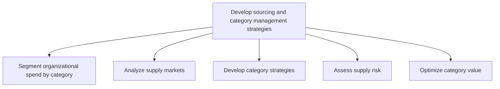
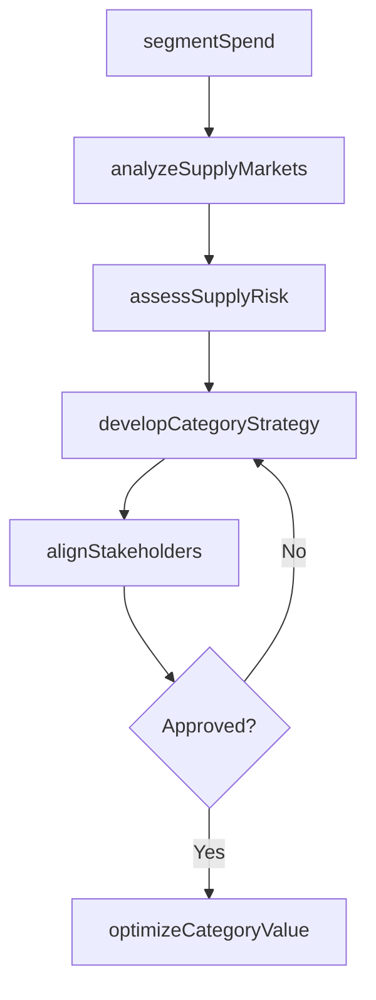

# Develop sourcing and category management strategies

> Business-as-Code definition for sourcing and category management strategy development. Models spend segmentation, category analysis, supply market assessment, strategic sourcing methodology, and value optimization as programmable workflows.

## Overview

Deploying a strategic sourcing methodology to segment the majority of organizational spend based on external supply markets (versus individual suppliers or internal stakeholders) to reduce the cost of buying goods and services, reduce risk in the supply chain, and maximize value delivered from the supply base. This approach typically includes cross-functional management of categories, examining the entire category spend, how the organization uses the products or services within the category, the marketplace, and major suppliers.

## Process Hierarchy



## GraphDL

```yaml
develop:
  object: Sourcing And Category Management Strategies
  actor: CategoryManager
  result: SourcingStrategy
```

## Actions

| Action | Description |
|--------|-------------|
| segmentSpend | Classify organizational spend into procurement categories |
| analyzeSupplyMarkets | Assess external supply market dynamics and supplier landscape |
| developCategoryStrategy | Create strategic sourcing plan for each procurement category |
| assessSupplyRisk | Evaluate risk exposure across supply categories and markets |
| optimizeCategoryValue | Identify cost reduction and value creation opportunities by category |
| alignStakeholders | Engage cross-functional teams in category strategy development |

## Events

| Event | Description |
|-------|-------------|
| spendSegmented | Organizational spend classified into procurement categories |
| supplyMarketsAnalyzed | External supply market assessment completed |
| categoryStrategyDeveloped | Strategic sourcing plan created for procurement category |
| supplyRiskAssessed | Risk evaluation completed for supply categories |
| categoryValueOptimized | Value improvement opportunities identified and prioritized |
| stakeholdersAligned | Cross-functional agreement on category strategy achieved |

## Searches

| Search | Description |
|--------|-------------|
| getSpendAnalysis | Retrieve spend breakdown by category, supplier, or business unit |
| getCategoryStrategy | Query sourcing strategy details for a specific category |
| getSupplyMarketIntelligence | Retrieve supply market data and supplier landscape analysis |
| getSupplyRiskProfile | Query risk exposure by category, supplier, or geography |
| getCategoryPerformance | Track category strategy execution and savings realization |

## Process Flow



## RACI Matrix

| Activity | Responsible | Accountable | Consulted | Informed |
|----------|-------------|-------------|-----------|----------|
| segmentSpend | SpendAnalyst | CategoryManager | Finance, BusinessUnits | Procurement |
| analyzeSupplyMarkets | MarketResearcher | CategoryManager | SupplierDevelopment | Legal |
| developCategoryStrategy | CategoryManager | ChiefProcurementOfficer | StakeholderLeads, Finance | Executive |
| assessSupplyRisk | RiskAnalyst | CategoryManager | Legal, Compliance | Supply Chain |

## Related Processes

| Process | Relationship |
|---------|-------------|
| 4.2.1 Provide sourcing governance and perform category management | Upstream - governance framework directs strategy development |
| 4.2.3 Select suppliers and develop/maintain contracts | Downstream - category strategies guide supplier selection |
| 4.2.5 Manage suppliers | Downstream - strategies inform supplier performance expectations |
| 1.2 Define and evaluate strategic options | Parallel - corporate strategy shapes sourcing priorities |

## Related Departments

| Department | Role |
|-----------|------|
| Strategic Sourcing | Primary owner of category strategy development |
| Finance | Provides spend data and validates savings projections |
| Business Units | Contribute requirements and validate category strategies |
| Risk Management | Assesses supply chain risk across categories |

## Related Occupations

| Occupation | Involvement |
|-----------|-------------|
| Category Manager | End-to-end category strategy ownership |
| Spend Analyst | Spend segmentation and analysis |
| Supply Market Researcher | Market intelligence and supplier landscape analysis |

## KPIs

| KPI | Description | Unit |
|-----|-------------|------|
| Category Savings Rate | Cost savings achieved versus baseline spend per category | % |
| Spend Under Management | Percentage of total spend covered by category strategies | % |
| Supplier Consolidation Ratio | Reduction in supplier count per category | Ratio |
| Strategy Implementation Rate | Percentage of category strategies fully implemented on schedule | % |

## Usage

```typescript
import { developSourcingAndCategoryManagementStrategies } from '@headlessly/develop-sourcing-and-category-management-strategies'

const client = developSourcingAndCategoryManagementStrategies()

// Segment organizational spend
const categories = await client.segmentSpend({
  fiscalYear: 'FY2025',
  minimumCategorySpend: 100000,
  segmentationMethod: 'supply-market-based'
})

// Develop category strategy
const strategy = await client.developCategoryStrategy({
  categoryId: 'CAT-IT-SERVICES',
  currentSpend: 5000000,
  approachType: 'strategic-sourcing',
  targetSavings: 15,
  timeline: '12-months'
})
```
