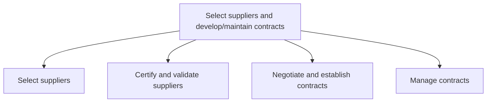
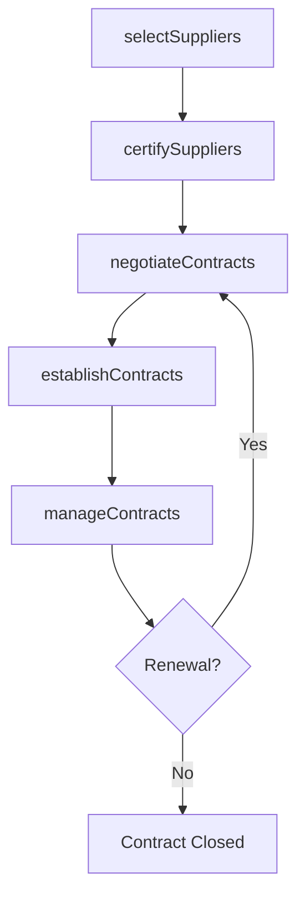

# Select suppliers and develop/maintain contracts

> Business-as-Code definition for supplier selection and contract management. Models supplier evaluation, certification, contract negotiation, and ongoing contract administration as programmable workflows.

## Overview

Evaluating supplier options to select the most effective and efficient suppliers. Validate selected suppliers. Establish and manage supplier contracts.

## Process Hierarchy



## GraphDL

```yaml
select:
  object: Suppliers And Develop/maintain Contracts
  actor: ProcurementSpecialist
  result: SupplierContract
```

## Actions

| Action | Description |
|--------|-------------|
| selectSuppliers | Evaluate and shortlist suppliers based on capability and cost |
| certifySuppliers | Validate supplier qualifications and grant certification |
| negotiateContracts | Negotiate pricing, terms, SLAs, and liability provisions |
| establishContracts | Formalize and execute supplier agreements |
| manageContracts | Monitor contract compliance and manage renewals |

## Events

| Event | Description |
|-------|-------------|
| suppliersSelected | Supplier shortlist finalized from evaluation |
| suppliersCertified | Suppliers validated and certified as approved |
| contractsNegotiated | Contract terms agreed upon by both parties |
| contractsEstablished | Supplier contracts signed and activated |
| contractsManaged | Contract performance reviewed and actions taken |

## Searches

| Search | Description |
|--------|-------------|
| findQualifiedSuppliers | Query suppliers by certification status and capability |
| getContractDetails | Retrieve contract terms, pricing, and expiration dates |
| getContractCompliance | Query contract compliance metrics and SLA adherence |
| findExpiringContracts | List contracts approaching renewal or expiration |

## Process Flow



## RACI Matrix

| Activity | Responsible | Accountable | Consulted | Informed |
|----------|-------------|-------------|-----------|----------|
| selectSuppliers | ProcurementSpecialist | CategoryManager | QA, Engineering | Finance |
| certifySuppliers | SupplierQualityEngineer | QAManager | Procurement, Compliance | Legal |
| negotiateContracts | ContractManager | CPO | Legal, Finance | Operations |
| manageContracts | ContractAdministrator | ContractManager | Procurement, Legal | Finance |

## Sub-Processes

| ID | Name | Description |
|----|------|-------------|
| 4.2.3.1 | Select suppliers | Evaluating the pros and cons of various suppliers. Choose the most appropriate and cost-effective su |
| 4.2.3.2 | Certify and validate suppliers | Validating the supply sources, and provide certification as an official supplier. |
| 4.2.3.3 | Negotiate and establish contracts | Legally binding suppliers with the company. Negotiate contracts individually with all the suppliers  |
| 4.2.3.4 | Manage contracts | Keeping contracts up-to-date with routine evaluation. Maintain order and discipline with the contrac |

## Related Processes

| Process | Relationship |
|---------|-------------|
| 4.2.1 Provide sourcing governance and perform category management | Upstream - sourcing strategy guides supplier selection |
| 4.2.4 Order materials and services | Downstream - contracts enable purchase ordering |
| 4.2.5 Manage suppliers | Downstream - ongoing supplier management post-contract |

## Related Departments

| Department | Role |
|-----------|------|
| Procurement | Leads supplier evaluation and selection |
| Legal | Contract drafting, review, and negotiation support |
| Quality Assurance | Supplier certification and quality audits |
| Finance | Contract financial terms and payment terms approval |

## Related Occupations

| Occupation | Involvement |
|-----------|-------------|
| Procurement Specialist | Supplier evaluation and shortlisting |
| Contract Manager | Contract negotiation and lifecycle management |
| Supplier Quality Engineer | Supplier certification and validation |

## KPIs

| KPI | Description | Unit |
|-----|-------------|------|
| Supplier Certification Rate | Percentage of active suppliers with current certification | % |
| Contract Cycle Time | Average time from supplier selection to contract execution | Days |
| Contract Compliance Rate | Percentage of contracts with full SLA adherence | % |
| Supplier Diversity | Percentage of spend with diverse suppliers | % |

## Usage

```typescript
import { selectSuppliersAndDevelopMaintainContracts } from '@headlessly/select-suppliers-and-develop-maintain-contracts'

const client = selectSuppliersAndDevelopMaintainContracts()

// Evaluate and select suppliers
const shortlist = await client.selectSuppliers({
  category: 'packaging-materials',
  criteria: ['price', 'quality', 'delivery', 'sustainability'],
  minimumScore: 3.5
})

// Negotiate and establish contract
const contract = await client.negotiateContracts({
  supplierId: shortlist[0].id,
  term: { years: 3 },
  volumeCommitment: { annual: 100000, unit: 'units' },
  paymentTerms: 'net-60'
})
```
