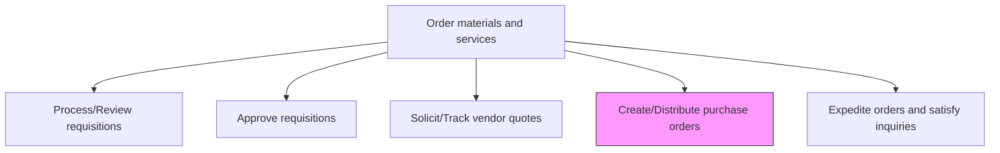
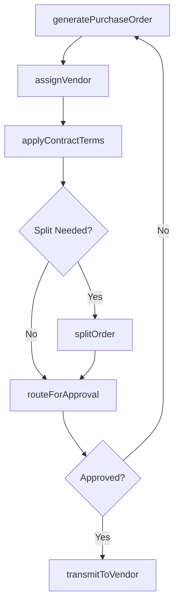

# Create/Distribute purchase orders

> Business-as-Code definition for purchase order creation and distribution. Models the end-to-end process of generating purchase orders from approved requisitions, routing them for approval, and transmitting them to selected vendors.

## Overview

Creating and placing the orders for purchasing materials and services from suppliers. Analyze vendor quotes. Choose the most cost-effective vendors. Create vendor-specific orders. Distribute them in order to initiate the purchasing process.

## Process Hierarchy



## GraphDL

```yaml
createDistribute:
  object: Purchase Orders
  actor: ProcurementSpecialist
  result: IssuedPurchaseOrder
```

## Actions

| Action | Description |
|--------|-------------|
| generatePurchaseOrder | Create a new PO from an approved requisition with line items and terms |
| assignVendor | Link the purchase order to the selected supplier based on sourcing decision |
| applyContractTerms | Attach negotiated pricing, payment terms, and delivery schedules from master contract |
| routeForApproval | Submit PO through the approval workflow based on dollar thresholds |
| transmitToVendor | Send the approved PO to the supplier via EDI, email, or portal |
| splitOrder | Divide a purchase order across multiple vendors or delivery dates |

## Events

| Event | Description |
|-------|-------------|
| purchaseOrderGenerated | New purchase order created from approved requisition |
| vendorAssigned | Supplier linked to purchase order |
| contractTermsApplied | Negotiated terms attached to the PO |
| approvalRouted | PO submitted to approval workflow |
| purchaseOrderApproved | PO passed all required approvals |
| purchaseOrderTransmitted | Approved PO sent to the vendor |

## Searches

| Search | Description |
|--------|-------------|
| findOpenPurchaseOrders | List POs by status, vendor, date range, or commodity |
| getPurchaseOrderDetails | Retrieve full PO including line items, terms, and approval history |
| getApprovalStatus | Check current position in the approval workflow |
| findPendingTransmissions | List approved POs not yet sent to vendors |

## Process Flow



## RACI Matrix

| Activity | Responsible | Accountable | Consulted | Informed |
|----------|-------------|-------------|-----------|----------|
| generatePurchaseOrder | Buyer | ProcurementManager | Requisitioner | FinanceTeam |
| applyContractTerms | ContractSpecialist | ProcurementManager | LegalTeam | Buyer |
| routeForApproval | Buyer | ProcurementManager | BudgetOwner | Requisitioner |
| transmitToVendor | Buyer | ProcurementManager | SupplierRelations | WarehouseTeam |

## Related Processes

| Process | Relationship |
|---------|-------------|
| 4.2.4 Order materials and services | Parent process |
| 4.2.4.3 Solicit/Track vendor quotes | Upstream - vendor quotes feed PO creation |
| 4.2.4.5 Expedite orders and satisfy inquiries | Downstream - POs are tracked and expedited |
| 4.2.3.2 Negotiate and establish contracts | Parallel - contract terms applied to POs |

## Related Departments

| Department | Role |
|-----------|------|
| Procurement | Creates and manages purchase orders |
| Finance | Approves spend and tracks commitments |
| Legal | Reviews contract terms applied to POs |
| Warehouse | Receives goods against POs |

## Related Occupations

| Occupation | Involvement |
|-----------|-------------|
| Procurement Specialist | Primary PO creator and coordinator |
| Purchasing Manager | Approves high-value purchase orders |
| Accounts Payable Clerk | Matches invoices to POs |

## KPIs

| KPI | Description | Unit |
|-----|-------------|------|
| PO Cycle Time | Average time from requisition approval to PO transmission | Hours |
| PO Accuracy Rate | Percentage of POs issued without errors requiring amendment | % |
| Contract Compliance | Percentage of POs issued against active contracts | % |
| Approval Turnaround | Average time to complete PO approval workflow | Hours |

## Usage

```typescript
import { createDistributePurchaseOrders } from '@headlessly/create-distribute-purchase-orders'

const purchasing = createDistributePurchaseOrders()

// Generate a purchase order from an approved requisition
const po = await purchasing.generatePurchaseOrder({
  requisitionId: 'REQ-2024-0892',
  vendorId: 'VEND-1045',
  lineItems: [
    { materialCode: 'MAT-500', quantity: 1000, unit: 'EA' },
    { materialCode: 'MAT-501', quantity: 500, unit: 'EA' }
  ]
})

// Route through approval workflow
await purchasing.routeForApproval({ purchaseOrderId: po.id })

// Transmit approved PO to vendor
await purchasing.transmitToVendor({
  purchaseOrderId: po.id,
  method: 'edi'
})
```
