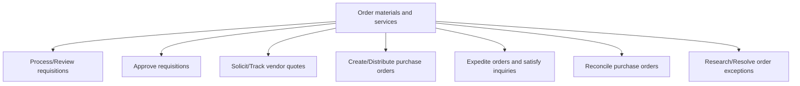
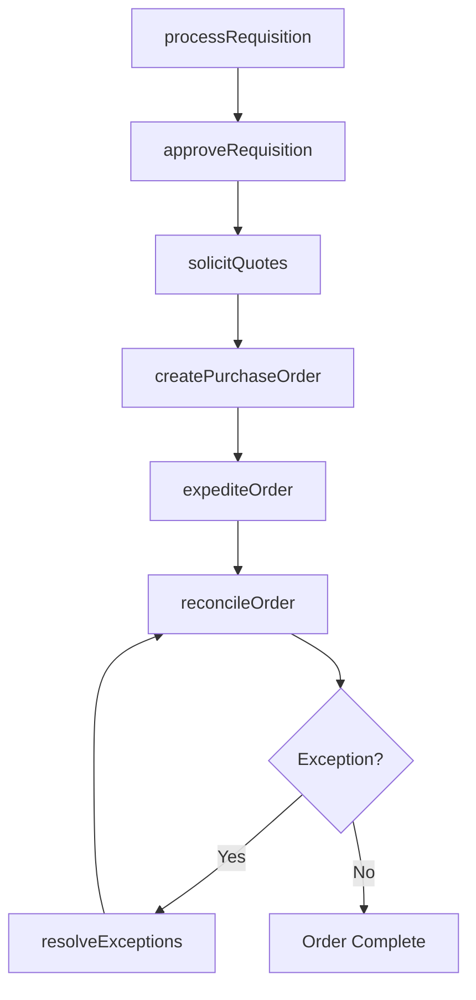

# Order materials and services

> Business-as-Code definition for purchase order management. Models requisition processing, quote solicitation, purchase order creation, expediting, reconciliation, and exception handling as programmable workflows.

## Overview

Creating and approving requisitions and distributing purchase orders accordingly. Hasten the procurement process to satisfy internal needs.

## Process Hierarchy



## GraphDL

```yaml
order:
  object: Materials And Services
  actor: Buyer
  result: FulfilledPurchaseOrder
```

## Actions

| Action | Description |
|--------|-------------|
| processRequisition | Review and validate purchase requisitions |
| approveRequisition | Authorize requisitions against budget and policy |
| solicitQuotes | Request and track vendor quotations and bids |
| createPurchaseOrder | Generate and distribute purchase orders to suppliers |
| expediteOrder | Accelerate order fulfillment for urgent needs |
| reconcileOrder | Verify received goods against purchase order terms |
| resolveExceptions | Investigate and resolve order discrepancies |

## Events

| Event | Description |
|-------|-------------|
| requisitionProcessed | Purchase requisition reviewed and validated |
| requisitionApproved | Requisition authorized for procurement |
| quotesReceived | Vendor quotes received and evaluated |
| purchaseOrderCreated | Purchase order generated and sent to supplier |
| orderExpedited | Order priority elevated and supplier notified |
| orderReconciled | Received goods matched against purchase order |
| exceptionResolved | Order discrepancy investigated and corrected |

## Searches

| Search | Description |
|--------|-------------|
| getRequisitions | Retrieve requisitions by status, requestor, or department |
| getPurchaseOrders | Query purchase orders by supplier, status, or date |
| findPendingQuotes | List outstanding RFQs awaiting vendor response |
| getOrderExceptions | Retrieve unresolved order discrepancies |

## Process Flow



## RACI Matrix

| Activity | Responsible | Accountable | Consulted | Informed |
|----------|-------------|-------------|-----------|----------|
| processRequisition | Buyer | ProcurementManager | Requisitioner | Finance |
| approveRequisition | BudgetOwner | ProcurementManager | Finance | Requisitioner |
| solicitQuotes | Buyer | ProcurementManager | CategoryManager | Suppliers |
| createPurchaseOrder | Buyer | ProcurementManager | Legal, Finance | Warehouse |
| reconcileOrder | APClerk | ProcurementManager | Warehouse, Buyer | Finance |

## Sub-Processes

| ID | Name | Description |
|----|------|-------------|
| 4.2.4.1 | Process/Review requisitions | Handling operations related to processing/reviewing the requisitions. Establish and maintain procedu |
| 4.2.4.2 | Approve requisitions | Approving requisitions for materials and services. Examine distributor-specific requests, and valida |
| 4.2.4.3 | Solicit/Track vendor quotes | Requesting quotes from suppliers. Use a request for quotation (RFQ) to invite suppliers into a biddi |
| 4.2.4.4 | Create/Distribute purchase orders | Creating and placing the orders for purchasing materials and services from suppliers. Analyze vendor |
| 4.2.4.5 | Expedite orders and satisfy inquiries | Accelerating the purchase orders in order to fulfill the internal needs (for raw materials) depicted |
| 4.2.4.6 | Reconcile purchase orders | Verify that purchase orders are filled as expected: verify that items and quantities are delivered a |
| 4.2.4.7 | Research/Resolve order exceptions | Identifying and resolving any exceptions. Address the internal needs/inquiries for materials that ca |

## Related Processes

| Process | Relationship |
|---------|-------------|
| 4.2.3 Select suppliers and develop/maintain contracts | Upstream - contracts govern purchase order terms |
| 4.2.5 Manage suppliers | Parallel - order performance feeds supplier evaluation |
| 4.4.2 Plan and manage inbound material flow | Downstream - POs trigger inbound logistics |
| 8.4 Process accounts payable | Downstream - reconciled orders trigger payment |

## Related Departments

| Department | Role |
|-----------|------|
| Procurement | Primary owner of requisition and PO processing |
| Finance | Budget approval and accounts payable processing |
| Warehousing | Goods receipt verification |
| Operations | Requisition origination and expediting |

## Related Occupations

| Occupation | Involvement |
|-----------|-------------|
| Buyer | Purchase order creation and vendor management |
| Procurement Coordinator | Requisition processing and expediting |
| Accounts Payable Clerk | Invoice matching and reconciliation |

## KPIs

| KPI | Description | Unit |
|-----|-------------|------|
| Requisition-to-PO Cycle Time | Average time from requisition to purchase order | Hours |
| PO Accuracy Rate | Percentage of POs requiring no amendments | % |
| Order Exception Rate | Percentage of orders with discrepancies | % |
| Expedite Rate | Percentage of orders requiring expediting | % |

## Usage

```typescript
import { orderMaterialsAndServices } from '@headlessly/order-materials-and-services'

const client = orderMaterialsAndServices()

// Process a purchase requisition
const requisition = await client.processRequisition({
  requestor: 'production-dept',
  items: [{ materialId: 'MAT-001', quantity: 5000, unit: 'kg' }],
  needByDate: '2025-06-01',
  budgetCode: 'PROD-2025-Q2'
})

// Create and distribute purchase order
const po = await client.createPurchaseOrder({
  requisitionId: requisition.id,
  supplierId: 'SUP-045',
  contractId: 'CTR-2025-0089',
  deliveryAddress: 'plant-midwest'
})
```
