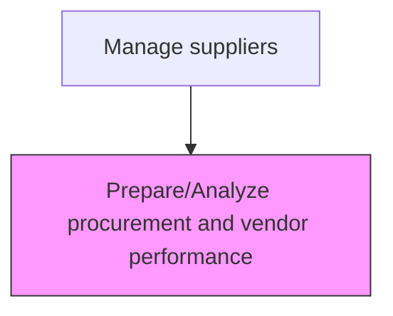
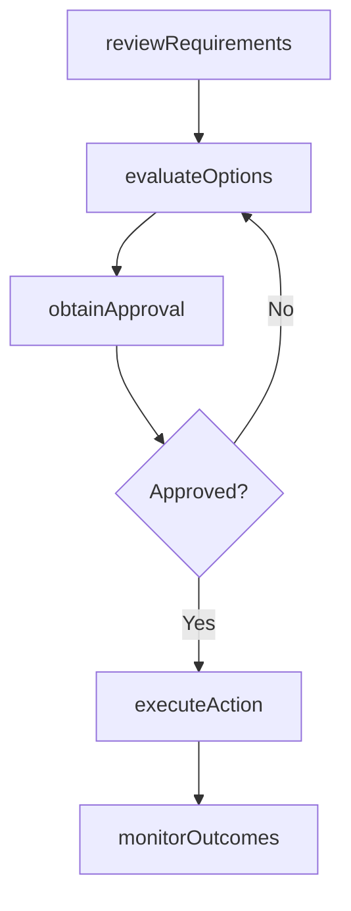

# Prepare/Analyze procurement and vendor performance

> Business-as-Code definition for prepare/analyze procurement and vendor performance. Models the supplier-performance processes within procurement to ensure materials and services are acquired efficiently and cost-effectively.

## Overview

Assisting the production and inventory processes through the information and reports created. Use the information and metrics of the procurement and vendor performance to enhance or improve the production process.

## Process Hierarchy



## GraphDL

```yaml
prepareAndAnalyze:
  object: Procurement And Vendor Performance
  actor: SupplierPerformanceAnalyst
  result: ProcurementPerformanceAnalyzed
```

## Actions

| Action | Description |
|--------|-------------|
| prepareProcurementAnalysis | Prepare procurement and vendor performance analysis based on organizational requirements |
| reviewRequirements | Assess business needs and specifications for procurement activities |
| evaluateOptions | Compare available options against cost, quality, and delivery criteria |
| obtainApproval | Secure necessary approvals from budget holders and management |
| executeAction | Carry out prepare/analyze procurement and vendor performance tasks and document outcomes |
| monitorOutcomes | Track results and measure effectiveness of procurement actions |

## Events

| Event | Description |
|-------|-------------|
| requirementsReviewed | Business needs and specifications assessed for procurement |
| optionsEvaluated | Available options compared against selection criteria |
| approvalObtained | Required approvals secured from management |
| actionExecuted | Prepare/Analyze procurement and vendor performance tasks completed and documented |
| outcomesMonitored | Results tracked and effectiveness measured |

## Searches

| Search | Description |
|--------|-------------|
| getProcurementStatus | Retrieve current status of prepare/analyze procurement and vendor performance activities |
| findSupplierOptions | Query available suppliers and their capabilities for this requirement |
| getSpendAnalysis | Retrieve spend analysis data for the relevant category |
| getProcurementHistory | Query historical data for procurement and vendor performance activities |

## Process Flow



## RACI Matrix

| Activity | Responsible | Accountable | Consulted | Informed |
|----------|-------------|-------------|-----------|----------|
| reviewRequirements | SupplierPerformanceAnalyst | VP Procurement | Requestors, Finance | Operations |
| evaluateOptions | SupplierPerformanceAnalyst | VP Procurement | QualityAssurance, Legal | Suppliers |
| executeAction | SupplierPerformanceAnalyst | VP Procurement | SupplyChain | Finance |
| monitorOutcomes | ProcurementAnalyst | VP Procurement | Finance, Quality | Executive |

## Related Processes

| Process | Relationship |
|---------|-------------|
| 4.2.1 Provide sourcing governance and perform category management | Upstream - sourcing strategy guides procurement activities |
| 4.2.4 Order materials and services | Downstream - procurement plans drive ordering |
| 4.1.4 Create materials plan | Upstream - materials plan defines procurement requirements |

## Related Departments

| Department | Role |
|-----------|------|
| Procurement | Primary owner of materials and services acquisition |
| Finance | Approves budgets and validates cost-effectiveness |
| Quality Assurance | Validates supplier quality capabilities |
| Legal | Reviews contract terms and compliance requirements |

## Related Occupations

| Occupation | Involvement |
|-----------|-------------|
| SupplierPerformanceAnalyst | Primary executor of procurement activities |
| Procurement Analyst | Provides analytical support and spend analysis |
| Category Manager | Manages category strategy and supplier portfolio |

## KPIs

| KPI | Description | Unit |
|-----|-------------|------|
| Procurement Cycle Time | Average time to complete prepare/analyze procurement and vendor performance | Days |
| Cost Savings Achieved | Savings realized through procurement activities | % |
| Supplier Quality Rate | Percentage of procured items meeting quality specifications | % |

## Usage

```typescript
import { prepareAnalyzeProcurementAndVendorPerformance } from '@headlessly/prepare-analyze-procurement-and-vendor-performance'

const client = prepareAnalyzeProcurementAndVendorPerformance()

// Review requirements for procurement
const requirements = await client.reviewRequirements({
  category: 'procurement-and-vendor-perform',
  urgency: 'standard',
  budgetCode: 'PROC-2025'
})

// Evaluate options and execute
const evaluation = await client.evaluateOptions({
  requirementsId: requirements.id,
  criteria: ['cost', 'quality', 'delivery-time']
})
```
