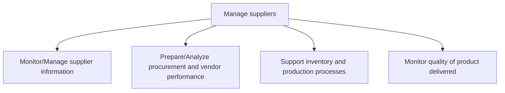
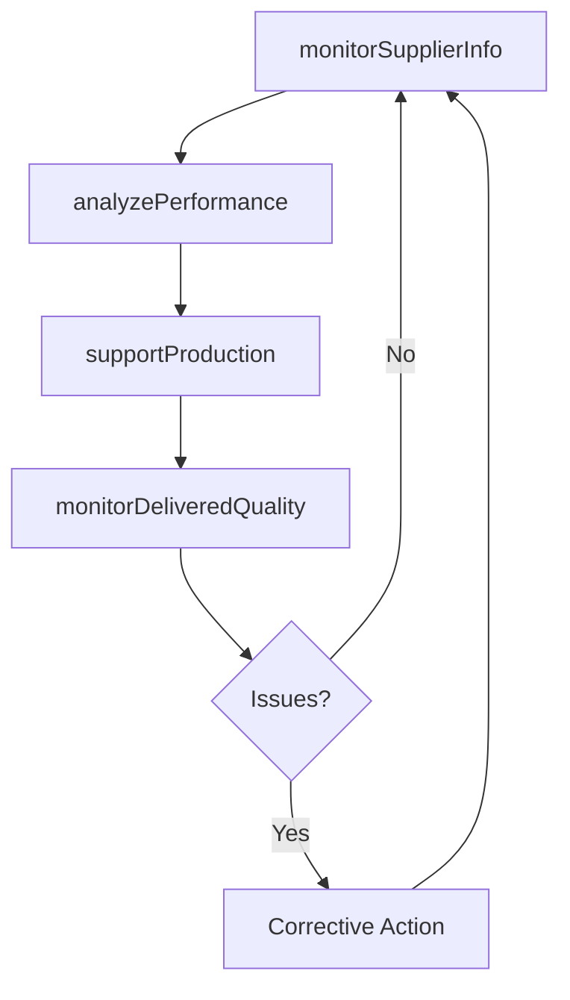

# Manage suppliers

> Business-as-Code definition for supplier relationship management. Models supplier information tracking, performance analysis, inventory support, and delivered quality monitoring as programmable workflows.

## Overview

Collecting and analyzing new information in order to track and rate suppliers through a supplier information management system.

## Process Hierarchy



## GraphDL

```yaml
manage:
  object: Suppliers
  actor: SupplierRelationshipManager
  result: SupplierScorecard
```

## Actions

| Action | Description |
|--------|-------------|
| monitorSupplierInfo | Track and update supplier master data and capabilities |
| analyzePerformance | Evaluate vendor delivery, quality, and cost performance |
| supportProduction | Coordinate supplier activities with inventory and production needs |
| monitorDeliveredQuality | Track quality metrics of products received from suppliers |

## Events

| Event | Description |
|-------|-------------|
| supplierInfoUpdated | Supplier profile and capability data refreshed |
| performanceAnalyzed | Vendor scorecard generated with delivery and quality metrics |
| productionSupported | Supplier activities aligned with production schedule |
| deliveredQualityMonitored | Incoming quality inspection results recorded |

## Searches

| Search | Description |
|--------|-------------|
| getSupplierScorecard | Retrieve supplier performance scorecard by period |
| findUnderperformingSuppliers | List suppliers below quality or delivery thresholds |
| getSupplierProfile | Query supplier capabilities, certifications, and history |

## Process Flow



## RACI Matrix

| Activity | Responsible | Accountable | Consulted | Informed |
|----------|-------------|-------------|-----------|----------|
| monitorSupplierInfo | SupplierDataAnalyst | SupplierRelationshipManager | IT | Procurement |
| analyzePerformance | ProcurementAnalyst | CategoryManager | QA, Finance | Executive |
| monitorDeliveredQuality | QualityInspector | QAManager | Procurement | Production |

## Sub-Processes

| ID | Name | Description |
|----|------|-------------|
| 4.2.5.1 | Monitor/Manage supplier information | Examining procurement and vendor performance. Report delivery timing and the quality of the material |
| 4.2.5.2 | Prepare/Analyze procurement and vendor performance | Assisting the production and inventory processes through the information and reports created. Use th |
| 4.2.5.3 | Support inventory and production processes | Support inventory and production processes by analyzing impact of procurement decisions and collabor |
| 4.2.5.4 | Monitor quality of product delivered | Track the performance of the suppliers on product quality. Use this information to further improve s |

## Related Processes

| Process | Relationship |
|---------|-------------|
| 4.2.3 Select suppliers and develop/maintain contracts | Upstream - contracts define supplier expectations |
| 4.2.4 Order materials and services | Parallel - order performance feeds supplier evaluation |
| 4.3.2 Produce/Assemble product | Downstream - supplier quality impacts production |

## Related Departments

| Department | Role |
|-----------|------|
| Procurement | Primary owner of supplier relationship management |
| Quality Assurance | Incoming quality monitoring and supplier audits |
| Production | Provides feedback on supplier material impact |

## Related Occupations

| Occupation | Involvement |
|-----------|-------------|
| Supplier Relationship Manager | Ongoing supplier performance oversight |
| Procurement Analyst | Performance data analysis and reporting |
| Quality Inspector | Incoming material quality verification |

## KPIs

| KPI | Description | Unit |
|-----|-------------|------|
| Supplier On-Time Delivery | Percentage of deliveries received on schedule | % |
| Supplier Quality Rate | Percentage of materials passing incoming inspection | % |
| Supplier Responsiveness | Average time to resolve supplier-related issues | Days |

## Usage

```typescript
import { manageSuppliers } from '@headlessly/manage-suppliers'

const client = manageSuppliers()

// Analyze supplier performance
const scorecard = await client.analyzePerformance({
  supplierId: 'SUP-045',
  period: 'Q2-2025',
  metrics: ['on-time-delivery', 'quality-rate', 'cost-variance']
})

// Monitor delivered product quality
const quality = await client.monitorDeliveredQuality({
  purchaseOrderId: 'PO-2025-1234',
  inspectionType: 'incoming',
  sampleSize: 50
})
```
