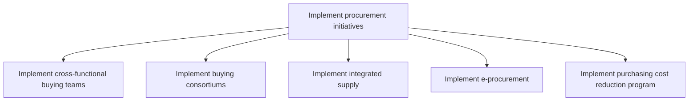
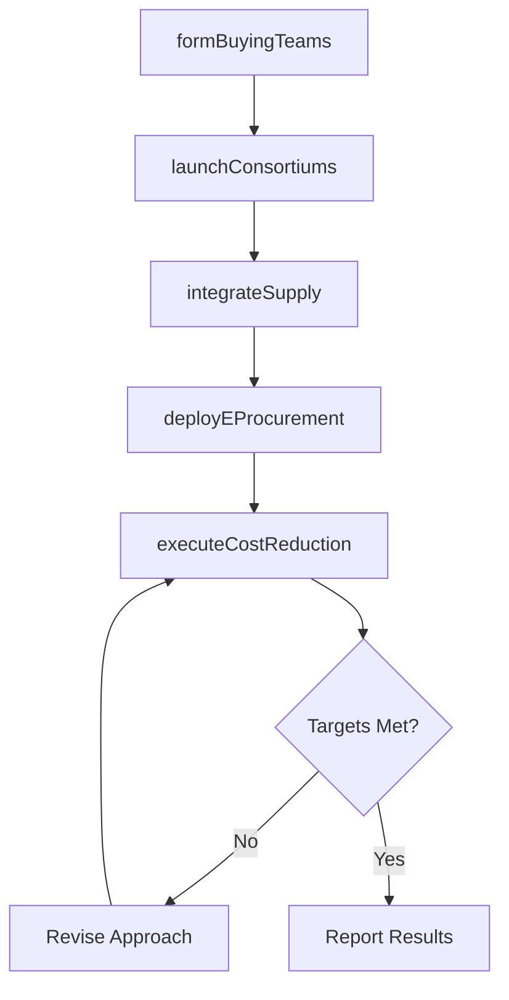

# Implement procurement initiatives

> Business-as-Code definition for procurement initiative implementation. Models cross-functional buying teams, buying consortiums, integrated supply, e-procurement, and cost reduction programs as programmable workflows.

## Overview

Deploying strategic procurement improvement programs to drive efficiency, reduce costs, and modernize purchasing operations. Establish cross-functional buying teams, form buying consortiums for volume leverage, implement integrated supply partnerships, deploy e-procurement systems, and execute purchasing cost reduction programs.

## Process Hierarchy



## GraphDL

```yaml
implement:
  object: Procurement Initiatives
  actor: ProcurementTransformationLead
  result: ImplementedInitiative
```

## Actions

| Action | Description |
|--------|-------------|
| formBuyingTeams | Establish cross-functional buying teams by spend category |
| launchConsortiums | Create buying consortiums to aggregate volume across units |
| integrateSupply | Implement integrated supply partnerships with key vendors |
| deployEProcurement | Roll out electronic procurement systems and catalogs |
| executeCostReduction | Implement purchasing cost reduction programs |

## Events

| Event | Description |
|-------|-------------|
| buyingTeamsFormed | Cross-functional buying teams established and trained |
| consortiumsLaunched | Buying consortium agreements activated |
| supplyIntegrated | Integrated supply program operational with key vendors |
| eProcurementDeployed | Electronic procurement platform live and adopted |
| costReductionExecuted | Cost reduction targets achieved for the program period |

## Searches

| Search | Description |
|--------|-------------|
| getInitiativeStatus | Retrieve progress and ROI of active procurement initiatives |
| findSavingsOpportunities | Query identified cost reduction opportunities by category |
| getAdoptionMetrics | Track e-procurement adoption and usage rates |

## Process Flow



## RACI Matrix

| Activity | Responsible | Accountable | Consulted | Informed |
|----------|-------------|-------------|-----------|----------|
| formBuyingTeams | ProcurementTransformationLead | CPO | CategoryManagers, Operations | Executive |
| deployEProcurement | ITProjectManager | CPO | IT, Procurement | Finance |
| executeCostReduction | CategoryManager | CPO | Finance, Suppliers | Executive |

## Sub-Processes

| ID | Name | Description |
|----|------|-------------|
| 4.2.6.1 | Implement cross-functional buying teams | Implement cross-functional buying teams within the supply chain to ensure operational efficiency and alignment with organizational objectives |
| 4.2.6.2 | Implement buying consortiums | Implement buying consortiums within the supply chain to ensure operational efficiency and alignment with organizational objectives |
| 4.2.6.3 | Implement integrated supply | Implement integrated supply within the supply chain to ensure operational efficiency and alignment with organizational objectives |
| 4.2.6.4 | Implement e-procurement | Implement e-procurement within the supply chain to ensure operational efficiency and alignment with organizational objectives |
| 4.2.6.5 | Implement purchasing cost reduction program | Implement purchasing cost reduction program within the supply chain to ensure operational efficiency and alignment with organizational objectives |

## Related Processes

| Process | Relationship |
|---------|-------------|
| 4.2.1 Provide sourcing governance and perform category management | Upstream - governance strategy drives initiative selection |
| 4.2.3 Select suppliers and develop/maintain contracts | Parallel - integrated supply enhances supplier partnerships |
| 4.2.4 Order materials and services | Downstream - e-procurement modernizes ordering |

## Related Departments

| Department | Role |
|-----------|------|
| Procurement | Primary owner of initiative design and execution |
| IT | Supports e-procurement system deployment |
| Finance | Validates savings targets and tracks ROI |

## Related Occupations

| Occupation | Involvement |
|-----------|-------------|
| Procurement Transformation Lead | Initiative design and rollout |
| E-Procurement Specialist | System deployment and adoption |
| Cost Analyst | Savings measurement and reporting |

## KPIs

| KPI | Description | Unit |
|-----|-------------|------|
| Initiative ROI | Return on investment from procurement programs | % |
| E-Procurement Adoption | Percentage of spend processed through e-procurement | % |
| Cost Savings Realized | Verified savings from cost reduction programs | Currency |

## Usage

```typescript
import { implementProcurementInitiatives } from '@headlessly/implement-procurement-initiatives'

const client = implementProcurementInitiatives()

// Deploy e-procurement platform
const deployment = await client.deployEProcurement({
  platform: 'ariba',
  categories: ['indirect-materials', 'office-supplies', 'IT-services'],
  catalogSuppliers: 150,
  goLiveDate: '2025-07-01'
})

// Execute cost reduction program
const program = await client.executeCostReduction({
  targetCategory: 'packaging-materials',
  savingsTarget: 12,
  strategies: ['volume-consolidation', 'supplier-negotiation', 'spec-optimization']
})
```
