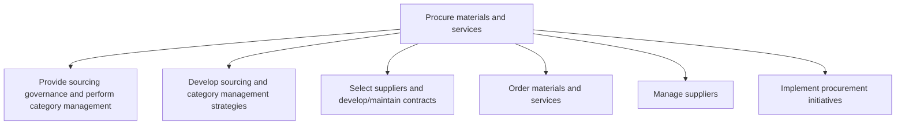
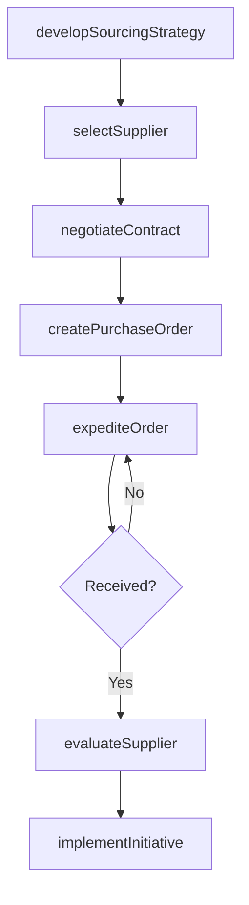

# Procure materials and services

> Business-as-Code definition for procurement and sourcing management. Models category management, supplier selection, contract negotiation, purchase ordering, and supplier relationship management as programmable workflows.

## Overview

Creating a plan for procuring materials and services. Develop strategies for sourcing materials and services. Choose the most appropriate suppliers, and develop contracts with them. Order the materials and services as per the requirements. Manage relationships with suppliers.

## Process Hierarchy



## GraphDL

```yaml
procure:
  object: Materials And Services
  actor: ProcurementManager
  result: PurchaseOrder
```

## Actions

| Action | Description |
|--------|-------------|
| developSourcingStrategy | Define category management and sourcing governance framework |
| selectSupplier | Evaluate, certify, and select qualified suppliers |
| negotiateContract | Negotiate terms, pricing, and SLAs with selected suppliers |
| createPurchaseOrder | Generate and distribute purchase orders to suppliers |
| expediteOrder | Accelerate order fulfillment for urgent procurement needs |
| evaluateSupplier | Assess supplier performance against quality and delivery metrics |
| implementInitiative | Deploy procurement improvement programs such as e-procurement |

## Events

| Event | Description |
|-------|-------------|
| sourcingStrategyDeveloped | Category management and sourcing strategy finalized |
| supplierSelected | Supplier evaluated, certified, and approved |
| contractNegotiated | Supplier contract terms agreed and executed |
| purchaseOrderCreated | Purchase order generated and sent to supplier |
| orderExpedited | Urgent order accelerated through procurement process |
| supplierEvaluated | Supplier performance review completed |
| initiativeImplemented | Procurement improvement initiative deployed |

## Searches

| Search | Description |
|--------|-------------|
| findSuppliers | Query suppliers by category, rating, geography, or capability |
| getPurchaseOrders | Retrieve purchase orders by status, supplier, or date range |
| getSpendAnalysis | Analyze procurement spend by category, supplier, or department |
| getContractStatus | Retrieve contract details and expiration status |
| getSupplierPerformance | Query supplier scorecards and delivery metrics |

## Process Flow



## RACI Matrix

| Activity | Responsible | Accountable | Consulted | Informed |
|----------|-------------|-------------|-----------|----------|
| developSourcingStrategy | CategoryManager | CPO | Finance, Operations | Executive |
| selectSupplier | ProcurementSpecialist | CategoryManager | QA, Engineering | Legal |
| negotiateContract | ContractManager | CPO | Legal, Finance | Operations |
| createPurchaseOrder | Buyer | ProcurementManager | Requisitioner | Finance |
| evaluateSupplier | SupplierManager | CategoryManager | QA, Logistics | Procurement |

## Sub-Processes

| ID | Name | Description |
|----|------|-------------|
| 4.2.1 | Provide sourcing governance and perform category management | Creating strategies for procuring materials and services from various sources, and for managing and  |
| 4.2.2 | Develop sourcing and category management strategies | Deploying a strategic sourcing methodology to segment the majority of organizational spend based on  |
| 4.2.3 | Select suppliers and develop/maintain contracts | Evaluating supplier options to select the most effective and efficient suppliers. Validate selected  |
| 4.2.4 | Order materials and services | Creating and approving requisitions and distributing purchase orders accordingly. Hasten the procure |
| 4.2.5 | Manage suppliers | Collecting and analyzing new information in order to track and rate suppliers through a supplier inf |
| 4.2.6 | Implement procurement initiatives | Implement procurement initiatives within the supply chain to ensure operational efficiency and alignment with organizational objectives |

## Related Processes

| Process | Relationship |
|---------|-------------|
| 4.1 Plan for and align supply chain resources | Upstream - materials plan drives procurement requirements |
| 4.3 Produce/Assemble/Test product | Downstream - procured materials feed production |
| 8.3 Perform management accounting | Downstream - procurement costs feed cost accounting |
| 4.2.3 Select suppliers and develop/maintain contracts | Child - supplier selection and contract management |

## Related Departments

| Department | Role |
|-----------|------|
| Procurement | Primary owner of sourcing and purchasing operations |
| Legal | Contract review, negotiation support, and compliance |
| Finance | Budget approval, payment processing, and spend analysis |
| Quality Assurance | Supplier quality audits and incoming material inspection |
| Operations | Defines material requirements and specifications |

## Related Occupations

| Occupation | Involvement |
|-----------|-------------|
| Procurement Manager | Overall procurement strategy and governance |
| Category Manager | Strategic sourcing by spend category |
| Buyer | Tactical purchasing and order management |
| Contract Manager | Supplier contract negotiation and administration |

## KPIs

| KPI | Description | Unit |
|-----|-------------|------|
| Procurement Cycle Time | Average time from requisition to purchase order | Days |
| Cost Savings | Realized savings from procurement negotiations and initiatives | % |
| Supplier On-Time Delivery | Percentage of supplier deliveries received on schedule | % |
| PO Accuracy | Percentage of purchase orders requiring no amendments | % |
| Maverick Spend | Percentage of spend occurring outside contracted suppliers | % |

## Usage

```typescript
import { procureMaterialsAndServices } from '@headlessly/procure-materials-and-services'

const client = procureMaterialsAndServices()

// Select and certify a new supplier
const supplier = await client.selectSupplier({
  category: 'raw-materials',
  criteria: ['quality-certified', 'ISO-9001'],
  minRating: 4.0
})

// Create a purchase order
const order = await client.createPurchaseOrder({
  supplierId: supplier.id,
  items: [{ sku: 'MAT-001', quantity: 5000, unit: 'kg' }],
  deliveryDate: '2025-06-15',
  contractId: 'CTR-2025-0089'
})

// Evaluate supplier performance
const scorecard = await client.evaluateSupplier({
  supplierId: supplier.id,
  period: 'Q2-2025',
  metrics: ['on-time-delivery', 'quality-defect-rate', 'responsiveness']
})
```
