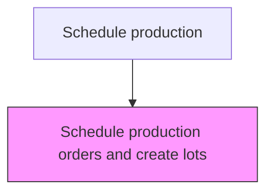
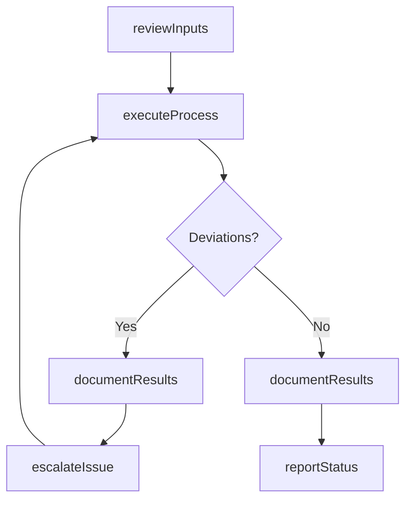

# Schedule production orders and create lots

> Business-as-Code definition for schedule production orders and create lots. Models the scheduling activities within manufacturing to ensure efficient and compliant production operations.

## Overview

Creating a schedule to commence production of orders received, and creating lots to consolidate the processing. Plan when the production orders are to be initiated by commencing the operations for processing products/services. Specify which materials to produce, where to produce them, which operations will facilitate this, and on which date production is to start. Define the size of production lots, demarcating the durations of batch production.

## Process Hierarchy



## GraphDL

```yaml
schedule:
  object: Production Orders And Create Lots
  actor: ProductionScheduler
  result: ScheduleOutcome
```

## Actions

| Action | Description |
|--------|-------------|
| scheduleActivity | Schedule production orders and create lots per established procedures |
| reviewInputs | Assess required inputs and prerequisites for schedule production orders and create lots |
| executeProcess | Carry out the core scheduling tasks following standard operating procedures |
| documentResults | Record outcomes, observations, and any deviations from standard |
| reportStatus | Communicate status and results to supervisors and downstream teams |

## Events

| Event | Description |
|-------|-------------|
| inputsReviewed | Inputs and prerequisites assessed for schedule production orders and create lots |
| processExecuted | Core scheduling tasks completed per standard procedures |
| resultsDocumented | Outcomes and observations recorded in production records |
| statusReported | Status and results communicated to relevant teams |
| deviationDetected | Non-standard condition identified during process execution |

## Searches

| Search | Description |
|--------|-------------|
| getProductionStatus | Retrieve current status of schedule production orders and create lots activities |
| getProductionRecords | Query production records for a specific batch, lot, or period |
| findDeviations | Identify deviations from standard operating procedures |
| getPerformanceMetrics | Query performance metrics for scheduling activities |

## Process Flow



## RACI Matrix

| Activity | Responsible | Accountable | Consulted | Informed |
|----------|-------------|-------------|-----------|----------|
| reviewInputs | ProductionScheduler | PlantManager | QualityAssurance | SupplyChain |
| executeProcess | ProductionScheduler | PlantManager | Maintenance | Quality |
| documentResults | ProductionScheduler | PlantManager | QualityAssurance | Regulatory |

## Related Processes

| Process | Relationship |
|---------|-------------|
| 4.3.1 Schedule production | Parent process |
| 4.3.3 Perform quality testing | Parallel - quality testing validates production output |
| 4.1.5 Create and manage master production schedule | Upstream - MPS provides production targets |

## Related Departments

| Department | Role |
|-----------|------|
| Manufacturing | Primary owner of production operations |
| Quality Assurance | Validates product quality and process compliance |
| Maintenance | Ensures equipment reliability for production |
| Supply Chain | Coordinates materials availability for production |

## Related Occupations

| Occupation | Involvement |
|-----------|-------------|
| ProductionScheduler | Leads scheduling activities on the shop floor |
| Quality Inspector | Verifies product and process quality |
| Production Supervisor | Oversees daily production execution |

## KPIs

| KPI | Description | Unit |
|-----|-------------|------|
| Overall Equipment Effectiveness | Combined measure of availability, performance, and quality | % |
| First Pass Yield | Percentage of products passing quality on first attempt | % |
| Production Cycle Time | Average time to complete schedule production orders and create lots | Hours |

## Usage

```typescript
import { scheduleProductionOrdersAndCreateLots } from '@headlessly/schedule-production-orders-and-create-lots'

const client = scheduleProductionOrdersAndCreateLots()

// Review inputs for production activity
const inputs = await client.reviewInputs({
  productionOrderId: 'PO-2025-0847',
  checkMaterials: true,
  checkEquipment: true
})

// Execute the production process
const result = await client.executeProcess({
  inputsId: inputs.id,
  standardProcedure: 'SOP-SCHE-001'
})
```
