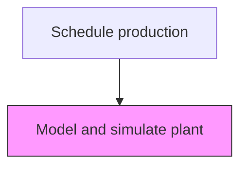
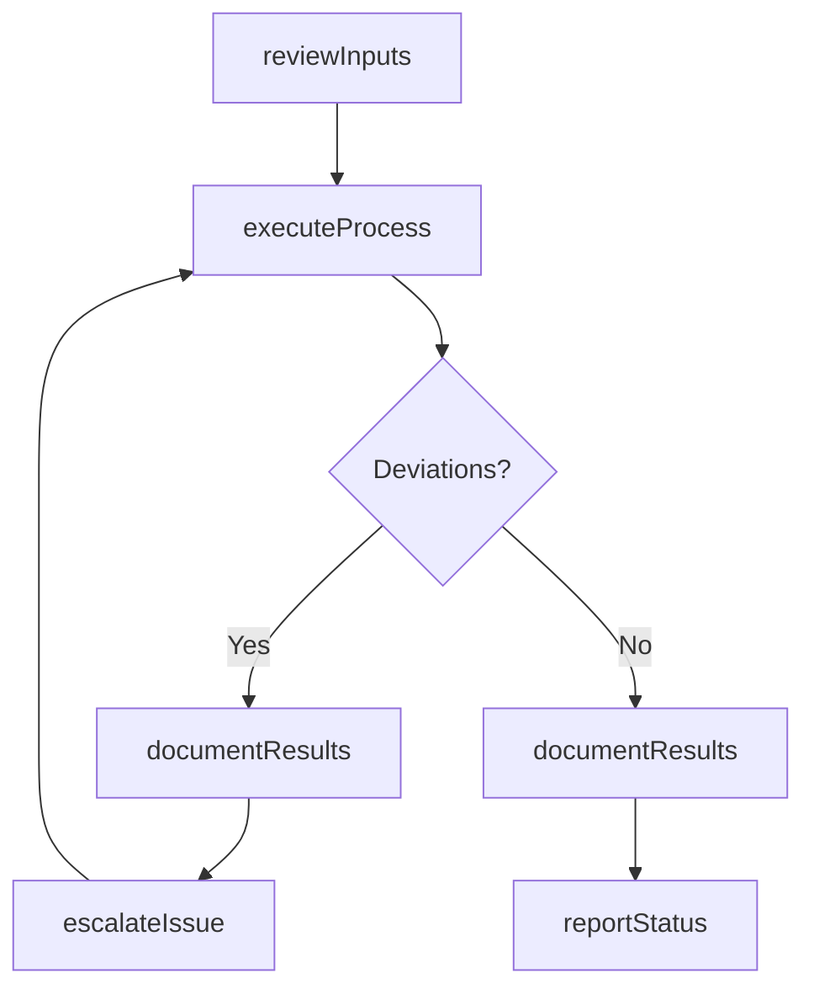

# Model and simulate plant

> Business-as-Code definition for model and simulate plant. Models the scheduling activities within manufacturing to ensure efficient and compliant production operations.

## Overview

Creating a representation of plant facilities to optimize material flow, resource utilization, and logistics for all levels of plant planning from global production facilities, through local plants, to specific lines and enabling the comparison of production�alternatives,.

## Process Hierarchy



## GraphDL

```yaml
model:
  object: And Simulate Plant
  actor: ProductionScheduler
  result: ModelOutcome
```

## Actions

| Action | Description |
|--------|-------------|
| modelActivity | Model and simulate plant per established procedures |
| reviewInputs | Assess required inputs and prerequisites for model and simulate plant |
| executeProcess | Carry out the core scheduling tasks following standard operating procedures |
| documentResults | Record outcomes, observations, and any deviations from standard |
| reportStatus | Communicate status and results to supervisors and downstream teams |

## Events

| Event | Description |
|-------|-------------|
| inputsReviewed | Inputs and prerequisites assessed for model and simulate plant |
| processExecuted | Core scheduling tasks completed per standard procedures |
| resultsDocumented | Outcomes and observations recorded in production records |
| statusReported | Status and results communicated to relevant teams |
| deviationDetected | Non-standard condition identified during process execution |

## Searches

| Search | Description |
|--------|-------------|
| getProductionStatus | Retrieve current status of model and simulate plant activities |
| getProductionRecords | Query production records for a specific batch, lot, or period |
| findDeviations | Identify deviations from standard operating procedures |
| getPerformanceMetrics | Query performance metrics for scheduling activities |

## Process Flow



## RACI Matrix

| Activity | Responsible | Accountable | Consulted | Informed |
|----------|-------------|-------------|-----------|----------|
| reviewInputs | ProductionScheduler | PlantManager | QualityAssurance | SupplyChain |
| executeProcess | ProductionScheduler | PlantManager | Maintenance | Quality |
| documentResults | ProductionScheduler | PlantManager | QualityAssurance | Regulatory |

## Related Processes

| Process | Relationship |
|---------|-------------|
| 4.3.1 Schedule production | Parent process |
| 4.3.3 Perform quality testing | Parallel - quality testing validates production output |
| 4.1.5 Create and manage master production schedule | Upstream - MPS provides production targets |

## Related Departments

| Department | Role |
|-----------|------|
| Manufacturing | Primary owner of production operations |
| Quality Assurance | Validates product quality and process compliance |
| Maintenance | Ensures equipment reliability for production |
| Supply Chain | Coordinates materials availability for production |

## Related Occupations

| Occupation | Involvement |
|-----------|-------------|
| ProductionScheduler | Leads scheduling activities on the shop floor |
| Quality Inspector | Verifies product and process quality |
| Production Supervisor | Oversees daily production execution |

## KPIs

| KPI | Description | Unit |
|-----|-------------|------|
| Overall Equipment Effectiveness | Combined measure of availability, performance, and quality | % |
| First Pass Yield | Percentage of products passing quality on first attempt | % |
| Production Cycle Time | Average time to complete model and simulate plant | Hours |

## Usage

```typescript
import { modelAndSimulatePlant } from '@headlessly/model-and-simulate-plant'

const client = modelAndSimulatePlant()

// Review inputs for production activity
const inputs = await client.reviewInputs({
  productionOrderId: 'PO-2025-0847',
  checkMaterials: true,
  checkEquipment: true
})

// Execute the production process
const result = await client.executeProcess({
  inputsId: inputs.id,
  standardProcedure: 'SOP-SCHE-001'
})
```
