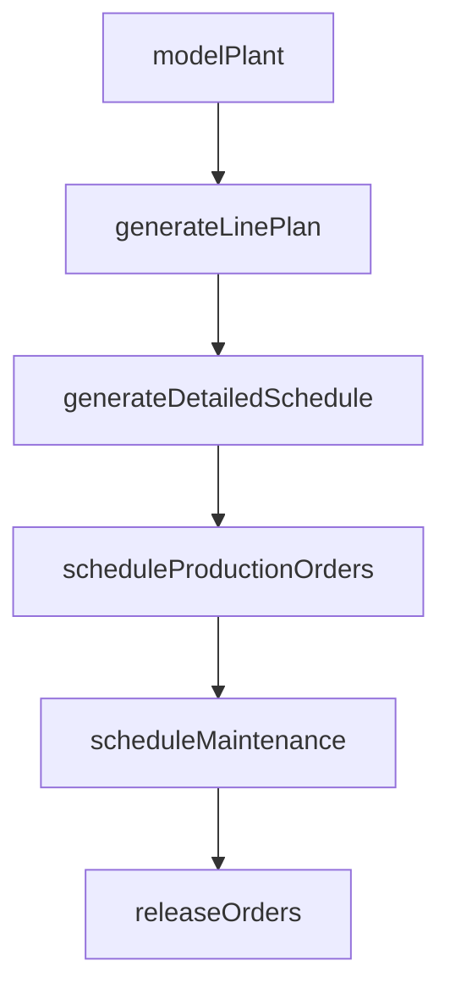

# Schedule production

> Business-as-Code definition for production scheduling. Models plant simulation, line-level planning, detailed scheduling, order creation, and maintenance scheduling as programmable workflows.

## Overview

Scheduling the production of final products. Generate a detailed schedule plan. Create and release production orders and lots. Schedule the planned and unplanned maintenance orders.

## Process Hierarchy

```mermaid
graph TD
    A[Schedule production]
    A --> B[Model and simulate plant]
    A --> C[Generate line level plan]
    A --> D[Generate detailed schedule]
    A --> E[Schedule production orders and create lots]
    A --> F[Schedule preventive (planned) maintenance (preventive maintenance orders)]
    A --> G[Schedule requested (unplanned) maintenance (work order cycle)]
    A --> H[Release production orders and create lots]
```

## GraphDL

```yaml
schedule:
  object: Production
  actor: ProductionScheduler
  result: ProductionSchedule
```

## Actions

| Action | Description |
|--------|-------------|
| modelPlant | Create simulation model of plant layout and material flow |
| generateLinePlan | Break down MPS into line-level production plans |
| generateDetailedSchedule | Create time-phased schedule with operation sequencing |
| scheduleProductionOrders | Create production orders with lot assignments |
| scheduleMaintenance | Plan preventive and reactive maintenance windows |
| releaseOrders | Release approved production orders to shop floor |

## Events

| Event | Description |
|-------|-------------|
| plantModeled | Plant simulation model created or updated |
| linePlanGenerated | Line-level production plan published |
| detailedScheduleGenerated | Detailed production schedule finalized |
| productionOrdersScheduled | Production orders with lots created |
| maintenanceScheduled | Maintenance windows integrated into production schedule |
| ordersReleased | Production orders released to shop floor |

## Searches

| Search | Description |
|--------|-------------|
| getProductionSchedule | Retrieve schedule by line, product, or date range |
| findScheduleConflicts | Identify scheduling overlaps or capacity conflicts |
| getMaintenanceWindows | Query scheduled maintenance by equipment or date |
| getOrderBacklog | List unreleased production orders awaiting scheduling |

## Process Flow



## RACI Matrix

| Activity | Responsible | Accountable | Consulted | Informed |
|----------|-------------|-------------|-----------|----------|
| modelPlant | ProductionEngineer | PlantManager | IT, Operations | SupplyChain |
| generateLinePlan | ProductionScheduler | PlantManager | Materials, Sales | Finance |
| scheduleProductionOrders | ProductionScheduler | PlantManager | QA, Maintenance | Warehouse |
| scheduleMaintenance | MaintenancePlanner | MaintenanceManager | Production | Operations |

## Sub-Processes

| ID | Name | Description |
|----|------|-------------|
| 4.3.1.1 | Model and simulate plant | Creating a representation of plant facilities to optimize material flow, resource utilization, and l |
| 4.3.1.2 | Generate line level plan | Initiating the line-level plan for production. Break down the production schedule into specific line |
| 4.3.1.3 | Generate detailed schedule | Broadening the line-level plan. Specify all the individual production processes, along with the timi |
| 4.3.1.4 | Schedule production orders and create lots | Creating a schedule to commence production of orders received, and creating lots to consolidate the  |
| 4.3.1.5 | Schedule preventive (planned) maintenance (preventive maintenance orders) | Scheduling planned maintenance of the production equipment. |
| 4.3.1.6 | Schedule requested (unplanned) maintenance (work order cycle) | Scheduling requested maintenance in order to address breakdowns where repairs or corrective remedies |
| 4.3.1.7 | Release production orders and create lots | Initiating the delivery of production orders, and creating lots. Communicate the order that specifie |

## Related Processes

| Process | Relationship |
|---------|-------------|
| 4.1.5 Create and manage master production schedule | Upstream - MPS provides schedule inputs |
| 4.3.2 Produce/Assemble product | Downstream - schedule drives production execution |
| 4.3.5 Assess production performance | Downstream - schedule adherence is a key metric |

## Related Departments

| Department | Role |
|-----------|------|
| Production Planning | Primary owner of scheduling operations |
| Manufacturing | Executes production per schedule |
| Maintenance | Provides equipment availability and maintenance windows |

## Related Occupations

| Occupation | Involvement |
|-----------|-------------|
| Production Scheduler | Detailed schedule creation and order management |
| Maintenance Planner | Maintenance window scheduling |
| Production Engineer | Plant modeling and simulation |

## KPIs

| KPI | Description | Unit |
|-----|-------------|------|
| Schedule Adherence | Percentage of production orders completed on time | % |
| Changeover Time | Average time to switch production between products | Minutes |
| Equipment Availability | Percentage of scheduled production time equipment is available | % |

## Usage

```typescript
import { scheduleProduction } from '@headlessly/schedule-production'

const client = scheduleProduction()

// Generate detailed production schedule
const schedule = await client.generateDetailedSchedule({
  mpsId: 'MPS-2025-Q3',
  plantId: 'plant-midwest',
  horizon: { weeks: 4 },
  optimizeFor: 'changeover-minimization'
})

// Release production orders to shop floor
const released = await client.releaseOrders({
  scheduleId: schedule.id,
  releaseDate: '2025-05-01',
  lines: ['line-A1', 'line-A2']
})
```
