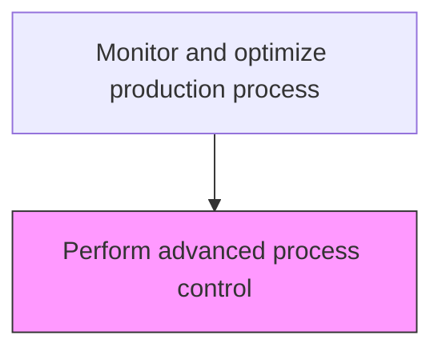
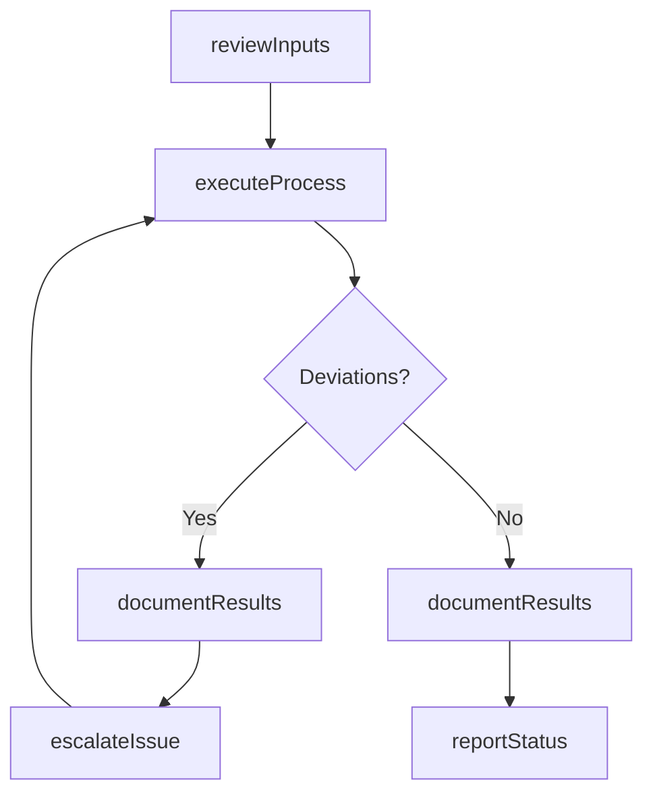

# Perform advanced process control

> Business-as-Code definition for perform advanced process control. Models the process-optimization activities within manufacturing to ensure efficient and compliant production operations.

## Overview

Including a broad range of techniques and technologies implemented within industrial process control systems that are routinely reviewed, audited, and improved, advanced process controls typically address particular performance or economic improvement opportunities. An advanced set of process control measures can be used to reduce variation and identify primary improvement options. Results of analysis are fed back into process design for incorporation into production.

## Process Hierarchy



## GraphDL

```yaml
perform:
  object: Advanced Process Control
  actor: ProcessEngineer
  result: PerformOutcome
```

## Actions

| Action | Description |
|--------|-------------|
| performActivity | Perform advanced process control per established procedures |
| reviewInputs | Assess required inputs and prerequisites for perform advanced process control |
| executeProcess | Carry out the core process-optimization tasks following standard operating procedures |
| documentResults | Record outcomes, observations, and any deviations from standard |
| reportStatus | Communicate status and results to supervisors and downstream teams |

## Events

| Event | Description |
|-------|-------------|
| inputsReviewed | Inputs and prerequisites assessed for perform advanced process control |
| processExecuted | Core process-optimization tasks completed per standard procedures |
| resultsDocumented | Outcomes and observations recorded in production records |
| statusReported | Status and results communicated to relevant teams |
| deviationDetected | Non-standard condition identified during process execution |

## Searches

| Search | Description |
|--------|-------------|
| getProductionStatus | Retrieve current status of perform advanced process control activities |
| getProductionRecords | Query production records for a specific batch, lot, or period |
| findDeviations | Identify deviations from standard operating procedures |
| getPerformanceMetrics | Query performance metrics for process-optimization activities |

## Process Flow



## RACI Matrix

| Activity | Responsible | Accountable | Consulted | Informed |
|----------|-------------|-------------|-----------|----------|
| reviewInputs | ProcessEngineer | PlantManager | QualityAssurance | SupplyChain |
| executeProcess | ProcessEngineer | PlantManager | Maintenance | Quality |
| documentResults | ProcessEngineer | PlantManager | QualityAssurance | Regulatory |

## Related Processes

| Process | Relationship |
|---------|-------------|
| 4.3.1 Schedule production | Upstream - production schedule drives execution |
| 4.3.3 Perform quality testing | Parallel - quality testing validates production output |
| 4.1.5 Create and manage master production schedule | Upstream - MPS provides production targets |

## Related Departments

| Department | Role |
|-----------|------|
| Manufacturing | Primary owner of production operations |
| Quality Assurance | Validates product quality and process compliance |
| Maintenance | Ensures equipment reliability for production |
| Supply Chain | Coordinates materials availability for production |

## Related Occupations

| Occupation | Involvement |
|-----------|-------------|
| ProcessEngineer | Leads process-optimization activities on the shop floor |
| Quality Inspector | Verifies product and process quality |
| Production Supervisor | Oversees daily production execution |

## KPIs

| KPI | Description | Unit |
|-----|-------------|------|
| Overall Equipment Effectiveness | Combined measure of availability, performance, and quality | % |
| First Pass Yield | Percentage of products passing quality on first attempt | % |
| Production Cycle Time | Average time to complete perform advanced process control | Hours |

## Usage

```typescript
import { performAdvancedProcessControl } from '@headlessly/perform-advanced-process-control'

const client = performAdvancedProcessControl()

// Review inputs for production activity
const inputs = await client.reviewInputs({
  productionOrderId: 'PO-2025-0847',
  checkMaterials: true,
  checkEquipment: true
})

// Execute the production process
const result = await client.executeProcess({
  inputsId: inputs.id,
  standardProcedure: 'SOP-PROC-001'
})
```
