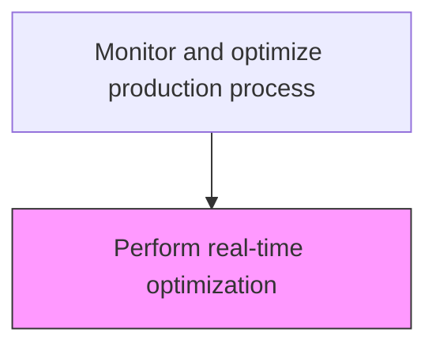
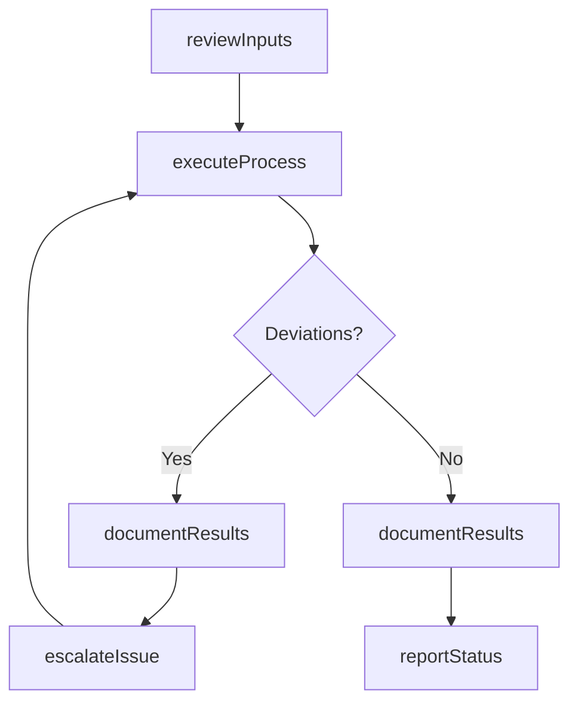

# Perform real-time optimization

> Business-as-Code definition for perform real-time optimization. Models the process-optimization activities within manufacturing to ensure efficient and compliant production operations.

## Overview

Helping organizations increase performance and efficiency, real-time optimization is a category of closed-loop process control that aims at optimizing process performance in real time for systems. It is normally built upon model-based optimization systems and is usually large scale. Real-time optimization automatically detects errors, and can modify and eliminate both random and non-random errors, as well as analyze and monitor all systems involved.

## Process Hierarchy



## GraphDL

```yaml
perform:
  object: Real-time Optimization
  actor: ProcessEngineer
  result: PerformOutcome
```

## Actions

| Action | Description |
|--------|-------------|
| performActivity | Perform real-time optimization per established procedures |
| reviewInputs | Assess required inputs and prerequisites for perform real-time optimization |
| executeProcess | Carry out the core process-optimization tasks following standard operating procedures |
| documentResults | Record outcomes, observations, and any deviations from standard |
| reportStatus | Communicate status and results to supervisors and downstream teams |

## Events

| Event | Description |
|-------|-------------|
| inputsReviewed | Inputs and prerequisites assessed for perform real-time optimization |
| processExecuted | Core process-optimization tasks completed per standard procedures |
| resultsDocumented | Outcomes and observations recorded in production records |
| statusReported | Status and results communicated to relevant teams |
| deviationDetected | Non-standard condition identified during process execution |

## Searches

| Search | Description |
|--------|-------------|
| getProductionStatus | Retrieve current status of perform real-time optimization activities |
| getProductionRecords | Query production records for a specific batch, lot, or period |
| findDeviations | Identify deviations from standard operating procedures |
| getPerformanceMetrics | Query performance metrics for process-optimization activities |

## Process Flow



## RACI Matrix

| Activity | Responsible | Accountable | Consulted | Informed |
|----------|-------------|-------------|-----------|----------|
| reviewInputs | ProcessEngineer | PlantManager | QualityAssurance | SupplyChain |
| executeProcess | ProcessEngineer | PlantManager | Maintenance | Quality |
| documentResults | ProcessEngineer | PlantManager | QualityAssurance | Regulatory |

## Related Processes

| Process | Relationship |
|---------|-------------|
| 4.3.1 Schedule production | Upstream - production schedule drives execution |
| 4.3.3 Perform quality testing | Parallel - quality testing validates production output |
| 4.1.5 Create and manage master production schedule | Upstream - MPS provides production targets |

## Related Departments

| Department | Role |
|-----------|------|
| Manufacturing | Primary owner of production operations |
| Quality Assurance | Validates product quality and process compliance |
| Maintenance | Ensures equipment reliability for production |
| Supply Chain | Coordinates materials availability for production |

## Related Occupations

| Occupation | Involvement |
|-----------|-------------|
| ProcessEngineer | Leads process-optimization activities on the shop floor |
| Quality Inspector | Verifies product and process quality |
| Production Supervisor | Oversees daily production execution |

## KPIs

| KPI | Description | Unit |
|-----|-------------|------|
| Overall Equipment Effectiveness | Combined measure of availability, performance, and quality | % |
| First Pass Yield | Percentage of products passing quality on first attempt | % |
| Production Cycle Time | Average time to complete perform real-time optimization | Hours |

## Usage

```typescript
import { performReal-timeOptimization } from '@headlessly/perform-real-time-optimization'

const client = performReal-timeOptimization()

// Review inputs for production activity
const inputs = await client.reviewInputs({
  productionOrderId: 'PO-2025-0847',
  checkMaterials: true,
  checkEquipment: true
})

// Execute the production process
const result = await client.executeProcess({
  inputsId: inputs.id,
  standardProcedure: 'SOP-PROC-001'
})
```
