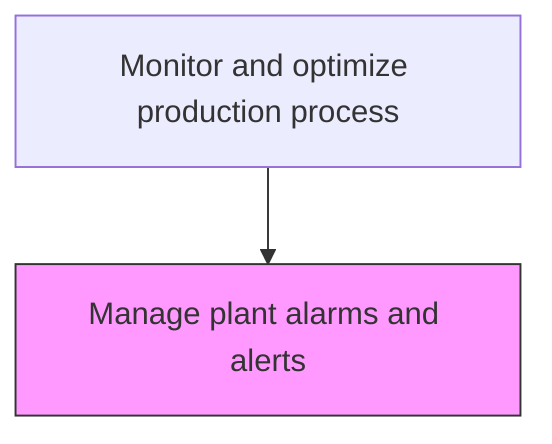
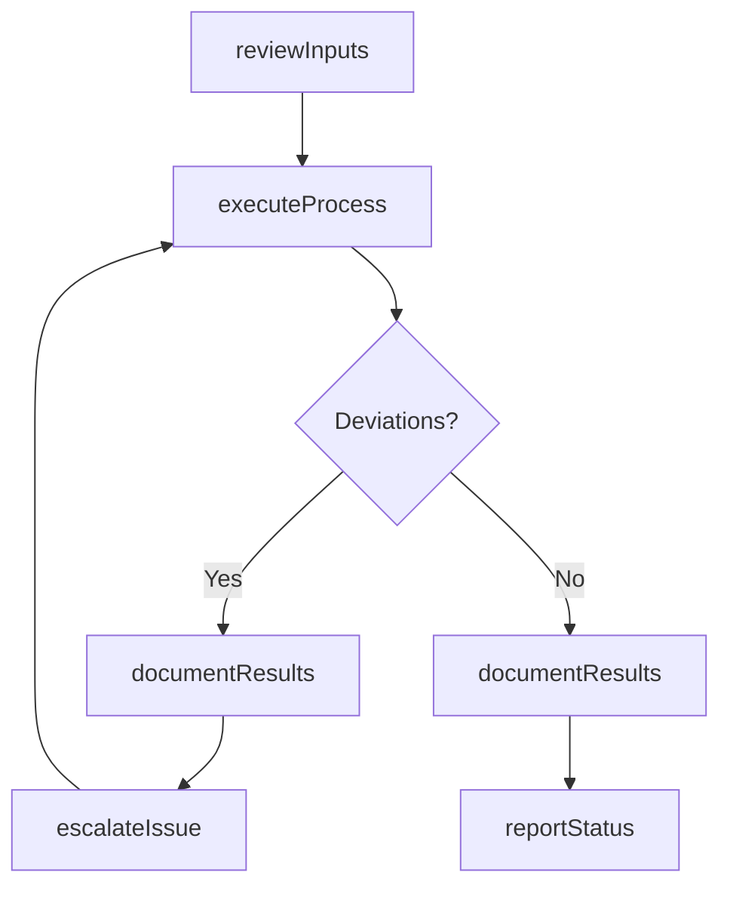

# Manage plant alarms and alerts

> Business-as-Code definition for manage plant alarms and alerts. Models the process-optimization activities within manufacturing to ensure efficient and compliant production operations.

## Overview

Applying human factors and instrumentation engineering and systems thinking to manage the design of an alarm or alert system to increase its usability. Typical challenges include having too many alarms in a plant, poorly designed alarms/alerts, improperly set alarm/alert points, unclear alarm/alert messages, etc. Poor alarm management is one of the leading causes of unplanned downtime.

## Process Hierarchy



## GraphDL

```yaml
manage:
  object: Plant Alarms And Alerts
  actor: ProcessEngineer
  result: ManageOutcome
```

## Actions

| Action | Description |
|--------|-------------|
| manageActivity | Manage plant alarms and alerts per established procedures |
| reviewInputs | Assess required inputs and prerequisites for manage plant alarms and alerts |
| executeProcess | Carry out the core process-optimization tasks following standard operating procedures |
| documentResults | Record outcomes, observations, and any deviations from standard |
| reportStatus | Communicate status and results to supervisors and downstream teams |

## Events

| Event | Description |
|-------|-------------|
| inputsReviewed | Inputs and prerequisites assessed for manage plant alarms and alerts |
| processExecuted | Core process-optimization tasks completed per standard procedures |
| resultsDocumented | Outcomes and observations recorded in production records |
| statusReported | Status and results communicated to relevant teams |
| deviationDetected | Non-standard condition identified during process execution |

## Searches

| Search | Description |
|--------|-------------|
| getProductionStatus | Retrieve current status of manage plant alarms and alerts activities |
| getProductionRecords | Query production records for a specific batch, lot, or period |
| findDeviations | Identify deviations from standard operating procedures |
| getPerformanceMetrics | Query performance metrics for process-optimization activities |

## Process Flow



## RACI Matrix

| Activity | Responsible | Accountable | Consulted | Informed |
|----------|-------------|-------------|-----------|----------|
| reviewInputs | ProcessEngineer | PlantManager | QualityAssurance | SupplyChain |
| executeProcess | ProcessEngineer | PlantManager | Maintenance | Quality |
| documentResults | ProcessEngineer | PlantManager | QualityAssurance | Regulatory |

## Related Processes

| Process | Relationship |
|---------|-------------|
| 4.3.1 Schedule production | Upstream - production schedule drives execution |
| 4.3.3 Perform quality testing | Parallel - quality testing validates production output |
| 4.1.5 Create and manage master production schedule | Upstream - MPS provides production targets |

## Related Departments

| Department | Role |
|-----------|------|
| Manufacturing | Primary owner of production operations |
| Quality Assurance | Validates product quality and process compliance |
| Maintenance | Ensures equipment reliability for production |
| Supply Chain | Coordinates materials availability for production |

## Related Occupations

| Occupation | Involvement |
|-----------|-------------|
| ProcessEngineer | Leads process-optimization activities on the shop floor |
| Quality Inspector | Verifies product and process quality |
| Production Supervisor | Oversees daily production execution |

## KPIs

| KPI | Description | Unit |
|-----|-------------|------|
| Overall Equipment Effectiveness | Combined measure of availability, performance, and quality | % |
| First Pass Yield | Percentage of products passing quality on first attempt | % |
| Production Cycle Time | Average time to complete manage plant alarms and alerts | Hours |

## Usage

```typescript
import { managePlantAlarmsAndAlerts } from '@headlessly/manage-plant-alarms-and-alerts'

const client = managePlantAlarmsAndAlerts()

// Review inputs for production activity
const inputs = await client.reviewInputs({
  productionOrderId: 'PO-2025-0847',
  checkMaterials: true,
  checkEquipment: true
})

// Execute the production process
const result = await client.executeProcess({
  inputsId: inputs.id,
  standardProcedure: 'SOP-PROC-001'
})
```
