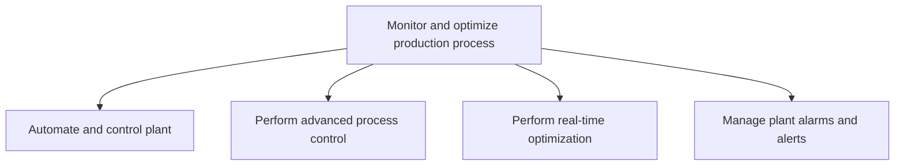
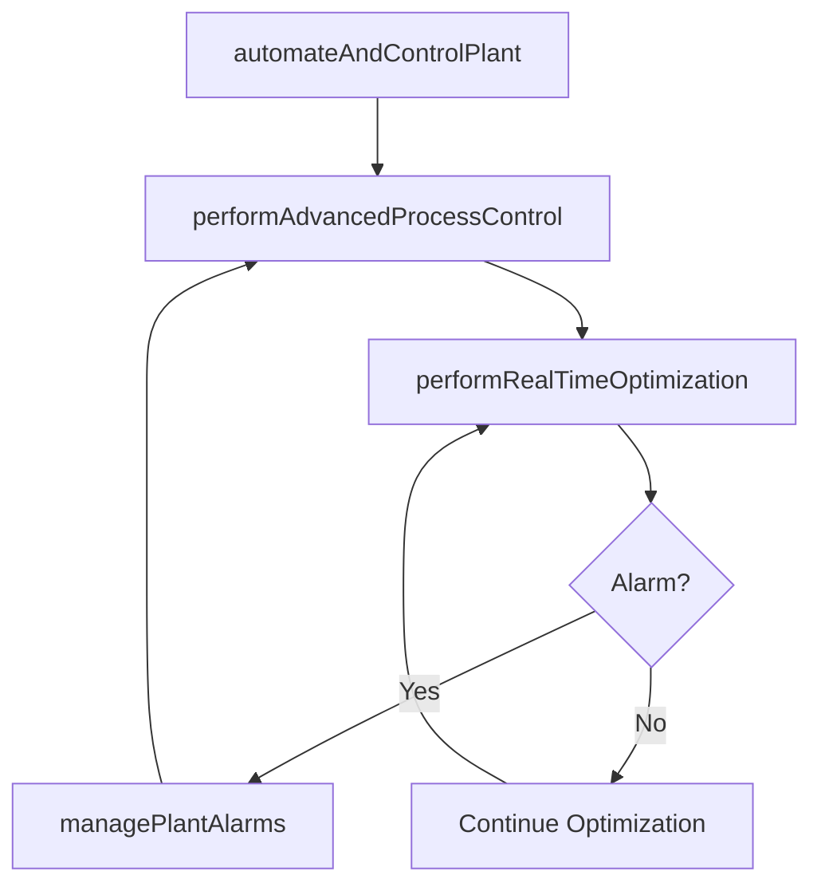

# Monitor and optimize production process

> Business-as-Code definition for production process monitoring and optimization. Models plant automation, advanced process control, real-time optimization, and alarm management as programmable workflows.

## Overview

Integrating different resources in the production process: material, personnel, equipment, robotics, etc. Includes automating and controlling the plant, performing advanced process control and real-time optimization. This activity also includes managing plant alarms and alerts.

## Process Hierarchy



## GraphDL

```yaml
monitor:
  object: And Optimize Production Process
  actor: ProcessControlEngineer
  result: OptimizedProcess
```

## Actions

| Action | Description |
|--------|-------------|
| automateAndControlPlant | Configure and manage automated production control systems |
| performAdvancedProcessControl | Execute advanced control techniques for process stability |
| performRealTimeOptimization | Apply real-time algorithms to maximize throughput and efficiency |
| managePlantAlarms | Configure, prioritize, and respond to plant alarms and alerts |

## Events

| Event | Description |
|-------|-------------|
| plantAutomationConfigured | Plant automation systems configured and activated |
| advancedControlExecuted | Advanced process control adjustments applied |
| realTimeOptimizationPerformed | Real-time optimization cycle completed with improvements |
| plantAlarmManaged | Plant alarm acknowledged, investigated, and resolved |

## Searches

| Search | Description |
|--------|-------------|
| getProcessMetrics | Retrieve real-time and historical process performance data |
| getAlarmHistory | Query plant alarm events by severity, type, or time range |
| getOptimizationResults | Retrieve optimization cycle results and efficiency gains |
| getControlLoopStatus | Check status of active process control loops |

## Process Flow



## RACI Matrix

| Activity | Responsible | Accountable | Consulted | Informed |
|----------|-------------|-------------|-----------|----------|
| automateAndControlPlant | AutomationEngineer | ProcessControlEngineer | IT, Maintenance | ProductionManager |
| performAdvancedProcessControl | ControlSystemSpecialist | ProcessControlEngineer | ProcessEngineering | QA |
| performRealTimeOptimization | OptimizationEngineer | ProcessControlEngineer | ProductionPlanning | Finance |
| managePlantAlarms | ShiftSupervisor | ProcessControlEngineer | Safety, Maintenance | Operations |

## Sub-Processes

| ID | Name | Description |
|----|------|-------------|
| 4.3.2.6.1 | Automate and control plant | Creating and applying technology to monitor and control the production and delivery of products and  |
| 4.3.2.6.2 | Perform advanced process control | Including a broad range of techniques and technologies implemented within industrial process control |
| 4.3.2.6.3 | Perform real-time optimization | Helping organizations increase performance and efficiency, real-time optimization is a category of c |
| 4.3.2.6.4 | Manage plant alarms and alerts | Applying human factors and instrumentation engineering and systems thinking to manage the design of  |

## Related Processes

| Process | Relationship |
|---------|-------------|
| 4.3.2.2 Execute detailed line schedule | Upstream - line schedule drives production monitoring |
| 4.3.2.7 Assess production performance | Downstream - optimization data feeds performance assessment |
| 4.3.1 Schedule production | Upstream - production schedule sets optimization targets |
| 4.3.3 Perform quality testing | Parallel - process control impacts quality outcomes |

## Related Departments

| Department | Role |
|-----------|------|
| Process Engineering | Primary owner of control systems and optimization |
| Maintenance | Responds to equipment alarms and maintains automation systems |
| IT/OT | Manages integration between operational and information technology |
| Safety | Sets alarm priority thresholds and safety interlock requirements |

## Related Occupations

| Occupation | Involvement |
|-----------|-------------|
| Process Control Engineer | Overall monitoring and optimization management |
| Automation Engineer | Plant automation system configuration and maintenance |
| Shift Supervisor | Real-time alarm response and escalation |

## KPIs

| KPI | Description | Unit |
|-----|-------------|------|
| Overall Equipment Effectiveness | Combined availability, performance, and quality rate | % |
| Alarm Rate | Number of alarms per operator per hour | Alarms/Hour |
| Process Capability Index | Statistical measure of process precision (Cpk) | Index |
| Optimization Savings | Cost savings from real-time optimization adjustments | Currency |

## Usage

```typescript
import { monitorAndOptimizeProductionProcess } from '@headlessly/monitor-and-optimize-production-process'

const client = monitorAndOptimizeProductionProcess()

// Perform real-time optimization
const optimization = await client.performRealTimeOptimization({
  productionLine: 'LINE-A3',
  targetMetrics: ['throughput', 'energy-efficiency', 'yield'],
  constraintSet: 'quality-first'
})

// Manage plant alarms
const alarms = await client.managePlantAlarms({
  facility: 'PLANT-WEST',
  severityFilter: ['critical', 'high'],
  timeRange: { start: '2025-05-01T00:00:00Z', end: '2025-05-01T23:59:59Z' }
})
```
