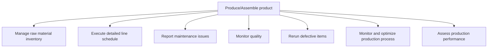
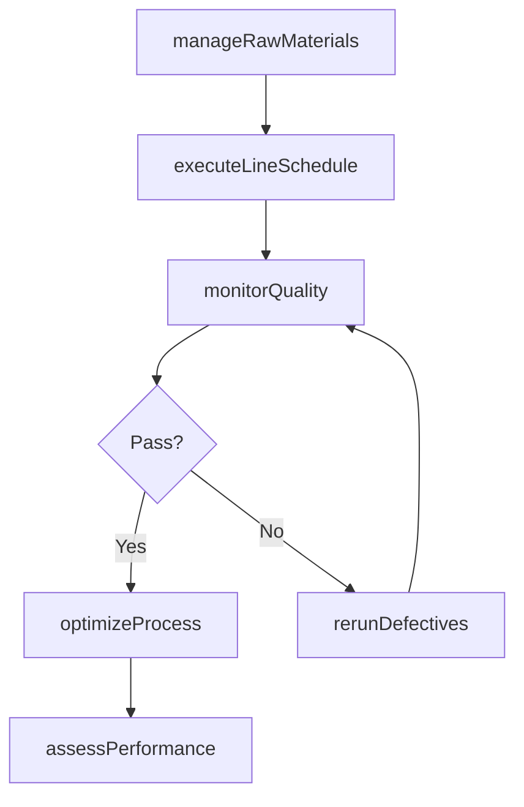

# Produce/Assemble product

> Business-as-Code definition for product manufacturing and assembly. Models raw material management, line execution, quality monitoring, defect rework, process optimization, and performance assessment as programmable workflows.

## Overview

Manufacturing the product. Convert the raw materials to develop consumer-ready products. Manage the raw materials to implement the detailed production schedule. Reproduce defectives to establish and remediate cause. Ensure production optimization and benchmark performance.

## Process Hierarchy



## GraphDL

```yaml
produce/assemble:
  object: Product
  actor: ProductionSupervisor
  result: AssembledProduct
```

## Actions

| Action | Description |
|--------|-------------|
| manageRawMaterials | Track and manage raw material inventory for production |
| executeLineSchedule | Run production lines per detailed schedule |
| reportMaintenanceIssues | Log equipment issues and request maintenance support |
| monitorQuality | Perform in-process quality checks during production |
| rerunDefectives | Rework items that failed in-process quality inspection |
| optimizeProcess | Monitor and tune production process parameters |
| assessPerformance | Evaluate production output against targets |

## Events

| Event | Description |
|-------|-------------|
| rawMaterialsManaged | Raw material inventory verified and staged for production |
| lineScheduleExecuted | Production line completed scheduled run |
| maintenanceIssueReported | Equipment issue logged and maintenance notified |
| qualityMonitored | In-process quality check completed |
| defectivesRerun | Defective items reworked and re-inspected |
| processOptimized | Production process parameters tuned for improvement |
| performanceAssessed | Production performance review completed |

## Searches

| Search | Description |
|--------|-------------|
| getLineStatus | Retrieve real-time production line status and output |
| findMaterialShortages | Identify raw material shortfalls for active orders |
| getDefectLog | Query defect records by line, product, or date |
| getOEEMetrics | Retrieve overall equipment effectiveness data |

## Process Flow



## RACI Matrix

| Activity | Responsible | Accountable | Consulted | Informed |
|----------|-------------|-------------|-----------|----------|
| manageRawMaterials | MaterialsHandler | ProductionSupervisor | Procurement | Warehouse |
| executeLineSchedule | LineOperator | ProductionSupervisor | Engineering | Planning |
| monitorQuality | QualityTechnician | QAManager | Production | Engineering |
| optimizeProcess | ProcessEngineer | PlantManager | Automation, QA | Operations |

## Sub-Processes

| ID | Name | Description |
|----|------|-------------|
| 4.3.2.1 | Manage raw material inventory | Administering the inventory of raw materials. Manage the total cost of all component parts in stock  |
| 4.3.2.2 | Execute detailed line schedule | Creating and implementing the detailed line production schedule on the ground level. |
| 4.3.2.3 | Report maintenance issues | Recording and reporting any deviations or issues in the maintenance schedule, in the performance to  |
| 4.3.2.4 | Monitor quality | Monitor quality within the supply chain to ensure operational efficiency and alignment with organizational objectives |
| 4.3.2.5 | Rerun defective items | Reproducing the items produced defectively. Assess the produced items by conducting quality and stan |
| 4.3.2.6 | Monitor and optimize production process | Integrating different resources in the production process: material, personnel, equipment, robotics, |
| 4.3.2.7 | Assess production performance | Analyzing and benchmarking the production process to judge its effectiveness and efficiency. Create  |

## Related Processes

| Process | Relationship |
|---------|-------------|
| 4.3.1 Schedule production | Upstream - schedule drives line execution |
| 4.3.3 Perform quality testing | Downstream - finished goods proceed to final quality testing |
| 4.3.4 Maintain production records | Downstream - production data feeds lot traceability |

## Related Departments

| Department | Role |
|-----------|------|
| Manufacturing | Primary owner of production and assembly operations |
| Quality Assurance | In-process quality monitoring |
| Maintenance | Equipment reliability and repair support |
| Engineering | Process design and optimization |

## Related Occupations

| Occupation | Involvement |
|-----------|-------------|
| Production Supervisor | Line management and output oversight |
| Line Operator | Hands-on equipment operation and assembly |
| Process Engineer | Production optimization and troubleshooting |

## KPIs

| KPI | Description | Unit |
|-----|-------------|------|
| Overall Equipment Effectiveness | Combined availability, performance, and quality | % |
| First Pass Yield | Units passing quality on first attempt | % |
| Throughput Rate | Units produced per hour or shift | Units/Hour |
| Scrap Rate | Percentage of material wasted during production | % |

## Usage

```typescript
import { produceAssembleProduct } from '@headlessly/produce-assemble-product'

const client = produceAssembleProduct()

// Execute production line schedule
const run = await client.executeLineSchedule({
  productionOrderId: 'PO-MFG-2025-0890',
  lineId: 'line-A1',
  shiftId: 'shift-1'
})

// Monitor in-process quality
const quality = await client.monitorQuality({
  lineId: 'line-A1',
  checkType: 'statistical-process-control',
  frequency: 'every-30-minutes'
})
```
