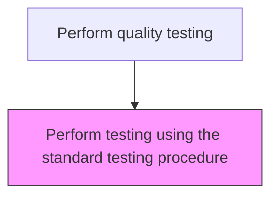
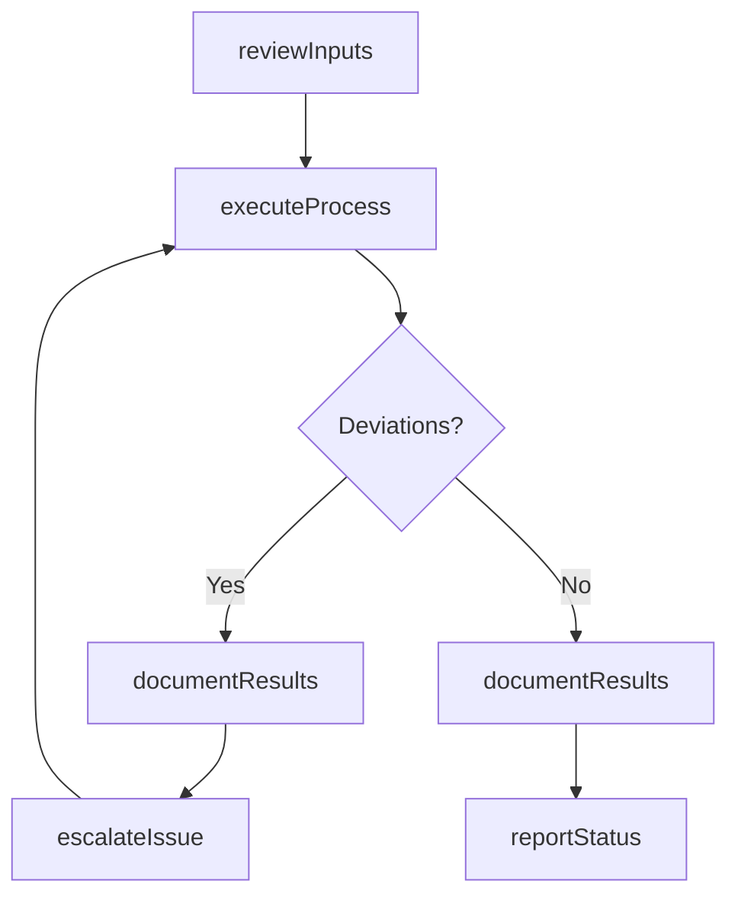

# Perform testing using the standard testing procedure

> Business-as-Code definition for perform testing using the standard testing procedure. Models the quality-testing activities within manufacturing to ensure efficient and compliant production operations.

## Overview

Performing testing using calibrated equipment in accordance with the standard testing procedure, including adherence to testing time requirements. This process ensures that each product batch or unit is systematically evaluated against defined quality specifications using approved test methods, calibrated instruments, and documented procedures. Test execution includes sample preparation, measurement recording, pass/fail determination, and proper handling of non-conforming items for further disposition.

## Process Hierarchy



## GraphDL

```yaml
perform:
  object: Testing Using Standard Testing Procedure
  actor: QualityInspector
  result: PerformOutcome
```

## Actions

| Action | Description |
|--------|-------------|
| performActivity | Perform testing using standard testing procedure per established procedures |
| reviewInputs | Assess required inputs and prerequisites for perform testing using the standard testing procedure |
| executeProcess | Carry out the core quality-testing tasks following standard operating procedures |
| documentResults | Record outcomes, observations, and any deviations from standard |
| reportStatus | Communicate status and results to supervisors and downstream teams |

## Events

| Event | Description |
|-------|-------------|
| inputsReviewed | Inputs and prerequisites assessed for perform testing using the standard testing procedure |
| processExecuted | Core quality-testing tasks completed per standard procedures |
| resultsDocumented | Outcomes and observations recorded in production records |
| statusReported | Status and results communicated to relevant teams |
| deviationDetected | Non-standard condition identified during process execution |

## Searches

| Search | Description |
|--------|-------------|
| getProductionStatus | Retrieve current status of perform testing using the standard testing procedure activities |
| getProductionRecords | Query production records for a specific batch, lot, or period |
| findDeviations | Identify deviations from standard operating procedures |
| getPerformanceMetrics | Query performance metrics for quality-testing activities |

## Process Flow



## RACI Matrix

| Activity | Responsible | Accountable | Consulted | Informed |
|----------|-------------|-------------|-----------|----------|
| reviewInputs | QualityInspector | PlantManager | QualityAssurance | SupplyChain |
| executeProcess | QualityInspector | PlantManager | Maintenance | Quality |
| documentResults | QualityInspector | PlantManager | QualityAssurance | Regulatory |

## Related Processes

| Process | Relationship |
|---------|-------------|
| 4.3.1 Schedule production | Upstream - production schedule drives execution |
| 4.3.3 Perform quality testing | Parent process |
| 4.1.5 Create and manage master production schedule | Upstream - MPS provides production targets |

## Related Departments

| Department | Role |
|-----------|------|
| Manufacturing | Primary owner of production operations |
| Quality Assurance | Validates product quality and process compliance |
| Maintenance | Ensures equipment reliability for production |
| Supply Chain | Coordinates materials availability for production |

## Related Occupations

| Occupation | Involvement |
|-----------|-------------|
| Quality Inspector | Executes standard test procedures and records pass/fail results |
| Quality Engineer | Maintains test method documentation and calibration schedules |
| Production Supervisor | Coordinates testing schedules with production line operations |

## KPIs

| KPI | Description | Unit |
|-----|-------------|------|
| Overall Equipment Effectiveness | Combined measure of availability, performance, and quality | % |
| First Pass Yield | Percentage of products passing quality on first attempt | % |
| Production Cycle Time | Average time to complete perform testing using the standard testing procedure | Hours |

## Usage

```typescript
import { performTestingUsingStandardTestingProcedure } from '@headlessly/perform-testing-using-standard-testing-procedure'

const client = performTestingUsingStandardTestingProcedure()

// Review inputs for production activity
const inputs = await client.reviewInputs({
  productionOrderId: 'PO-2025-0847',
  checkMaterials: true,
  checkEquipment: true
})

// Execute the production process
const result = await client.executeProcess({
  inputsId: inputs.id,
  standardProcedure: 'SOP-QUAL-001'
})
```
