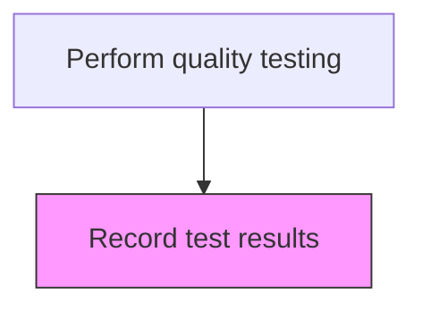
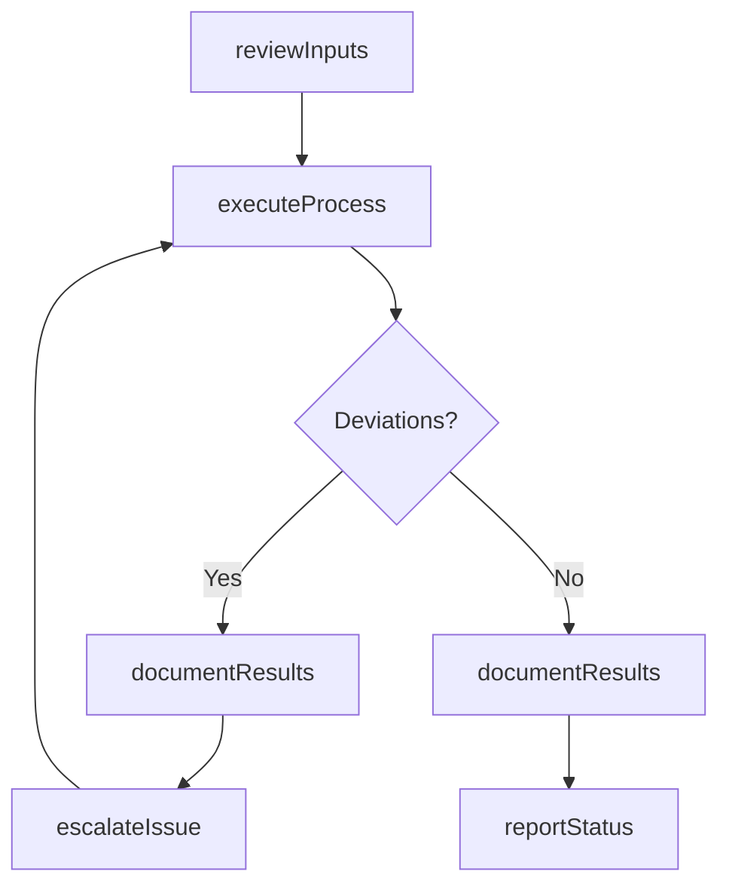

# Record test results

> Business-as-Code definition for record test results. Models the quality-testing activities within manufacturing to ensure efficient and compliant production operations.

## Overview

Documenting the results and outcomes of the quality tests. Track the performance of the production process. Record/Document it to evaluate the qualitative efficiency of the production process. Use electronic devices and software in order to ensure effectiveness in recording the results and outcomes of the test.

## Process Hierarchy



## GraphDL

```yaml
record:
  object: Test Results
  actor: QualityInspector
  result: RecordOutcome
```

## Actions

| Action | Description |
|--------|-------------|
| recordActivity | Record test results per established procedures |
| reviewInputs | Assess required inputs and prerequisites for record test results |
| executeProcess | Carry out the core quality-testing tasks following standard operating procedures |
| documentResults | Record outcomes, observations, and any deviations from standard |
| reportStatus | Communicate status and results to supervisors and downstream teams |

## Events

| Event | Description |
|-------|-------------|
| inputsReviewed | Inputs and prerequisites assessed for record test results |
| processExecuted | Core quality-testing tasks completed per standard procedures |
| resultsDocumented | Outcomes and observations recorded in production records |
| statusReported | Status and results communicated to relevant teams |
| deviationDetected | Non-standard condition identified during process execution |

## Searches

| Search | Description |
|--------|-------------|
| getProductionStatus | Retrieve current status of record test results activities |
| getProductionRecords | Query production records for a specific batch, lot, or period |
| findDeviations | Identify deviations from standard operating procedures |
| getPerformanceMetrics | Query performance metrics for quality-testing activities |

## Process Flow



## RACI Matrix

| Activity | Responsible | Accountable | Consulted | Informed |
|----------|-------------|-------------|-----------|----------|
| reviewInputs | QualityInspector | PlantManager | QualityAssurance | SupplyChain |
| executeProcess | QualityInspector | PlantManager | Maintenance | Quality |
| documentResults | QualityInspector | PlantManager | QualityAssurance | Regulatory |

## Related Processes

| Process | Relationship |
|---------|-------------|
| 4.3.1 Schedule production | Upstream - production schedule drives execution |
| 4.3.3 Perform quality testing | Parent process |
| 4.1.5 Create and manage master production schedule | Upstream - MPS provides production targets |

## Related Departments

| Department | Role |
|-----------|------|
| Manufacturing | Primary owner of production operations |
| Quality Assurance | Validates product quality and process compliance |
| Maintenance | Ensures equipment reliability for production |
| Supply Chain | Coordinates materials availability for production |

## Related Occupations

| Occupation | Involvement |
|-----------|-------------|
| Quality Inspector | Records test measurements and pass/fail determinations |
| Quality Data Analyst | Compiles and validates test result data for trend reporting |
| Production Supervisor | Reviews test results to clear production lots for release |

## KPIs

| KPI | Description | Unit |
|-----|-------------|------|
| Overall Equipment Effectiveness | Combined measure of availability, performance, and quality | % |
| First Pass Yield | Percentage of products passing quality on first attempt | % |
| Production Cycle Time | Average time to complete record test results | Hours |

## Usage

```typescript
import { recordTestResults } from '@headlessly/record-test-results'

const client = recordTestResults()

// Review inputs for production activity
const inputs = await client.reviewInputs({
  productionOrderId: 'PO-2025-0847',
  checkMaterials: true,
  checkEquipment: true
})

// Execute the production process
const result = await client.executeProcess({
  inputsId: inputs.id,
  standardProcedure: 'SOP-QUAL-001'
})
```
